= VLAN

VLAN (Virtual Local Area Network) - позволяет разделить единую сеть (широковещательный домен) на изолированные друг от друга сегменты сети.

Возьмем пример, когда сдаете в аренду несколько офисов в бизнес-центре. В одном офисе работает компания с разработчиками, а в соседнем туристическая фирма. Для изоляции сетей разных организаций, вы решаете отделить сеть одной компании от другой.

Рассмотрим схему сети, состоящую из 4-х хостов, которые подключены к одному коммутатору, как показано на рисунке ниже.

.VLAN по портам (Access) (https://miminet.ru/web_network?guid=865d4618-0b97-45b5-a2af-392e15670f76)
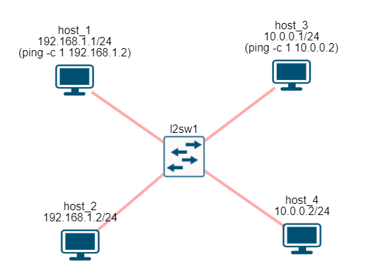

Пусть хост 1 и хост 2 находятся в одном офисе, а хост 3 и хост 4 в другом. Хоть они и подключены к одному коммутатору, мы, как администраторы, хотим изолировать их друг от друга. Для решения этой проблемы используется VLAN.

VLAN изолирует один сегмент сети от другого путем назначения идентификатора виртуальной сети (VLAN Id).

== Access VLAN (по портам)

VLAN реализуется на свитчах путём назначения VLAN ID (идентификатор виртуальной сети) конкретному порту коммутатора. В нашем примере мы назначили:

* VLAN ID = 10 для портов, куда подключены хосты 1 и 2
* VLAN ID = 20 для портов, куда подключены хосты 3 и 4.

.VLAN по портам (Access) (https://miminet.ru/web_network?guid=865d4618-0b97-45b5-a2af-392e15670f76)
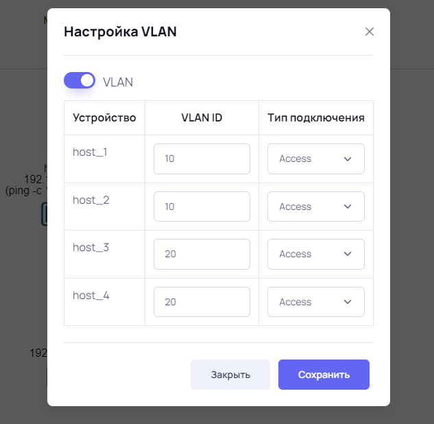

Теперь, когда коммутатор получает пакет на порт он определяет, какому VLAN ID принадлежит данный порт. Определив VLAN ID, он коммутирует пакет только в рамках данного VLAN ID. В нашем случае хост 1 и хост 2 подключены в порты с VLAN ID = 10, а хосты 3 и 4 подключены в порты VLAN ID = 20.

Если мы запустим ping от хоста 1 к хосту 2, то даже широковещательные (чей MAC-адрес назначения равен FF:FF:FF:FF:FF:FF) пакеты не попадут на хост 3 и 4. Путём назначения VLAN ID на портах коммутатора мы создаём виртуальную сеть. И пакеты из одной виртуальной сети не будут попадать в другую.

Можно ещё думать так: когда вы включаете и настраиваете VLAN, то внутри вашего коммутатора создаётся виртуальный коммутатор с портами, которые вы назначили в VLAN. И весь трафик коммутируется внутри этих виртуальных коммутаторов, как показано на рисунке ниже.

.Виртуальный коммутатор с VLAN.
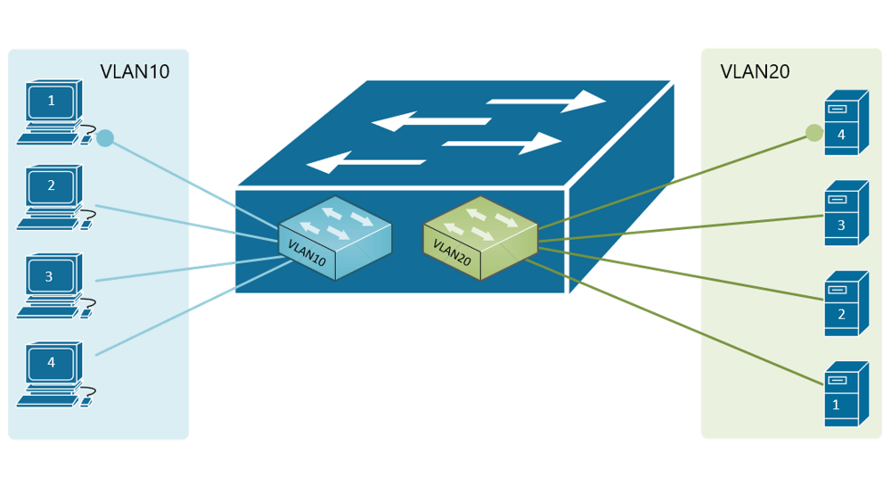

NOTE: VLAN по портам еще называют Port-Based VLAN.

== Trunk VLAN (тегам/меткам)

Давайте усложним немного нашу схему, как показано на рисунке ниже. При этом оставим условие (хост 1 и 2 в одной сети, хост 3 и 4 в другой). Как видно, хосты из разных VLAN подключены к разным коммутаторам. То есть хост 1 подключён к коммутатору l2sw1, а хост 2 подключён к коммутатору l2sw2.

.VLAN по портам (Access) на двух коммутаторах (https://miminet.ru/web_network?guid=e43b978b-6292-4619-8bec-0c82a75e004d)
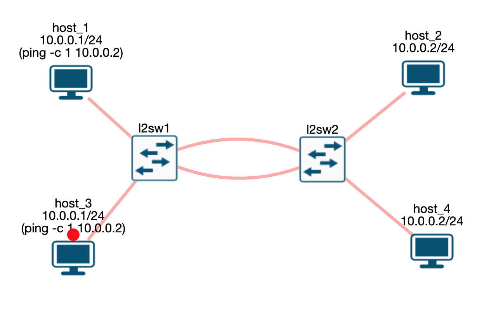

В данном примере для решения нашей задачи потребуется сделать два соединения между коммутаторами l2sw1 и l2sw2. По одному соединению мы будем передавать VLAN ID = 10, по-другому VLAN ID = 20. Но эта избыточность нам не нужна. Порт на коммутаторе не бесплатное удовольствие, и занимать его просто так нет желания. Есть желание передавать пакеты для обоих VLAN ID по одному физическому соединению, как это показано на рисунке ниже.

.VLAN по тегам (Trunk) (https://miminet.ru/web_network?guid=1ccd87d4-a74f-485e-a95e-e1111c041fc7)
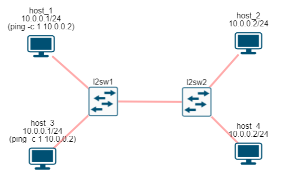

Для реализации такой схемы используется тег. Стандарт IEEE 802.1Q описывает процедуру тегирования трафика. В соответствии с IEEE 802.1Q внутрь Ethernet фрейма помещается тег, который передаёт информацию о принадлежности трафика к VLAN.

.Заголовок 802.1Q в Ethernet фрейме.
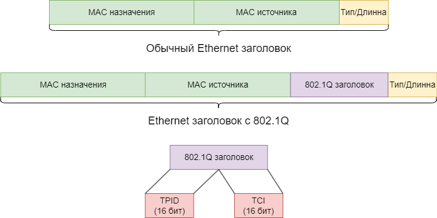

NOTE: На английском языке такой VLAN называется Tagging VLAN, а сам заголовок 802.1Q называется tag. В русской литературе tag переводят как тег или как метка. Поэтому кто-то пишет тегированый VLAN, кто-то VLAN по тегам, а кто-то VLAN с метками.

Заголовок 802.1Q имеет размер 4 байта и помещается между полями MAC-адрес источника и полем Тип/Длина.

802.1Q заголовок состоит из следующих полей:

* *TPID* (Tag Protocol Identifier, 16 бит) - указывает, какой протокол используется для тегирования. Для 802.1Q используется значение 0x8100. Это поле размещается прямо в том месте, где обычно размещается поле Тип/Длина. Таким образом, принимающая сторона может сразу определить, что имеет дело с заголовком 802.1Q.
* *TCI* (Tag control information. 16 бит) состоит из следующих полей:
 ** Priority code point (PCP, 3 бита) - используется стандартом IEEE 802.1p для задания приоритета передаваемого трафика (class of service). Число 0 соответствует наименьшему приоритету, а 7 — наивысшему.
 ** Drop eligible indicator (DEI, 1 бит) - индикатор допустимости удаления. Может использоваться отдельно или совместно с PCP для указания кадров, которые могут быть отброшены при наличии перегрузки.
 ** *VLAN Identifier* (12 бит) - указывает, какому VLAN ID принадлежит кадр.

Именно поле VLAN Identifier позволяет прямо в пакете передать информацию его принадлежности к конкретному VLAN ID.

Теперь для решения нашей задачи нам достаточно одного физического соединения и сконфигурировать соответствующие VLAN. Такой тип соединения обычно называют *Trunk*, *802.1Q* или *тегированый VLAN*.

.VLAN по тегам (Trunk) (https://miminet.ru/web_network?guid=1ccd87d4-a74f-485e-a95e-e1111c041fc7).
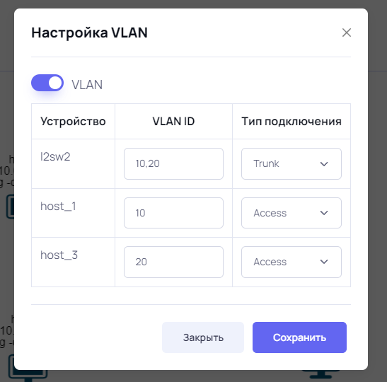

Для настройки тегированого VLAN на коммутаторе нужно перевести порт в состояние Trunk и назначить ему идентификаторы VLAN. В нашем случае назначаются идентификаторы 10 и 20 (через запятую).

Теперь, когда хост 1 отправит пакет на хост 2, то:

* коммутатор 1 получает пакет от хоста 1, смотрит настройку порта (Access, VLAN Id = 10) и назначает данный пакет в VLAN 10.
* пакету на коммутаторе 1 разрешено коммутироваться только между портами, которым разрешено работать в VLAN 10. На основе таблицы коммутации пакет нужно отправить в порт, который подключен к коммутатору 2.
* так как порт между коммутатором 1 и 2 сконфигурирован как Trunk, то коммутатор 1 перед отправкой такого пакета добавляет в пакет тег (Tag) с информацией о VLAN (в нашем случае VLAN Id = 10)
* коммутатор 2 получает на Trunk порт пакет с VLAN Id = 10, значит, данный пакет можно коммутировать только в порты, которые принадлежат VLAN Id =10
* на основе таблицы коммутации пакет нужно отправить в порт, куда подключён хост 2
* хост 2 подключён на Access порт с VLAN Id = 10, значит, перед отправкой пакета тег удаляется.

NOTE: Терминация - это процесс удаление VLAN тега из пакета.

== VLAN маршрутизатор

VLAN позволяет нам разделить один большой широковещательный домен на несколько небольших. Представим, есть сеть компании на 1000 хостов (ПК, ноутбуки, телевизоры и т.п.). Сеть, конечно, построена на коммутаторах. Разделение такого одного широковещательного домена на несколько небольших с использованием VLAN будет очень удобным. Например, выделим отдел бухгалтерии, серверную, разработчиков и тестировщиков.

NOTE: Без VLAN у нас был бы один большой широковещательный домен, что вызывало бы проблемы с широковещательными пакетами и безопасностью.

С другой стороны, строя сеть, мы хотим уметь взаимодействовать со всеми хостами. Например, разработчики и тестировщики хотят иметь доступ к серверам.

Это приводит нас к необходимости маршрутизировать пакеты между различными VLAN. Как известно, для маршрутизации пакетов используют маршрутизатор.

.Маршрутизация между VLAN. (https://miminet.ru/web_network?guid=02521bae-d323-4384-af7c-47f8314607bb).
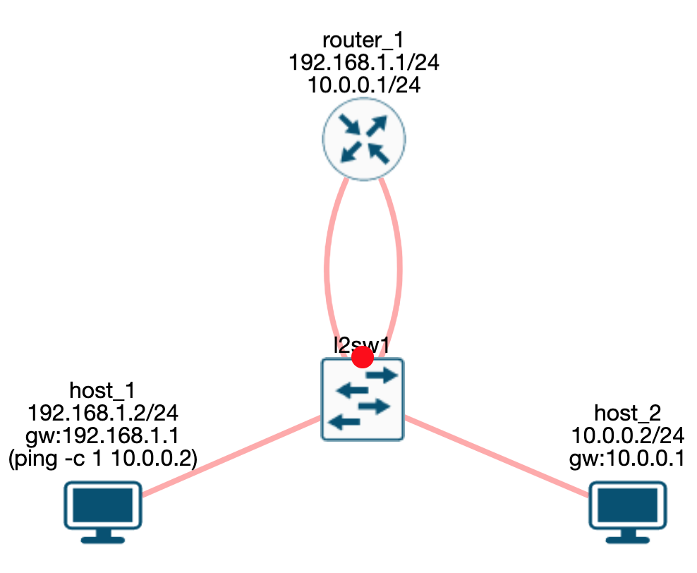

Создадим сеть, как показано на рисунке выше. К коммутатору подключено 2 хоста и 1 маршрутизатор:

* хост 1 находится в VLAN 10 (Access port)
* хост 2 находится в VLAN 20 (Access port)
* маршрутизатор 1 подключён к двум портам коммутатора. Один порт находится в  VLAN 10, другой в VLAN 20. Оба порта настроены как Acces port.

.Конфигурация VLAN на коммутаторе. (https://miminet.ru/web_network?guid=02521bae-d323-4384-af7c-47f8314607bb).
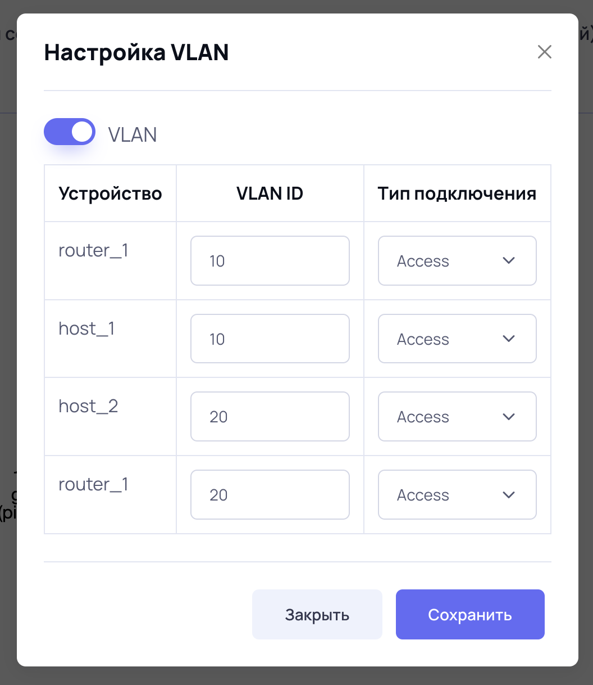

Таким образом, маршрутизатор одновременно подключён сразу к двум VLAN и может с ними взаимодействовать:

* Интерфейс 192.168.1.1/24 подключён к порту коммутатора с VLAN 10.
* Интерфейс 10.0.0.1/24 подключён к порту коммутатора с VLAN 20.

Давайте разберём, что произойдёт, когда хоста 1 отправит пакет хосту 2:

* пакет придёт на порт коммутатора с VLAN 10, значит, коммутация может выполняться только между портами с VLAN 10
* коммутатор отправит пакет на маршрутизатор 1 через порт, который находится в VLAN 10
* маршрутизатор получит пакет на интерфейс с IP-адресом 192.168.1.1:
  ** разберёт IP заголовок
  ** определит, что IP-адрес получателя (10.0.0.2) не его и будет этот пакет маршрутизировать дальше
  ** на основе таблицы маршрутизации определит, что пакет можно отправить во второй интерфейс с IP-адресом 10.0.0.1
  ** отправит пакет в сеть
* пакет придёт на порт коммутатора с VLAN 20, т.е. коммутация может выполняться только между портами с VLAN 20
* коммутатор отправит пакет хосту 2.

Вот так, используя обычный маршрутизатор, можно передавать трафик между различными VLAN.

NOTE: Вы возможно заметили, что вместо VLAN Id = 10 я начал писать просто VLAN 10. Это не опечатка, а сделано специально. Так короче и уже понятно, что речь идет именно про VLAN Id = 10.

== Сабинтерфейсы (sub-interface)

Описанная выше схема рабочая, но не очень эффективная. Она занимает целых два порта коммутатора только для маршрутизации между VLAN. Если ваш маршрутизатор поддерживает создание сабинтерфейсов, то можно обойтись одним физическим соединением.

Сабинтерфейс - это виртуальный интерфейс сетевого уровня (привет, модель ISO/OSI), который умеет отправлять и получать пакеты с VLAN тегом (IEEE 802.1q).

Давайте переделаем нашу сеть с использованием сабинтерфейсов. У маршрутизатора теперь будет одно физическое соединение вместо двух. И настроим два сабинтерфейса:

* сабинтерфейс 192.168.1.1/24 работает с VLAN 10
* сабинтерфейс 10.0.0.1/24 работает с VLAN 20

.Маршрутизация между VLAN через сабинтерфейсы. (https://miminet.ru/web_network?guid=0f13773b-0ec4-45d4-85f7-ba91330fab08).
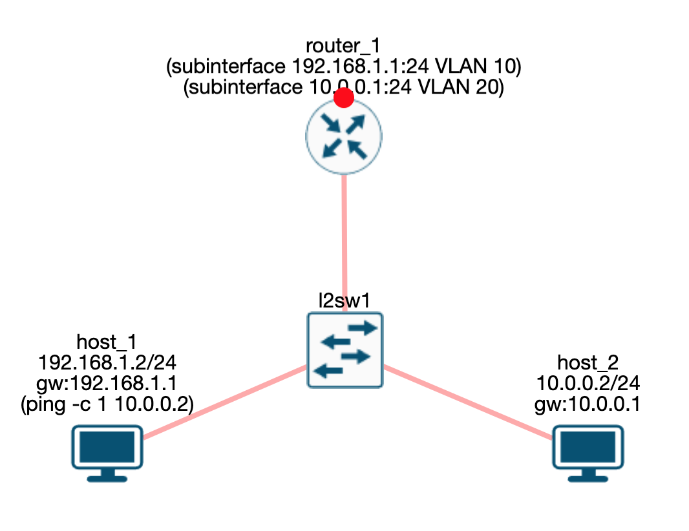

У маршрутизатора осталось только одно физическое соединение, по которому мы будем передавать два различных VLAN. Значит, на коммутаторе нам нужно сконфигурировать соответствующий порт как Trunk. На рисунке ниже показана конфигурация VLAN на коммутаторе.

.Конфигурация VLAN на коммутаторе. (https://miminet.ru/web_network?guid=0f13773b-0ec4-45d4-85f7-ba91330fab08).
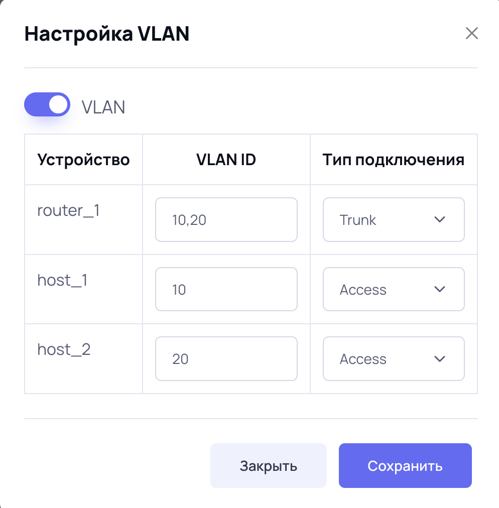

Теперь, если мы отправим пакет от хоста 1 к хосту 2:

* пакет придет на порт коммутатора с VLAN 10, значит, коммутация может выполняться только между портами с VLAN 10
* коммутатор отправит пакет на маршрутизатор 1 через Trunk порт, который находится в VLAN 10 и 20. Коммутатор добавит VLAN тег с указанием VLAN Id = 10
* маршрутизатор получит пакет с VLAN тегом, у которого VLAN Id = 10, значит, он будет обрабатываться сабинтерфейсом с IP-адресом 192.168.1.1. Затем маршрутизатор:
  ** разберёт IP заголовок
  ** определит, что IP-адрес получателя (10.0.0.2) не его и будет этот пакет маршрутизировать дальше
  ** на основе таблицы маршрутизации определит, что пакет можно отправить в сабинтерфейс с IP-адресом 10.0.0.1
  ** отправит пакет в сеть, при этом добавит в пакет VLAN тег со значением VLAN Id = 20
* пакет с VLAN Id = 20 придёт на Trunk порт коммутатора, т.е. коммутация может выполняться только между портами с VLAN 20
* коммутатор отправит пакет хосту 2.

Вот таким образом можно организовать трафик между VLAN и не занимать слишком много портов на коммутаторе. Теперь не удивляйтесь, если вдруг увидите маршрутизатор, который подключён к коммутатору только 1 физическим соединением. Им может оказаться VLAN маршрутизатор с настроенными сабинтерфейсами.

Ещё такую схему подключения называют ROAS (Router-on-a-stick).

Используя VLAN и маршрутизацию между VLAN, можно одну большую сеть разделить не несколько небольших. А ещё можно добавить правила для фильтрации трафика, проходящего через маршрутизатор. Таким образом, можно не только уменьшить широковещательный домен, но и сделать сеть более безопасной.

== Native VLAN

Когда вы включаете VLAN на коммутаторе, то у него появляется специальный Native VLAN. Можно сказать, что это VLAN Id по умолчанию (обычно это VLAN Id = 1).

Коммутаторы не только переправляют чужие пакеты, но и нередко генерируют свои. Есть много протоколов общения между коммутаторами. Например, STP (Spanning Tree Protocol) - протокол для обнаружения и устранения петель в топологии Etherhet. Во время его работы коммутаторы обмениваются специальными STP пакетами между собой. Представим, мы сконфигурировали на коммутаторе Trunk порт с VLAN Id = 10 и 20. А после этого запустили STP процесс на коммутаторе. Коммутатор хочет отправить в Trunk порт STP пакет, какой VLAN Id ему поставить в тег, 10 или 20?

В этой ситуации хочется просто отправить пакет для другого коммутатора без установки VLAN тега. Но если мы так поступим, то другому коммутатору на Trunk порт придёт пакет без тега. Что с ним делать, обрабатывать или выбрасывать? А если обрабатывать, то к какому VLAN его приписывать?

Именно эти проблемы решает Native VLAN. Если на Trunk порт пришёл пакет без тега, то такой пакет автоматически приписывается к Native VLAN.

Другой случай, если вы только что cконфигурировали VLAN на коммутаторе, то все порты автоматически будут в режиме Access и будут принадлежать Native VLAN. Это нужно, чтобы в момент конфигурирования VLAN на коммутаторе, подключенные к этому коммутатору хосты продолжали работать.

Таким образом, коммутаторы, на которых cконфигурировали VLAN, могут спокойно общаться друг с другом, используя Native VLAN и не переживая о том, какой VLAN Id ставить в тег.

== VLAN и MTU

Стандарт IEEE 802.3 определяет максимальный размер Ethernet фрейма в 1518 байт:

* 14 байт Ethernet заголовок
* до 1500 байт данных
* 4 байта CRC32 (контрольная сумма).

А если мы включим VLAN tag, то он добавит ещё 4 байта. В итоге максимальный размер Ethernet фрейма вырастит до 1522. Будет ли пакет такого размера успешно передан?

*Вопрос*: нужно ли при включении VLAN tag изменять значение MTU (maximum transmission unit) или нет?

*Ответ*: менять MTU не нужно. Уже очень давно, коммутаторы и сетевые карты по умолчанию, могут принимать пакеты большей длины, чем 1518 или1522 байт.