= Туннелирование (VPN)

== Введение
В начале изучения компьютерных сетей обязательно изучается модель ISO/OSI и приводятся примеры, как данные по ней передвигаются вверх (от физического уровня к приложению) или вниз (от приложения к физическому уровню).

Во время обсуждения маршрутизации оказывается, что иногда пакеты передвигаются вдоль уровней. Например, во время маршрутизации, пакет поднимается с физического уровня до сетевого уровня. Там принимается решение о том, что данный пакет необходимо маршрутизировать дальше, и этот пакет отправляется обратно вниз по стеку.

.Движение пакета по модели ISO/OSI во время маршрутизации.
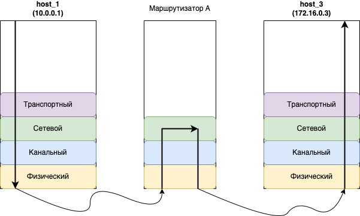

Если открыть сниффер (например, Wireshark) и посмотреть на отправляемые пакеты, то можно заметить, что протокол транспортного уровня (TCP) инкапсулируется (вкладывается внутрь) в протокол сетевого уровня (IP), а он, в свою очередь, в протокол канального уровня (Ethernet). А когда пакет поднимается по стеку, то всё происходит наоборот. Сначала обрабатывается протокол канального уровня (Ethernet), потом сетевого уровня и затем транспортного.

.Пакеты в Wireshark.
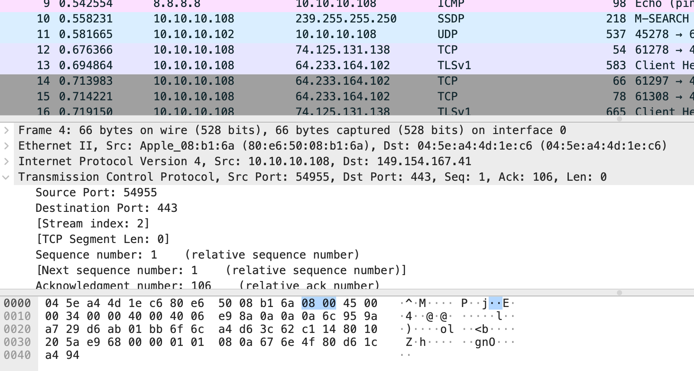

Когда программист занимается реализацией протоколов в операционной системе (ОС) он обычно не смотрит на модель ISO/OSI. Каждый протокол реализуется как некоторый модуль/подпрограмма, который на вход принимает данные и работает с ними.

Разберём пример:

* Хост получил Ethernet пакет и он поступает Ethernet модулю на обработку.
* Ethernet модуль разбирает Ethernet заголовок, проверяет длину пакета, извлекает MAC-адрес получателя и сравнивает его со своим. Предположим, что MAC-адрес оказался равен его собственному и Ethernet модуль решает передать данные на обработку следующему модулю.
* Ethernet модуль заглядывает в поле Тип/Длинна, смотрит значение (пусть это будет 0x0800, что указывает на IP протокол) и ищет модуль, который зарегистрирован в ОС для обработки данного типа.
* Если такой модуль нашёлся (IP модуль), то Ethernet модуль передаёт извлечённые данные ему на обработку.

Аналогичным образом поступает и модуль IP протокола. IP модуль разбирает IP заголовок, проверяет его на ошибки, извлекает IP-адрес получателя и так далее. В конечном счёте, если IP модуль решит продолжить обработку данных, он заглянет в поле Protocol (протокол) в IP заголовке, извлечёт его значение и, как в случае с Ethernet, попробует передать данные для обработки дальше.

.Поле "Протокол" в IP зголовке.
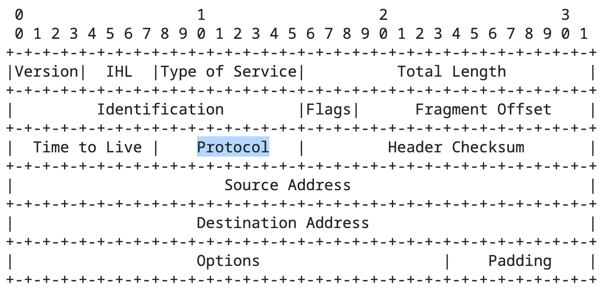

Мы привыкли, что после IP обычно следует UDP, ICMP или TCP протокол. А что если за IP заголовком последует ещё один IP заголовок. Или, что если после IP заголовка вновь последует Ethernet?

С позиции разработчика ничего особенного не произошло. После обработки IP заголовка передать данные на обработку снова модулю IP или Ethernet так же естественно, как и передать их модулю TCP или UDP. То есть двигаясь по стеку протоколов, данные могут передавать в следующем порядке Ethernet -> IPv4 -> IPv4 - > TCP. И в этом не будет никакой трагедии. Нарушение только в модели ISO/OSI =)

Предлагаю такое нарушение называть туннелированием. Приведу ещё определение из википедии, выбирайте, кому что больше нравится.

“Туннелирование (от англ. tunnelling — «прокладка туннеля») в компьютерных сетях — процесс, в ходе которого создаётся логическое соединение между двумя конечными точками посредством инкапсуляции различных протоколов. Туннелирование представляет собой метод построения сетей, при котором один сетевой протокол инкапсулируется в другой. От обычных многоуровневых сетевых моделей (таких как OSI или TCP/IP) туннелирование отличается тем, что в качестве туннеля используется протокол более высокого, чем инкапсулируемый, уровня, либо протокол того же уровня.”

Внутри протокола IPv4 может вкладываться далеко не только TCP, UDP, ICMP, но и IPv4, IPv6, Ethernet и много чего ещё. Полный список можно посмотреть на сайте IANA (https://www.iana.org/assignments/protocol-numbers/protocol-numbers.xhtml).

== Для чего используется туннелирование?

Главный вопрос: для чего используется туннелирование?

Рассмотрим пример, когда у вашей компании есть офис в Москве (Офис 1) и в Санкт-Петербурге (Офис 2). Расстояние между ними большое (около 800 км.). В Москве у вас сидят разработчики и тестировщики, а в Санкт-Петербурге находятся ваши сервера и команда администраторов. Разработчикам и тестировщикам необходимо иметь доступ к вашим внутренним серверам (хранить код, запускать тестовые сборки и т.д.). Как организовать такой доступ?

.Сеть компании в двух офисах. (https://miminet.ru/web_network?guid=fcd00973-a899-49d4-911b-7bdf86212d12).
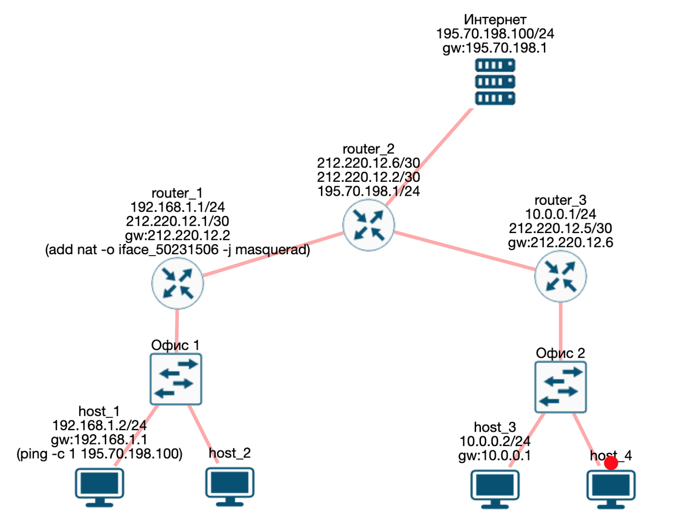

На рисунке выше нарисована сеть с демонстрацией проблемы. Коммутаторы “Офис 1” и “Офис 2” установлены в Москве и СПб соответственно. Внутри офисов, естественно, используются серые IP-адреса. Не будем же мы всем нашим сотрудникам и тестовым серверам выделять белые IP-адреса. Поэтому:

* сеть 192.168.1.0/24 - для офиса 1
* сеть 10.0.0.0/24 - для офиса 2

Маршрутизатор 1 и 3 (router_1, router_3) - это маршрутизаторы компании, каждый из них имеет по одному белому IP-адресу. Мы можем их настраивать и делать с ними что угодно.

Маршрутизатор 2 (router 2) - это маршрутизатор провайдера, у него три белых IP-адреса:

* 212.220.2.2/30 - для общения с маршрутизатором 1
* 212.220.2.6/30 - для общения с маршрутизатором 3
* 195.70.198.1/24 - для доступа в интернет. В качестве наглядности я взял сервер с IP-адресом 195.70.198.100

Для упрощения схемы я нарисовал только один маршрутизатор от провайдера. В реальности их будет несколько, на проблему это никак не повлияет.

* *Задача 1* - хост 1 из офиса 1 должен уметь получать доступ к хосту 3 из офиса 2.
* *Задача 2* - хост 1 должен иметь доступ в интернет.

С задачей 2 всё несложно, это мы знаем. Раз у нас есть маршрутизатор 1 с белым IP-адресом, то мы просто включим NAT на нём. В приведённой выше сети именно так и сделано.

А вот как быть с решением задачи 1? Чтобы чуть легче думалось, я перерисовал нашу схему и выбросил оттуда лишние устройства. Фокусируемся на главном, нам нужно организовать связь между хостом 1 и хостом 3.

.Сеть компании в двух офисах. (https://miminet.ru/web_network?guid=4b35502a-3d7a-4cc4-886d-2da0525569f7).
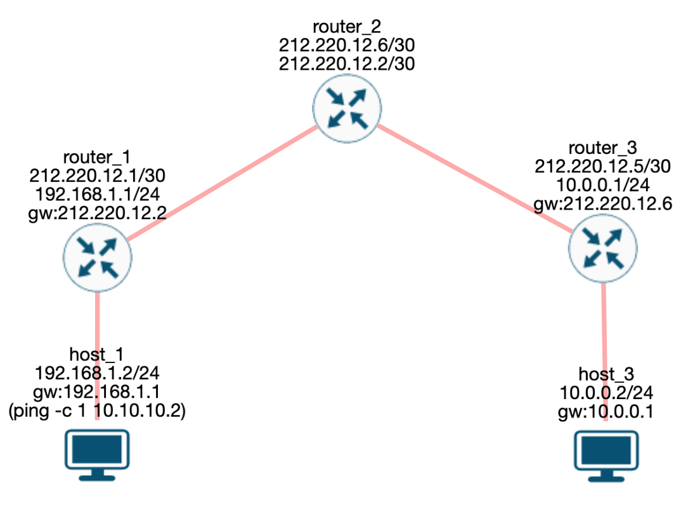

Из хорошего есть связь между маршрутизатором 1 и маршрутизатором 3. Они могут обмениваться пакетами друг с другом. У каждого из них есть по 1 белому адресу. А вот если мы попробуем отправить пакет от хоста 1 к хосту 3, то он потеряется на маршрутизаторе 2 из-за того, что маршрутизатор 2 не знает, от кого пришёл пакет (IP-адрес источника 192.168.1.2) и не знает, куда его дальше отправлять (10.0.0.2).

Можно, например, попросить у провайдера маршрутизацию наших серых сетей (192.168.1.0/24 и 10.0.0.0/24). Пусть провайдер добавит в свои таблицы маршрутизации маршруты до этих сетей. Скорее всего, в этой услуге нам откажут, так как IP-адреса серые.

Если внимательно посмотреть на схему, то для решения задачи 1 нам нужно сделать так:

* Хост 1 отправляет пакет с IP-адресом назначения хост 3 (10.0.0.2).
* Пакет от хоста 1 до хоста 3 попадает на маршрутизатор 1.
* Пакет от хоста 1 до хоста 3 оказывается на маршрутизаторе 3 (*произошла магия!*)
* Маршрутизатор 3 смотрит на свою таблицу маршрутизации и отправляет пакет до хоста 3. Это мы умеем, так как маршрутизатор 3 знает про сеть 10.0.0.0/24.

Вот как раз для реализации данной магии и используется туннелирование. В данном случае нам нужно создать туннель от маршрутизатора 1 до маршрутизатора 3.

.Туннелирование IP пакета.
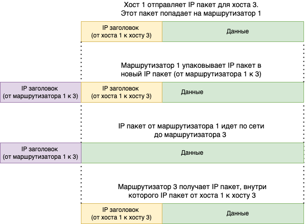

Разберём по шагам, как это работает туннель:

. Хост 1 генерирует пакет для хоста 3 и отправляет его маршрутизатор 1
. Маршрутизатор 1 получает IP пакет для хоста 3.
.. В настройках маршрутизатора 1 указывается, что пакеты для сети 10.0.0.0/24 (куда входит хост 3) необходимо упаковать в туннель.
.. Маршрутизатор 1 создаёт новый IP пакет, где IP-адрес отправителя он сам (212.220.12.1), а IP-адрес получателя маршрутизатор 3 (212.220.12.5).
.. Внутрь нового IP пакета упаковывается IP пакет от хоста 1 к хосту 3.
. Так как у маршрутизатора 1 и 3 есть белые IP-адреса и между ними ходят пакеты, то новый IP пакет доставляется провайдером (в нашем случае это маршрутизатор 2) до маршрутизатора 3.
. Маршрутизатор 3 получает IP пакет, где IP-адрес получателя он сам. Значит, пакет нужно не маршрутизировать, а обрабатывать самому.
. Разобрав IP заголовок, маршрутизатор 3 обнаруживает внутри ещё один IP пакет (от хоста 1 к хосту 3). В этот раз IP-адрес получателя не принадлежит маршрутизатору 3, значит пакет необходимо маршрутизировать.
. Маршрутизатор 3 на основе своей таблицы маршрутизации отправляет IP пакет хосту 3.

Вот таким образом туннелирование помогает организовать связь между двумя удалёнными офисами.

Туннелирование - очень популярная техника в руках сетевых администраторов. Соединить два удалённых офиса или дать доступ к внутренним ресурсам сотрудникам, которые работают удалённо. Помимо этого, применение туннелей популярно у тестировщиков. Например, когда нужно убедиться, что ваш сайт корректно отображается для иностранных посетителей (т.е. правильно определяется страна и язык на основе IP-адресов). Для этого вы можете установить туннели до серверов в других странах и посмотреть на свой сайт через них.

== VPN

VPN (virtual private network) - это виртуальная частная сеть, обобщённое название технологий, позволяющих обеспечить одно или несколько сетевых соединений поверх чьей-либо другой сети. А туннелирование - это способ обеспечения таких соединений.

.VPN.
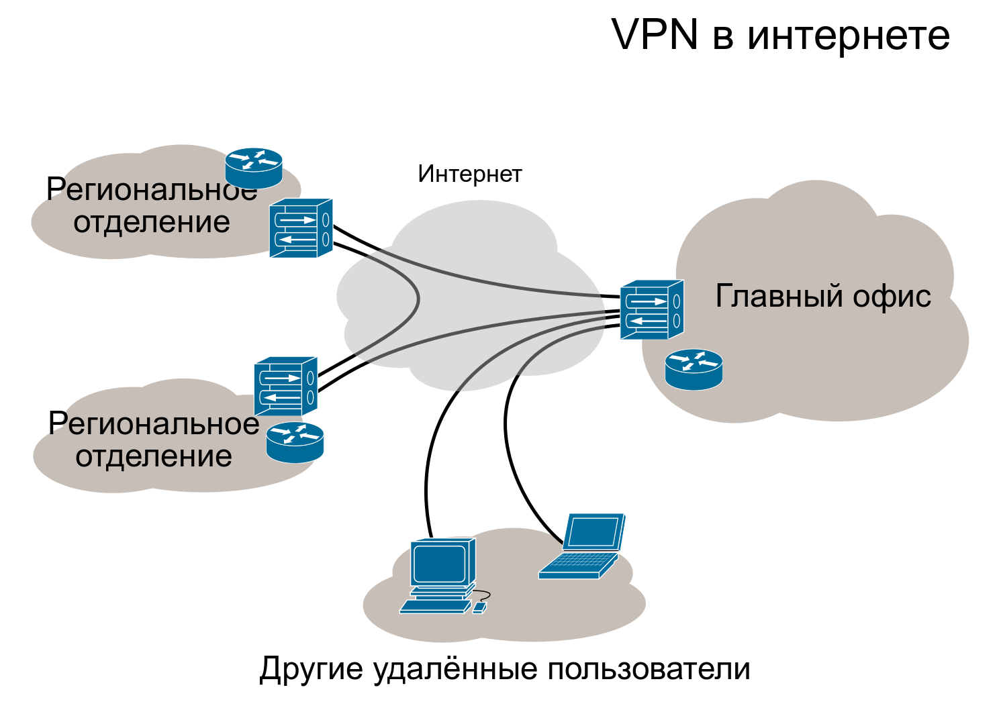

== IPIP

Туннель IPIP - пожалуй, самый простой способ рассказать о том, что такое туннель, как он работает и как решает поставленные задачи. Как можно догадаться из названия, IPIP туннель подразумевает передачу IP пакета внутри другого IP пакета. Описание IPIP туннеля можно найти в https://datatracker.ietf.org/doc/html/rfc2003[RFC 2003].

Для установки IPIP туннеля нам потребуется два хоста, которые могут общаться между собой.

.IPIP туннель между маршрутизатором 1 и маршрутизатором 3. (https://miminet.ru/web_network?guid=fe1fc02f-6bb4-421d-94cb-6902f826e30d)
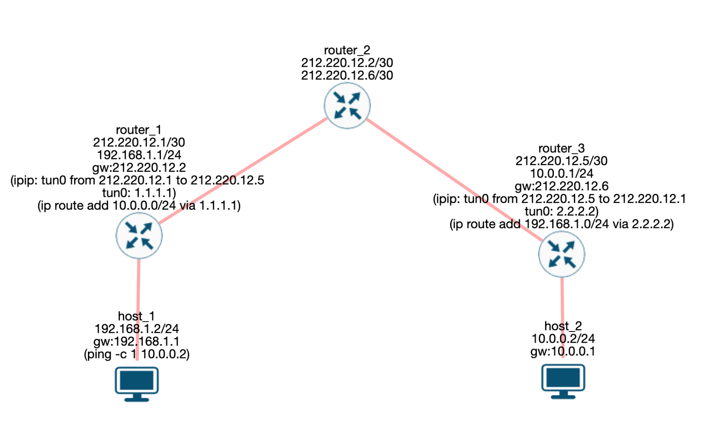

Настройки туннеля на одном маршрутизаторе требует выполнить 2 действия:

. Создание виртуального L3 интерфейса, а также настройка начального и конечного IP-адреса туннеля
. Создание маршрута (т.е. добавить в таблицу маршрутизации), какие IP сети необходимо отправлять в туннель.

Виртуальный интерфейс L3 уровня необходим, чтобы отправлять туда нужные нам IP пакеты. Внутри этого интерфейса наш IP пакет будет обрастать новым IP заголовком. Интерфейс L3 - означает, что ему нужно присвоить свой IP-адрес. Так как внутри этого интерфейса будет создаваться новый IP заголовок, при настройке необходимо ещё указать IP-адреса для источника и назначения.

В итоге создание интерфейса для IPIP туннеля на маршрутизаторе 1 требует:

* указать имя интерфейса, обычно это tun0, tunip или что-то в этом духе
* указать IP-адрес исходящего интерфейса (начальная точка IPIP туннеля), в нашем случае это 212.220.12.1
* указать IP-адрес конечной точки IPIP туннеля, в нашем случае это 212.220.12.5
* указать IP-адрес для вновь создаваемого IPIP интерфейса, в нашем случае это 1.1.1.1

Вторым шагом нужно настроить маршрутизацию. По умолчанию, пакет для хоста 3 маршрутизатор 1 попробует отправить дальше в сеть, а именно, на маршрутизатор 2. Нам нужно сообщить, чтобы он отправлял IP пакет не на маршрутизатор 2, а в IPIP интерфейс. Для этого мы добавим правило в таблицу маршрутизации:

----
10.0.0.0/24 отправлять на 1.1.1.1
----

Это означает, что все IP пакеты, у которых IP-адрес назначения попадает в сеть 10.0.0.0/24 отправлять в интерфейс с IP-адресом 1.1.1.1, т.е. в наш IPIP туннель.

На маршрутизаторе 3 необходимо выполнить похожие действия, чтобы пакет мог прийти в обратном направлении, от хоста 3 к хосту 1.

Чтобы посмотреть, как работает IPIP туннель, вы можете открыть готовую сеть (см. рисунок выше) и запустить анимацию сети. Обратите внимание, что от хостов вылетает ICMP пакет (так он подписан), а между маршрутизаторами ходит только IP. Дело в том, что во время анимации Miminet не знает про IPIP туннель. Эту функциональность мы вскоре добавим.

IPIP туннель очень просто и понятный, но обладает недостатками:

* данные передаются в открытом виде
* нет аутентификации и авторизации
* данные могут быть искажены или подменены во время передачи
* IPIP инкапсулирует только IPv4 для одноадресной рассылки
* IPIP туннель не может работать через NAT, т.е. если одна точка туннеля скрыта за NAT, то туннель не построить.

== IPIP туннель (меняем местоположение)

Давайте рассмотрим пример, как на рисунке ниже.

.Сеть из 3-х маршрутизаторов и одного сервера. (https://miminet.ru/web_network?guid=1844d7b2-641b-4725-96b2-9e148d88daae).
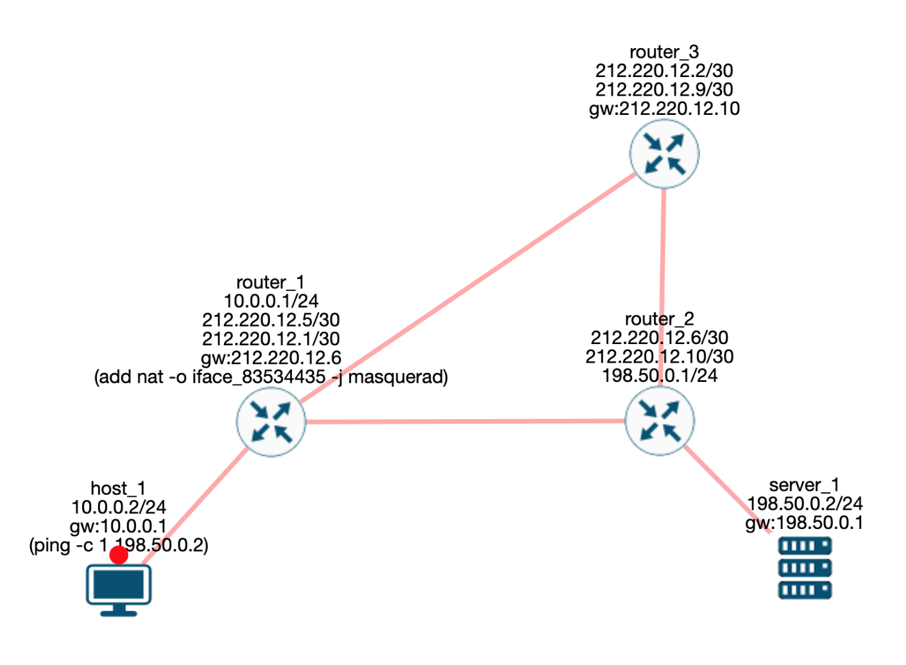

*Хост 1* - это наш домашний или рабочий компьютер.

*Сервер 1* - сервер, с котором мы хотим обмениваться данными. Допустим, мы занимаемся тестированием веб-сайта, который там запущен.

*Маршрутизатор 1* - это наш маршрутизатор. В нашей внутренней сети используются серые IP-адреса, а наружу маршрутизатор смотрит белыми. В интернет мы выходим через NAT, как это обычно происходит.

*Маршрутизатор 2* - какой-то маршрутизатор провайдера.

*Маршрутизатор 3* - виртуальный маршрутизатор в другой стране, который мы где-то купили.

Все маршрутизаторы находятся в публичной сети интернет. Между ними множество других маршрутизаторов и различного сетевого оборудования провайдеров. Для удобства демонстрации я соединил маршрутизаторы напрямую.

*Задача* - сделать так, чтобы хост 1 общался с сервером так, словно это делает маршрутизатор 3. То есть чтобы пакеты на сервер приходили с IP-адресом маршрутизатора 3. Предположим, что мы хотим проверить, как сервер определяет страну и выбирает язык отображения сайта на основании IP-адреса источника. Или, предположим, есть ограничения на трафик между маршрутизатором 1 и 2 и мы хотим  обойти их.

Решить эту задачу нам поможет туннель (возьмём IPIP) и NAT. В общих словах:

* от маршрутизатора 1 до маршрутизатора 3 мы построим IPIP туннель
* на маршрутизаторе 3 мы настроим NAT, чтобы подменять IP-адрес источника (10.0.0.2) на IP-адрес маршрутизатора 3

.IPIP туннель в обход. (https://miminet.ru/web_network?guid=e1cdb148-519a-480a-8c2f-78590fd2036d).
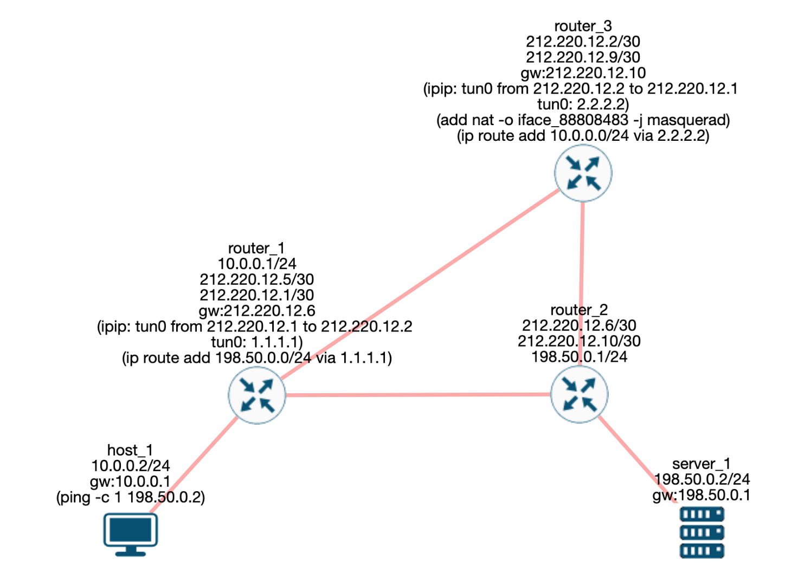

Настроенную сеть я изобразил выше (можете пройти по ссылке и посмотреть все настройки). А теперь давайте разберём по шагам, что и где будет происходить. Все изменения с пакетом, которые будут происходить на пути его следования, можно посмотреть на рисунке ниже.

.Использование IPIP туннеля и NAT.
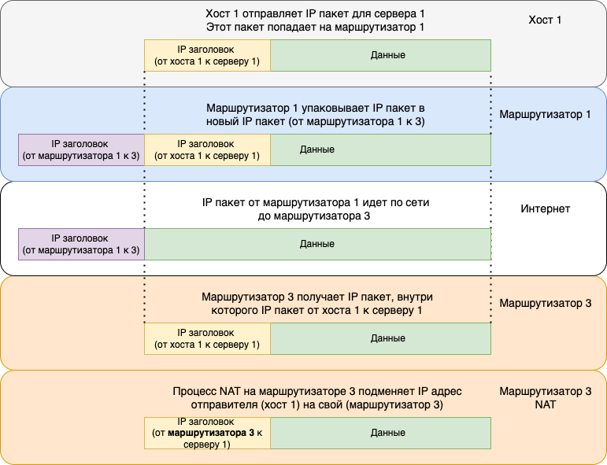

* Хост 1 (10.0.0.2) отправляет IP пакет для сервера 1 (198.50.0.2).
IP пакет от хоста 1 для сервера 1 приходит на маршрутизатор 1 и он пытается его отправить дальше.
* Маршрутизатор 1 смотрит в таблицу маршрутизации и находит запись, что IP пакеты с IP-адресом назначения из IP сети 198.50.0.0/24 нужно отправить в интерфейс 1.1.1.1. Для этого мы добавили маршрут (ip route add 198.50.0.0/24 via 1.1.1.1.)
* Интерфейс 1.1.1.1 - это виртуальный сетевой интерфейс для IPIP туннеля, который мы настроили. IPIP туннель построен от маршрутизатора 1 (212.220.12.1) до маршрутизатора 3 (212.220.12.2).
* Оригинальный IP пакет попадает в туннельный интерфейс, там к нему добавляется новый IP заголовок с IP-адресом отправителя 212.220.12.1 (маршрутизатор 1) и IP-адресом получателя 212.220.12.2 (маршрутизатор 3).
* Маршрутизатор 1 смотрит в таблицу маршрутизации и отправляет новый IP пакет на маршрутизатор 3.
* Маршрутизатор 3 получает пакет и разбирает IP заголовок. IP-адрес назначения равен одному из IP-адресов маршрутизатора 3, то пакет нужно обрабатывать.
* Маршрутизатор 3 обрабатывает IP пакет и видит, что следующий протокол снова IP (оригинальный IP пакет).
* Маршрутизатор 3 снова разбирает IP заголовок. IP-адрес назначения (198.50.0.2) не равен ни одному из IP-адресов маршрутизатора, значит, пакет нужно маршрутизировать, т.е. отправить в сеть.
* IP-адрес назначения в оригинальном IP пакете равен 198.50.0.2 (сервер 1). Маршрутизатор 3, на основании таблицы маршрутизации решает, что оригинальный IP пакет нужно отправить на маршрутизатор 2.
* На маршрутизаторе 3 настроен NAT. Его правило гласит - всем пакетам, которые отправляются в интерфейс, ведущий к маршрутизатору 2, менять IP-адрес источника на свой (212.220.12.9).
* Маршрутизатор 3 заменяет IP-адрес источника на свой (212.220.12.9) в оригинальном IP пакете и отправляет его в сеть.

Вот таким вот образом, на маршрутизатор 2 приходит IP пакет, где:

. IP-адрес источника стоит маршрутизатор 3
. IP-адрес назначения стоит сервер 1

Получив такой пакет, маршрутизатор 2 отправляет его на сервер. Как и маршрутизатор 2, сервер считает, что пакет пришёл от маршрутизатора 3.

Во время ответа от сервера 1, пакет пройдёт обратный путь:

* дойдя до маршрутизатора 3, на пакет сработает NAT, и вернёт старый IP-адрес. То есть подменит IP-адрес назначения (так как это ответный пакет) на тот, что стоял раньше, 10.0.0.2 (хост 1).
* маршрутизатор 3, посмотрев свою таблицу маршрутизации, обнаружит, что все IP пакеты до сети 10.0.0.0/24 нужно отправлять в IPIP туннель. Этот туннель ведёт до маршрутизатора 1.
* на маршрутизаторе 1 пакет появится из туннеля и будет отправлен хосту 1.

Вот таким нехитрым способом можно строить соединения от одного хоста к другому через свои маршрутизаторы/сервера.

== GRE (Generic Routing Encapsulation)

Как уже подчёркивалось, IPIP туннелирование имеет ряд недостатков. Серьёзной проблемой является то, что IPIP туннель может положить внутрь только IPv4 пакет.

Обычно для построения туннелей используется GRE протокол. GRE (Generic Routing Encapsulation — общая инкапсуляция маршрутов) -  протокол туннелирования сетевых пакетов, разработанный компанией CISCO Systems. GRE может пробрасывать IPv4/IPv6/групповой трафик, а также немаршрутизируемые протоколы: NetBios, IPX, AppleTalk.

GRE описан в https://datatracker.ietf.org/doc/html/rfc2784[RFC 2784], документ небольшой можете почитать самостоятельно. Размер GRE заголовка всего 4 байта.

.Заголовок GRE. (https://datatracker.ietf.org/doc/html/rfc2784).
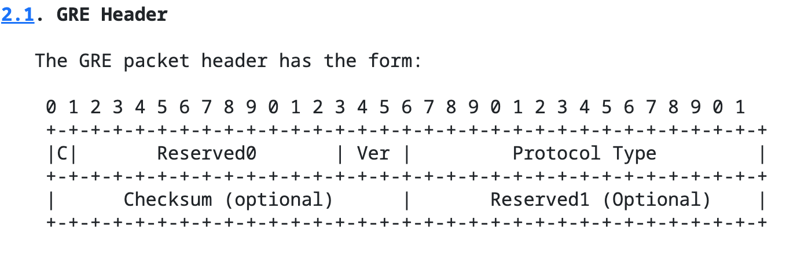

Он вставляется сразу после IP заголовка. На рисунке ниже показана схема инкапсуляции IP пакета в GRE туннель.

.Инкапсуляция в GRE.
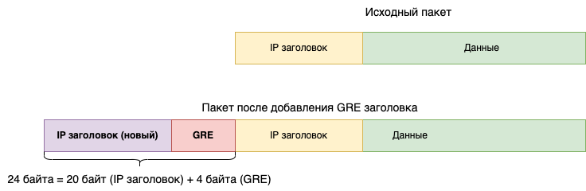

Как и IPIP туннель, GRE туннель без состояния. Это означает, что конечные точки этого туннеля не хранят состояния о том, кто на другом конце. Если вдруг один из маршрутизаторов этого туннеля выключился или стал недоступен, то второй об этом никак не узнает. GRE небезопасен, передаёт данные в том виде, в котором он их получил. GRE туннель не работает через NAT.

== Разновидности туннелей

В целом, все туннели работают по похожей схеме:

. На двух хостах (маршрутизаторах, серверах, пользовательских ПК, телефонах и т.д.) настраивается туннель.
. После настройки туннеля создаётся виртуальное сетевое устройство, куда будут отправляться пакеты.
. Добавляются маршруты в таблицу маршрутизации, чтобы отправлять в туннель не все пакеты, а только интересующие

Вот и всё.

А дальше, различные виды туннелей отличаются по функциональности. Кто-то работает поверх IP (IPIP, GRE), кто-то работает поверх протоколов транспортного уровня TCP/UDP (L2TP, OpenVPN) и работает через NAT, кто-то умеет шифровать данные, кто-то умеет ещё и проходить авторизацию, а кто-то умеет всё это.

Существует много различных способов организовать туннель от одного хоста к другому. Ниже приведу небольшой список туннелей с краткими характеристиками их работы.

== OpenVPN

Один из самых распространённых туннелей сегодня. OpenVPN - открытая свободная реализация технологии виртуальной частной сети (VPN) с открытым исходным кодом. В отличие от IPIP и GRE, OpenVPN создаёт зашифрованный канал между сервером и клиентами.

OpenVPN работает поверх транспортных протоколов TCP/UDP (по умолчанию используется https://www.iana.org/assignments/service-names-port-numbers/service-names-port-numbers.txt[порт 1194]), что даёт возможность работать через NAT. В общем случае предпочтительным является UDP, так как внутри туннеля зачастую передаются TCP сессии и передавать одну TCP сессию внутри другой не несёт в себе большого смысла.

OpenVPN предлагает два различных варианта сетевых интерфейсов: TUN и TAP.

*TUN* позволяет создавать туннели сетевого уровня, т.е. внутрь туннеля отправляется пакет вплоть до заголовка сетевого уровня.

*TAP* - для создания туннелей канального уровня, т.е. вкладывается внутрь туннеля весь пакет, включая заголовок канального уровня (Ethernet).

Также возможно использование библиотеки компрессии LZO для сжатия потока данных.

== IPsec
IPsec (сокращение от IP Security) - набор протоколов для обеспечения защиты данных, передаваемых по протоколу IP. Хоть сам по себе IPsec и не является туннелем, сложно пройти мимо и не упомянуть его.

Уточню для начала, что IPSec - это не один протокол, это стандарт, включающий в себя целых три протокола, каждый со своими функциями:

*ESP* (Encapsulating Security Payload – безопасная инкапсуляция полезной нагрузки) занимается непосредственно шифрованием данных, а также может обеспечивать аутентификацию источника и проверку целостности данных.

*AH* (Authentication Header – заголовок аутентификации) отвечает за аутентификацию источника и проверку целостности данных.

*IKE* (Internet Key Exchange protocol – протокол обмена ключами) используется для формирования IPSec SA, проще говоря, согласования работы участников защищённого соединения. Используя этот протокол, участники договариваются, какой алгоритм шифрования будет использоваться, по какому алгоритму будет производиться (и будет ли вообще) проверка целостности, как аутентифицировать друг друга.

.Туннельный и транспортный режим работы IPsec.
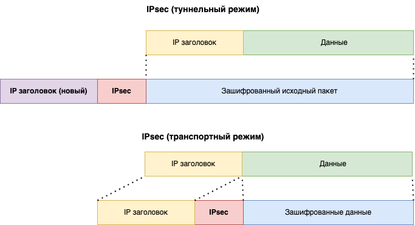

IPsec может функционировать в двух режимах: туннельном и транспортном.

В туннельном режиме шифруется весь исходный IP-пакет: данные, заголовок, а затем он вставляется в поле данных нового пакета, то есть происходит инкапсуляция. В целом, можно создавать IPsec туннели.

В транспортном режиме шифруются или подписываются только данные IP-пакета, исходный заголовок сохраняется. Транспортный режим, как правило, используется для установления соединения между хостами. Он может также использоваться между маршрутизаторами для защиты туннелей, организованных каким-нибудь другим способом (GRE).

В туннелировании IPsec часто применяется в паре с другими протоколами, чтобы обеспечивать шифрование, аутентификацию и целостность данных. Например, GRE over IPsec.

== PPTP

PPTP (Point-to-Point Tunneling Protocol) - устаревший способ создания туннелей из-за проблем с безопасностью. Описан в https://datatracker.ietf.org/doc/html/rfc2637[RFC 2637].

Создание PPTP туннеля состоит из двух частей:

. Установка управляющего TCP соединения на https://www.iana.org/assignments/service-names-port-numbers/service-names-port-numbers.txt[порт 1723] между двумя точками туннеля. Данное соединение используется для установки и управления GRE туннелем между этими же хостами.
. Создание GRE туннеля.

PPTP использует расширенный формат GRE заголовка, включающий поле Acknowledgment Number.

.Расширенный GRE заголовок в PPTP. (https://datatracker.ietf.org/doc/html/rfc2637#section-4.1)
image::images/vpn_pptp_1.png[Расширенный GRE заголовок в PPTP. (https://datatracker.ietf.org/doc/html/rfc2637#section-4.1)]

Сам GRE туннель инкапсулирует внутрь PPP пакеты, как показано на рисунке ниже.

.Инкапсуляция IP пакета в PPTP туннеле.
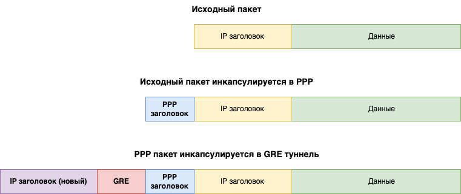

PPTP может передавать IP, NetBEUI и IPX пакеты.

== MPPE и MPPC

MPPE (Microsoft Point-To-Point Encryption Protocol) - протокол, разработанный компанией Microsoft. Позволяет организовать шифрование данных в PPTP туннеле. Более подробно можно почитать в https://datatracker.ietf.org/doc/html/rfc3078[RFC 3078]. Как правило, вместе с MPPE используется MPPC (Microsoft Point-to-Point Compression, https://datatracker.ietf.org/doc/html/rfc2118[RFC 2118]) протокол. Он занимается сжатием данных. Вместе они сжимают и шифруют данные.

== L2TP

L2TP (Layer 2 Tunneling Protocol) - туннельный протокол для построения VPN описан в https://datatracker.ietf.org/doc/html/rfc2661[RFC 2661]. В отличие от PPTP, IP и GRE, L2PT использует UDP протокол (https://www.iana.org/assignments/service-names-port-numbers/service-names-port-numbers.txt[порт 1701]) для передачи данных. Что позволяет ему работать через NAT.

Как и PPTP, L2TP передаёт PPP пакеты. Схема инкапсуляции IP пакета в L2TP туннель представлена на рисунке ниже.

.Инкапсуляция IP пакета в L2TP туннеле.
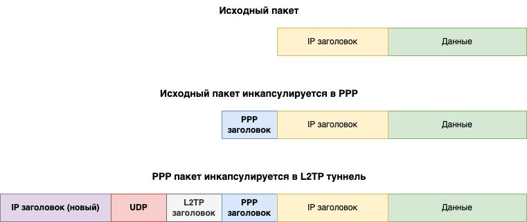

Сам по себе L2PT не предоставляет возможностей для шифрования или целостности передачи данных через публичные сети (как и IPIP или GRE). Поэтому, он часто используется вместе с IPsec. Такую связку называют L2TP/IPsec.

L2TP протокол передачи с установлением соединения. Конечные точки соединения называются LAC (L2TP access concentrator) и LNS (L2TP network server). LNS ожидает соединения от LAC. Как только соединение установлено, данные могут передаваться в обе стороны.

L2TP пакеты бывают двух видов: *управляющие* (control packets) и *информационные* (data packets). Управляющие сообщения используются для установки, при поддержании и аннулировании туннелей. Они используют надёжный управляющий канал в пределах L2TP, чтобы гарантировать доставку. Ниже проставлен формат L2TP заголовка.

.Заголовок L2TP пакета. (https://datatracker.ietf.org/doc/html/rfc2661#page-9)
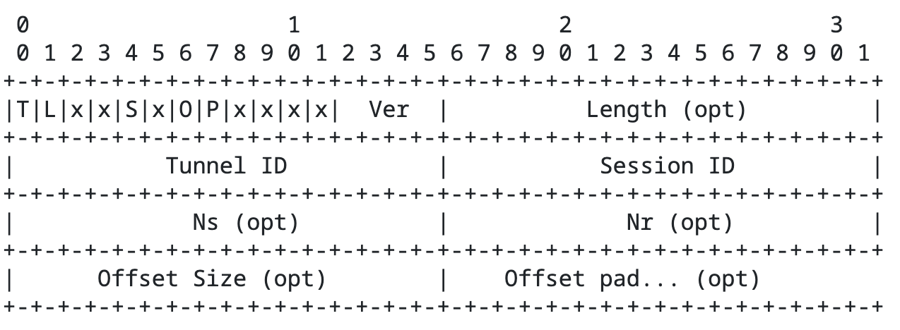

Для надёжности передачи управляющих пакетов используются поля *Ns* и *Nr*.

*Ns* - определяет порядковый номер информационного или управляющего пакета, начиная с нуля и увеличиваясь на 1 для каждого переданного пакета.

Поле *Nr* - содержит порядковый номер, который ожидается для следующего пакета. Таким образом, Nr устанавливается равным Ns последнего по порядку полученного пакета плюс 1. В информационных пакетах Nr зарезервировано и, если присутствует (это определяется S- битом), должно игнорироваться при получении.

Информационные сообщения при потере повторно не пересылаются. Восстановление потерянных пакетов с данными возлагается на протоколы транспортного уровня в инкапсулированных данных.

L2TP туннель весьма популярный:

* Может использоваться в связке с IPsec, что даст высокий уровень безопасности.
* Доступен по умолчанию на Windows, Linux, MacOS и многих других ОС.
* Довольно простой в настройке.