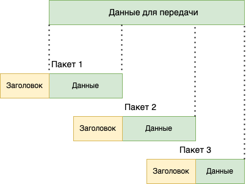

= Коммутация каналов и пакетная коммутация

В компьютерной сети все данные передаются небольшими порциями, называемыми пакетами. Такой способ передачи данных придумал Леонард Клейнрок в 1961 году и называл его пакетная коммутация. Есть два способа организации передачи информации:

* коммутация каналов
* пакетная коммутация

== Коммутация каналов

Коммутация каналов применяется обычно в телефонии. Перед тем, как передать данные от одного абонента к другому, необходимо установить соединение (т.е. позвонить). Как только соединение будет успешно установлено, можете начинать передавать данные (говорить в трубку).

.Ручной телефонный коммутатор, телефонистка за работой.
image::images/channel_switching.jpeg[Ручной телефонный коммутатор, телефонистка за работой.]

Этот способ хорошо зарекомендовал себя в телефонных сетях, где конечными точками сети являются люди. Однако, если конечными узлами сети будут компьютеры, то канальная коммутация имеет несколько явных недостатков:

. *Невозможность обмениваться данными с несколькими абонентами.* Установив канал связи с одним абонентом вы можете обмениваться данными только с ним. Если нужно отправить или получить данные от другого абонента, нужно разорвать все имеющиеся каналы и установить новый.

. *Простой ресурсов в случае молчания в сети.* Когда абоненты установили канал связи и не передают данные, то ресурсы сети просто простаивают. В то же время, никакой другой абонент не может им передать свои данные.

. *Время на установку соединения.* Каждый раз, когда один абонент хочет передать данные другому абоненту, необходимо установить соединение. Что требует определенного времени и ресурсов сети.

. Недостатком канальной коммутации является полоса пропускания и аналоговая природа этой полосы. Таким образом, что большой объем дискретных сигналов через нее не передать.

NOTE: Пакетная передача данных выросла из телеграфа именно поэтому все каналы должны быть установлены заранее.

== Коммутация пакетов

В пакетной коммутации считается, что все каналы связи уже установлены, и данные просто передаются от одного узла к другому. Перед отправкой данные разбиваются на отдельные фрагменты, называемые пакетами. Каждый пакет состоит из двух частей:

* заголовок 
* данные

.Данные разбиваются на пакеты.

Заголовок пакета всегда содержит в себе информацию о получателе и другую информацию, необходимую для успешной доставки пакета конечному адресату.

Хорошей аналогией сетевого пакета является обыкновенное письмо в конверте. Само письмо - это данные. А информация на конверте - это заголовок. Информации на конверте должно быть достаточно, чтобы доставить письмо адресату и чтобы адресат знал, от кого оно пришло.

NOTE: Все сети передачи данных растут из телеграфа, а телеграф растет из почтового сообщения. Именно поэтому и в русской и в английской терминологии все соответсвует почтовому сообщению и телефграной передачи данных.

Сравнение сетей с коммутацией каналов и пакетов (https://evileg.com/ru/post/37/)

[cols="1,1"]
|===
|Коммутация каналов |Коммутация пакетов

|Необходимо предварительно устанавливать соединение
|Отсутствует этап установления соединения

|Адрес требуется только на этапе установления соединения
|Адрес и другая служебная информация передаются с каждым пакетом

|Сеть может отказать абоненту в установлении соединения
|Сеть всегда готова принять данные от абонента

|Гарантированная пропускная способность (полоса пропускания) для взаимодействующих абонентов
|Пропускная способность сети для абонентов неизвестна, задержки передачи носят случайный характер

|Трафик реального времени передается с минимальными задержками
|Ресурсы сети используются эффективно при передаче пульсирующего трафика

|Высокая надежность передачи аналоговых данных
|Возможные потери данных из-за переполнения буферов

|Нерациональное использование пропускной способности каналов, снижающее общую эффективность сети
|Автоматическое динамическое распределение пропускной способности физического канала между абонентами

|===
