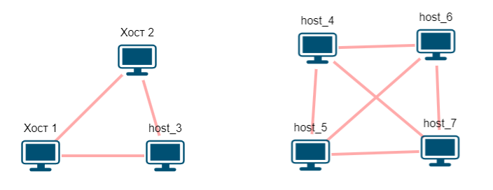
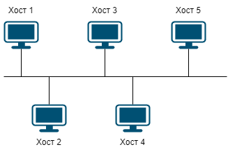
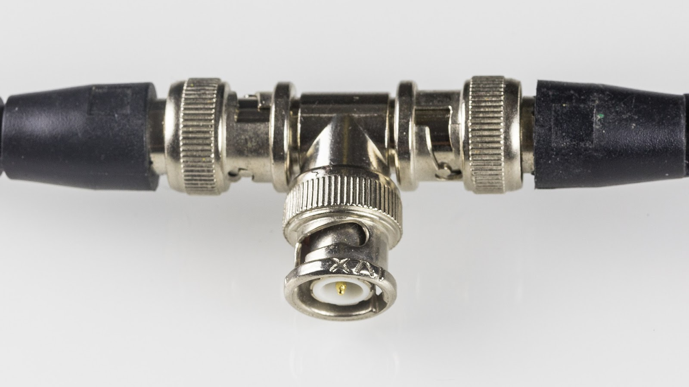
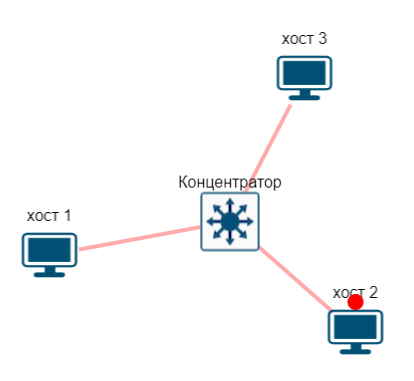

= Топологии

== Полносвязная (ячеистая)

Если мы попробуем собрать компьютерную сеть из 3, 4 хостов вооружившись только сетевой картой и проводом, то все, что мы сможем собрать:

* Полносвязная сеть
* Общая шина

.Полносвязная компьютерная сеть.

Если мы будем использовать полнодуплексное соединение (full-duplex), то в такой сети у нас не будет коллизий и скорость передачи данных для всех хостов будет постоянной.

Проблема полносвязной сети заключается в количестве сетевых карт, необходимых для подключения. Для каждого хоста нам потребуется N-1 сетевая карта. Если у вас всего 3 хоста, то вставить в один компьютер 2 сетевые карты не очень сложно. Но если ваша сеть будет насчитывать 10 хостов, то вставить 9 сетевых карт уже проблематично.

== Общая шина

Использование топологии общая шина более практичное, чем полносвязная сеть. Организации сети на базе технологии Ethernet по топологии общая шина описано в стандартах IEEE 802.3 (самый первый стандарт, он же 10BASE5) и IEEE 802.3a (он же 10BASE2). Передача данных осуществляется по полуплексному каналу (half-duplex).

.Общая шина.

Большим недостатком такой топологии является ее ненадежность. На рисунке 25 показан стандартный BNC T-коннектор. С одной стороны (слева) подключается Хост 1, с другой стороны (справа) подключается Хост 3, а ваш (например, Хост 2) подключается по центру. И таким образом сеть может организовываться дальше. И проблема тут как раз в этих подключениях. Довольно часто, по неаккуратности (пинали ногами или шваброй, во время уборки) коннекторы разъединялись, что приводило к отключению всей сети.

Предположим, у нас есть, как на рисунке. Вы, владелец хоста 3 неаккуратно пнули ногой кабель, что привело к отсоединению коннектора и выходу из строя всей сети

.10BASE2 кабель с BNC T-коннектором.

== Звезда

Для решения проблемы, когда один пользователь может намеренно или случайно сломать часть сети, придумали топологию звезда.

.Организация сети по топологии звезда.

Для организации такой топологии одних сетевых карт и проводов будет недостаточно. Потребуется сетевое оборудование - концентратор (он же репитер или хаб) или коммутатор.

На сегодняшний день это самая распространенная топология. Выход из строя одной рабочей станции не отражается на работе всей сети в целом. В отличие от общей шины, в топологии звезда более лёгкий поиск неисправностей и обрывов в сети.

Другими достоинствами такой топологии являются:

* высокая производительность сети (при условии правильного проектирования);
* гибкие возможности администрирования;
* низкая стоимость;

Простота установки и масштабируемость сделали топологию звезды единственной общей топологией.

Хороший пример такой топологии - домашняя Wi-Fi сеть. Обычно домой устанавливается Wi-Fi роутер, к которому подключаются все устройства - ноутбуки, телевизор, телефоны и так далее.

