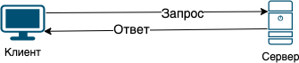
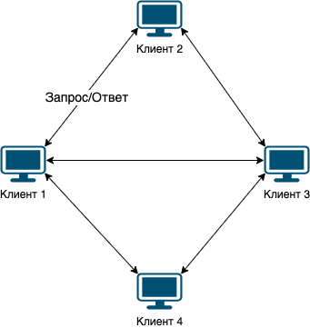

// suppress inspection "PyUnresolvedReferences" for whole file
= Архитектура сетевых приложений

== Клиент-сервер

Клиент-сервер - это такая архитектура, в которой нагрузка распределяется между поставщиком (сервер/сервис) и заказчиков (клиент) услуг. Фактически клиент и сервер — это программы, которые обычно работают на разных хостах и взаимодействуют между собой через компьютерную сеть. Но они могут быть расположены также и на одном хосте и взаимодействовать через сетевой интерфейс loopback.

Серверы ожидают от клиентских программ запросы и предоставляют им свои ресурсы в виде данных. Например, передача веб-страниц с веб-сервера или проверка новых писем на почтовом сервере. Другими словами, клиент отправляет запросы на сервер и ожидает ответа.

.Клиент-сервер.

Один сервер, как правило, может обрабатывать запросы от множества клиентов. Поэтому, сервер размещают на более производительном хосте. Из-за особой роли такого хоста в сети, специфики её оборудования и программного обеспечения, её также называют сервером, а машины, выполняющие клиентские программы, соответственно, клиентами.

Некоторые примеры клиентов и соответствующих им серверов:

[cols="1,1"]
|===
|Клиент |Сервер

|Веб-браузер (IE, Chrome, Opera, Mozilla и т.д.)
|Веб-сервер (он же HTTP сервер)

|Почтовые клиенты (Outlook, Mozilla Thunderbird, The Bat и т.д)
|Почтовый сервер (IMAP и/или POP3 сервер)

|Служба обновления Windows
|Windows Update Server

|Telegram desktop/mobile/bot
|Telegram сервер
|===

Достоинства клиент-серверной архитектуры:

* Мощный сервер дешевле множества мощных клиентских машин.
* Нет дублирования кода и данных - основной код и данные хранится на сервере. Это существенно уменьшает требования к клиенту.
* Данные хранятся на сервере, который, как правило, защищён гораздо лучше большинства клиентов. На сервере проще организовать контроль полномочий, чтобы разрешать доступ к данным только клиентам с соответствующими правами доступа.

Недостатки:

* Выход из строя сервера может сделать неработоспособными всех клиентов (неработоспособным сервером будем считать сервер, производительности которого не хватает на обслуживание всех клиентов, а также сервер, находящийся на ремонте, профилактике и т. п.). Именно по этой причине критически важные сервера часто дублируются и нагрузка между ними равномерно распределяется. Например, у Яндекс поиска, Вконтакте, mail.ru и других крупных сервисов несколько веб-серверов. Периодически, открывая их страницу в браузере, вы подключаетесь к разным серверам.
* Поддержка работы сервера требует отдельного специалиста.
* Высокая стоимость оборудования.

== Одноранговая (пиринговая, p2p)

Одноранговая (пиринговая) сеть  - сеть, основанная на равноправии участников. Часто в такой сети отсутствуют выделенные серверы, а каждый узел (peer) является и клиентом и сервером. Участников такой сети называют узлами (peer). Узлы отдают часть своих ресурсов (вычислительная мощность, дисковое хранилище, пропускная способность сети) напрямую другим участникам сети без необходимости централизованной координации со стороны серверов.

В отличие от клиент-серверной архитектуры, такая организация позволяет сохранять работоспособность сети при любом количестве и любом сочетании доступных узлов.

Примерами таких сетей являются:

* BitTorrent - во время скачивания файла вы и клиент (скачиваете кусочки файла) и сервер (раздаете уже скаченные кусочки файла другим клиентам)
* Многие криптовалюты, использующие блокчейн.

.Одноранговая (пиринговая) архитектура.

== Сервер

В архитектуре клиент-сервер под сервером обычно понимается программа, которая предоставляет какие-то услуги/ресурсы/данные. Например, веб-сервер (для просмотра веб-страниц), почтовый сервер (для приема или отправки почты), игровые сервера (для объединения игроков), ssh сервера (для безопасного соединения для удаленного администрирования), DNS сервера (для перевода имени хоста в IP-адрес) и т.д.

За каждым популярным сервером закреплен определенный порт, так называемый порт по умолчанию или хорошо известный порт. На этот порт, по умолчанию, клиент пытается устанавливать соединения. Например:

* веб-сервер (http) по умолчанию использует 80 (TCP)
* для безопасного соединения (https) веб-сервер использует порт 443 (TCP)
* ssh сервер использует порт 22 (TCP)
* почтовый сервер использует порт 25 (TCP)
* DNS сервер использует порт 53 (UDP)
* ...

Список хорошо известных портов можно посмотреть на сайте IANA - https://www.iana.org/assignments/service-names-port-numbers/service-names-port-numbers.xhtml

Конечно, никто не мешает серверу работать используя любой другой порт.