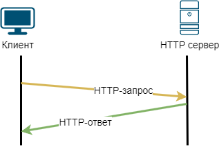

// suppress inspection "PyUnresolvedReferences" for whole file
= Сокеты

Для работы с сетью на низком уровне используются сокеты (socket). Сокет - это название программного интерфейса (API) для обеспечения обмена данными между процессами. Процессы при этом могут исполняться как на одном хосте, так и на различных.

Хорошей аналогией сокета является файловый дескриптор - некоторая абстракция, для работы с файлами в ОС. Вы можете открыть или закрыть файловый дескриптор, можете прочитать или записать туда данные и т.д.

Использование сокета у клиента немного отличается от сервера. Во время разработки сервера вы увидите эту разницу.

NOTE: Подробности по использованию сокетов в Python можно найти https://docs.python.org/3.8/library/socket.html[в официальной документации].

== TCP-клиент

Давайте напишем первого сетевого клиента, который будет подключаться к серверу miminet.ru на порт 80 (TCP), отправлять HTTP-запрос, получать HTTP-ответ и печатать содержимое ответа в консоль. Схема работы показана на рисунке ниже.

.Схема работы TCP-клиента.

NOTE: HTTP (HyperText Transfer Protocol) - протокол для коммуникации с веб-сервером. HTTP-запрос - запрос отправляемый клиентом на веб-сервер. В ответ на такой запрос веб-сервер отправляет данные (HTML страницу, JS код, картинки, видео и т.д.) или отправляет информационное сообщение.

NOTE: По умолчанию, веб-сервер для работы использует порт 80 (TCP).

Нам необходимо выполнить следующие действия:

. Создать TCP сокет.
. Подключиться к веб-серверу miminet.ru на порт 80.
. Отправить HTTP-запрос.
. Получить ответ и вывести его на экран.

[source,python]
----
#!/usr/bin/python

import socket

HOST = "miminet.ru"
PORT = 80                                               # HTTP port

ip_addr = socket.gethostbyname(HOST)                    # Get IP address by name
s = socket.socket(socket.AF_INET, socket.SOCK_STREAM)   # Create TCP socket
s.connect((ip_addr, PORT))                              # Connect to miminet.ru
s.send(b'GET / HTTP/1.0\n\n')                           # Send HTTP-request
data = s.recv(4096)                                     # Recieve data from miminet.ru
print(data)                                             # Print data to console

----

Вы можете скопировать этот код и попробовать выполнить его у себя. В результате его работы в консоль должно вывестись следующее сообщение:

[source]
----
(venv) ScrumBook:src ilya2$ python tcp-client-1.py
b'HTTP/1.1 301 Moved Permanently\r\nServer: nginx/1.25.4\r\nDate: Wed, 16 Oct 2024 08:40:37 GMT\r\nContent-Type: text/html\r\nContent-Length: 169\r\nConnection: close\r\nLocation: https://miminet.ru/\r\n\r\n<html>\r\n<head><title>301 Moved Permanently</title></head>\r\n<body>\r\n
<h1>301 Moved Permanently</h1>
\r\n

nginx/1.25.4
\r\n</body>\r\n</html>\r\n'
----

Я постарался прокомментировать каждую строку, но давайте подробней  разберем, что мы делаем и что происходит

[source,python]
----
import socket
----

Импортируем модуль socket. Как раз он нам позволит работать с сокетами.

[source,python]
----
ip_addr = socket.gethostbyname(HOST)
----

Для создания TCP соединения необходимо знать IP-адрес хоста и порт, на который мы хотим подключиться. Пока мы знаем только имя хоста miminet.ru и порт 80. Функция gethostbyname позволяет по имени определить IP-адрес хоста. Т.е. по имени miminet.ru она вернет IP-адрес хоста. Сохраним его в переменную ip_addr.

[source,python]
----
s = socket.socket(socket.AF_INET, socket.SOCK_STREAM)
----

Данный код создает TCP сокет и сохраняет его в переменную ``s``. Функция ``socket`` позволяет создавать не только TCP или UDP сокеты. Она принимает два обязательных параметра:

* socket.AF_INET - когда мы хотим открыть сокет из семейства протоколов TCP/IP
* socket.SOCK_STREAM - для создания TCP-сокета.

И так, сокет создан, IP-адрес и порт известны, можем подключаться.

[source,python]
----
s.connect((ip_addr, PORT))
----

Функция ``connect`` устанавливает TCP соединения (3-х разовое рукопожатие SYN, SYN+ACK, ACK) на заданный IP-адрес и порт. Обратите внимание, что функция ``connect`` принимает только один порт - это порт назначения. Т.е. порт, на который мы устанавливаем соединение. У клиентов (тот кто инициирует установку соединения) порт источника выбирается случайным образом.

[source,python]
----
s.send(b'GET / HTTP/1.0\n\n')
----

Функция ``send`` отправляет данные в установленное TCP соединение. В данном случае мы отправили HTTP-запрос на веб-сервер miminet.ru. HTTP - это текстовый протокол, поэтому, запрос можно написать прямым текстом. Два подряд идущие перевода строки ``\n\n`` означают окончание HTTP-запроса. В этом HTTP-запросе мы хотим получить главную страницу miminet.ru.

[source,python]
----
data = s.recv(4096)
----

Получаем данные из сокета. Функция ``recv`` по умолчанию работает в блокирующем режиме. Это означает, что вызвав эту функцию программа будет ожидать, пока не придут данные. Так как заранее не известно, сколько данных придет, указал 4096 байт. Если данных придет меньше, вернут их, если придет больше, вернут не более 4096 байт. Полученные данные сохраняем в переменную ``data``.

[source,python]
----
print(data)
----

Печатаем полученные данные в консоль.

NOTE: На самом деле можно опустить вызов функции ``gethostbyname``, так как функция ``connect`` может самостоятельно по имени определить IP адрес. Я решил оставить ``gethostbyname`` для наглядности.

== Обработка ошибок

Код из примера выше годится только для примера. Не трудно заметить, что там нет обработки ошибок. Давайте добавим обработку ошибок и посмотрим, что может пойти не так.

[source,python]
----
#!/usr/bin/python

import socket

HOST = "miminet.ru"
PORT = 80

s = socket.socket(socket.AF_INET, socket.SOCK_STREAM)

try:
    s.connect((HOST, PORT))
    s.send(b'GET / HTTP/1.0\n\n')
    data = s.recv(4096)
    print(data)
except Exception as e:
    print ("Socket error: " + str(e))
----

=== Ошибка преобразования имени в IP адрес

Попробуем вместо имени хоста miminet.ru подставить несуществующее имя, например, miminet.rus.

[source,python]
----
HOST = "miminet.rus"
----

Для этого изменим имя хоста в переменной HOST и запустим наш код. В результате мы получим ошибку:

[source,console]
----
(venv) ScrumBook:src ilya2$ python tcp-client-2-hostname.py
Socket error: [Errno 8] nodename nor servname provided, or not known
----

Она означает, что нам не удалось по имени хоста определить IP-адрес. Дальнейшая установка соединения бессмысленно, так как мы не знаем IP-адрес хоста.

NOTE: Для воспроизведения следующих ошибок верните имя в переменной HOST обратно на miminet.ru

=== Ошибка подключения

Для воспроизведения ошибки подключения поменяем переменную PORT c 80 на 81 (можно и 81 и многие другие порты, которые закрыты). Запустим наш код и увидим ошибку подключения:

[source,console]
----
(venv) ScrumBook:src ilya2$ python tcp-client-2-port81.py
Socket error: [Errno 61] Connection refused
----

Данная ошибка сообщает, что на удаленной стороне нет программы, которая готова работать на указанном порту. В моем случае - это порт 81. Нет смысла продолжать выполнять программу и пытаться отправить данные. Ошибка появляется, когда во время установки TCP соединения клиент получает пакет с флагом RST. Из хорошего, данная ошибка появляется быстро. Т.е. наш хост отправил SYN пакет, в ответ получил RST и сообщил об этом нам.

А теперь попробуем установить TCP соединение на порт, который не будет отвечать пакетом с флагом RST. Посмотрим, как себя поведет наша программа. Для этого на сервере miminet.ru настроен фаервол, который отбрасывает все входящие TCP пакеты с портом назначения равным 8000.

Поменяем переменную PORT на 8000 и запустим нашу программу. После длительного ожидания появляется ошибка:

[source,console]
----
(venv) ScrumBook:src ilya2$ python tcp-client-2-port8000-1.py
Socket error: [Errno 60] Operation timed out
----

Ошибка означает, что не удалось установить TCP соединение. Такую ошибку можно наблюдать, когда пакеты по какой-то причине не доходят до сервера. Либо они блокируются фаерволом, либо сервер просто выключен.

Это неприятная ошибка! Сокет и все его функции, включая ``connect``, по умолчанию работают в блокирующем режиме. Это когда программа вызывает функцию и ждет, пока эта функция не завершит свою работу. И когда пакеты во время установки соединения вот так теряются, то вся программа зависает. В моем случае программа зависла на 75 секунд.

[source,console]
----
(venv) ScrumBook:src ilya2$ time python tcp-client-2-port8000-1.py
Socket error: [Errno 60] Operation timed out

real    1m15.779s
user    0m0.028s
sys     0m0.012s
----

NOTE: Если у вас Linux или MacOS, то для замера времени исполнения программы, перед запуском напишите time. Общее время исполнения программы будет отображаться в строке real.

Чтобы решить проблему с подвисанием, можно запустить работу с сокетом в отдельном потоке. Но, даже в отдельном потоке установка соединения может происходить аж 70 секунд. Это очень долго! Современные сети работают на много быстрей, чтобы ждать столько времени перед тем, как будет принято решение о невозможности установить соединение. Для уменьшения таймаута воспользуемся функцией ``settimeout``.

[source,python]
----
s = socket.socket(socket.AF_INET, socket.SOCK_STREAM)
s.settimeout(5)
----

Сразу после создания сокета установим таймаут на блокирующие операции в 5 секунд. Теперь функция ``connect`` ожидает всего 5 секунд, после чего сообщает об ошибке и завершает свою работу.

[source,console]
----
(venv) ScrumBook:src ilya2$ time python tcp-client-2-port8000-2.py
Socket error: timed out

real    0m5.055s
user    0m0.032s
sys     0m0.013s
----

NOTE: Установка таймаута в 0 переведет сокет в неблокирующий режим. В этом случае нужно будет поменять схему работы с сокетом. Об этом будет подробней рассказано дальше по курсу.

При работе с сокетом я всегда рекомендую уменьшать таймауты до приемлемого значения. Современные компьютерные сети позволяют на много быстрей определить невозможность установки соединения и сообщить об этом.

=== Обработка отправки данных (send)

Функция ``send`` обычно отрабатывает без сбоя. Но вот что стоит о ней знать! Когда вы вызываете send, то данные не передаются приложению на другом конце сокета. Функция send только помещает данные в буфер для отправки. И все.

После того как функция ``send`` поместила данные на отправку, соединение может быть уже разорвано и, соответственно, никакие данные никуда не будут переданы. Учтите этот момент!

=== Обработка получения данных (recv)

Функция ``recv`` принимает один обязательный аргумент - это максимальное количество байт, которое можно вернуть. В случае ошибки функция ``recv`` вернёт 0 байт данных. Это будет означать, что соединение было закрыто и от туда больше ничего не может быть получено.

Особо внимание стоит обратить на работу функции ``recv``. Функция recv - блокирующая функция и она будет ожидать данные вечно (либо пока соединение не будет закрыто). Теоретически, вызвав ``recv`` вы можете вечно ожидать, пока она что-то вернет.

Чтобы воспроизвести проблему с ``recv`` изменим наш код на следующий:

[source,python]
----
#!/usr/bin/python

import socket

HOST = "miminet.ru"
PORT = 80

s = socket.socket(socket.AF_INET, socket.SOCK_STREAM)
s.settimeout(5)

try:
    s.connect((HOST, PORT))
    data = s.recv(4096)
    print(data)
except Exception as e:
    print ("Socket error: " + str(e))
----

В этом коде мы убрали отправку HTTP-запроса (``s.send``) и сразу ожидаем данные. Запустите этот код. Программа будет ожидать данные до тех пор, пока сокет не будет закрыт или пока не истечет таймаут.

[source,console]
----
(venv) ScrumBook:src ilya2$ time python tcp-client-2-recv.py
Socket error: timed out

real    0m5.079s
user    0m0.028s
sys     0m0.011s
----

В этом случае ожидание длилось 5 секунд - время установленного таймаута.

=== TCP-клиент с обработкой ошибок

Давайте посмотрим, как будет выглядеть наш TCP-клиент с обработкой указанных ошибок:

[source,python]
----
#!/usr/bin/python

import socket

HOST = "miminet.ru"
PORT = 80

s = socket.socket(socket.AF_INET, socket.SOCK_STREAM)
s.settimeout(5)

try:
    s.connect((HOST, PORT))
    s.send(b'GET / HTTP/1.0\n\n')
    data = s.recv(4096)

    if not data:
        raise RuntimeError("socket connection broken")

    print(data)
except Exception as e:
    print ("Socket error: "+str(e))
----

[source,python]
----
s.settimeout(5)
----

Чтобы не ждать слишком долго блокирующих операций (при невозможности установить соединение и когда нечего читать в буфере приема).

[source,python]
----
    if not data:
        raise RuntimeError("socket connection broken")
----

Проверяем результат работы функции ``recv`` и в случае ошибки сообщаем, что соединение было закрыто.

В целом, уже не плохо!

Правда, проблема с ``recv`` до конца не решена. Если данные не поступят, то ``recv`` будет их ждать 5 секунд.

== Проверка доступности данных (select)

Можно работу с сокетами выделить в отдельный поток (``thread``) и не переживать о блокировке кода. Но, это перенос проблемы из одного места в другое. Для решения данной проблемы используется функция ``select`.

Функция ``select`` позволяет проверить наличия данных в буфере, что дает возможность вызывать ``recv`` только тогда, когда буфер не пуст и избегать ненужных ожиданий. Ниже представлен код с использованием ``select``

[source,python]
----
##!/usr/bin/python

import socket
import select

HOST = "miminet.ru"
PORT = 80

s = socket.socket(socket.AF_INET, socket.SOCK_STREAM)
s.settimeout(5)

try:
    s.connect((HOST, PORT))
    s.send(b'GET / HTTP/1.0\n\n')

    rdy = select.select([s], [], [], 2)
    if not rdy[0]:
        raise RuntimeError("no response")

    data = s.recv(4096)

    if not data:
        raise RuntimeError("socket connection broken")

    print(data)

except Exception as e:
    print ("Socket error: "+str(e))
----

Функция select принимает 4 аргумент:

* список дескрипторов, готовых для чтения
* список дескрипторов, готовых для записи
* список дескрипторов которые в исключительном состоянии (exceptional condition)
* время ожидания (float)

[source,python]
----
    rdy = select.select([s], [], [], 2)
    if not rdy[0]:
        raise RuntimeError("no response")
----

Как и многие другие функции, ``select`` - блокирующая функция. Код выше означает - жать 2 секунды или пока в сокете ``s`` не появятся данные для чтения.

Проверка нужна для того, чтобы определить, функция ``select`` завершилась по таймауту  (2 секунды) или появились данные для чтения.

NOTE: функция select работает с дескрипторами и ей все равно, это сокет, файловый дескриптор или дескриптор для ввода/вывода с консоли.

Таким образом, у нас получился следующий TCP-клиент:

* если все хорошо, то все хорошо
* если невозможно установить TCP соединение, сразу сообщаем об этом
* если TCP соединение не устанавливается 5 секунд (вместо 70), прекращаем работу с ошибкой
* если данные не приходят в ответ на запрос, ждем 2 секунды (вместо 5) и прекращаем работу.

Это уже на много лучше того, что было изначально.

NOTE: Вся сила функции ``select`` совсем не в том, что мы ждем всего 2 секунды. Она раскрывается при работе с множеством сокетов. Что бы для каждого сокета не выделять отдельный поток, используя ``select`` всю работу можно организовать в одном потоке.

== UDP-клиент

UDP-клиент во многом очень похож на TCP-клиент. Напишем программу, которая узнает точное время от одного из серверов времени. Для работы с сервером времени используется UDP протокол.

NOTE: Для синхронизации времени ОС используют SNTP (Simple Network Time Protocol) протокол. Сервер SNTP использует для работы порт 123 (UDP). SNTP работает по схеме запрос-ответ. Клиент отправляет запрос на сервер, а в ответ получает информацию о точном времени.

[source,python]
----
import socket
import struct
import time
import select

NTP_SERVER = "2.ru.pool.ntp.org"
PORT = 123
TIME1970 = 2208988800

client = socket.socket(socket.AF_INET, socket.SOCK_DGRAM)

data = '\x1b' + 47 * '\0'

try:
    client.sendto( data.encode('utf-8'), (NTP_SERVER, PORT))
    rdy = select.select([client], [], [], 0.9)

    if not rdy[0]:
        raise RuntimeError("socket recv broken")

    data, address = client.recvfrom(1024)

    if data:
        print ('Response received from:', address)
        t = struct.unpack( '!12I', data )[8]
        t -= TIME1970
        print ('\tTime=%s' % time.ctime(t))
except Exception as e:
    print ("Socket error: " + str(e))
----

Нам необходимо выполнить следующие действия:

. Создать UDP сокет.
. Отправить запрос на SNTP сервер.
. Получить ответ, достать полученное время и вывести его на экран.

Обратите внимание, в отличие от TCP-клиента у UDP-клиента нет необходимости устанавливать соединение. Как мы знаем, UDP протокол не поддерживает их.

[source,python]
----
NTP_SERVER = "2.ru.pool.ntp.org"
PORT = 123
TIME1970 = 2208988800
----

Переменные NTP_SERVER и PORT содержат имя сервера и порт, на который мы будем отправлять SNTP запрос. Переменная TIME1970 содержит количество секунд прошедших с 1 Января 1900 года по 1 Января 1970 года.

[source,python]
----
client = socket.socket(socket.AF_INET, socket.SOCK_DGRAM)
----

Создание UDP-сокета. Когда мы создавали TCP-сокет, то вторым параметром указывали socket.SOCK_STREAM, для создания UDP-сокета нужно указать socket.SOCK_DGRAM.

[source,python]
----
data = '\x1b' + 47 * '\0'
----

Запрос, который мы будем отправлять на SNTP сервер. Не суть, что именно означает такой запрос. Пока главное понять, что SNTP сервер получив такой запрос сформирует и отправит SNTP-ответ, в котором будет указано точное время.

NOTE: Более подробно про формат SNTP-пакета можно почитать в https://www.rfc-editor.org/rfc/rfc1769#page-5[RFC 1769].

[source,python]
----
client.sendto( data.encode('utf-8'), (NTP_SERVER, PORT))
----

Функция ``sendto`` используется для отправки данных по UDP. Она принимает второй аргумент аналогичный тому, который принимает функция ``connect`` при установке TCP-соединения - это имя сервера или его IP-адрес и порт назначения. Еще раз обратите внимание,  перед отправкой данных по UDP соединение не устанавливается.

Отсутствие установки соединения приводит к тому, что после создания UDP-сокета нельзя вызывать функция ``recv`` или её аналог. На какой входящий порт ожидать UDP-пакет? А когда мы вызовем функцию ``sendto``, то ОС отправит пакет на заданный IP-адрес и порт, а порт источника выберет случайным образом. И именно после этого момента можно будет вызывать функции для получения данных. Теперь, если придет UDP пакет на наш случайно выбранный порт и IP-адрес и порт источника, при этому, будут идентичны тем, что мы указали при sendto - то ОС передаст нам пакет на обработку.

[source,python]
----
rdy = select.select([client], [], [], 0.9)

    if not rdy[0]:
        raise RuntimeError("socket recv broken")
----

UDP - ненадежный протокол передачи данных. Отправив запрос на SNTP сервер не факт, что он дойдет. И еще нет уверенности в том, что ответ не потеряется. Поэтому, есть не малая вероятность вызывать функцию чтения из сокета и зависнуть там на долго. Мы уже знакомы с ``select``, поэтому воспользуемся этой функцией для проверки доступности данных в буфере на чтение.

Я намеренно установил время ожидания менее 1 секунды, чтобы показать такую возможность. Некоторые разработчик, когда им нужно подождать, например, 0.5 секунды, пишут ``select([], [], [], 0.5)``.

[source,python]
----
data, address = client.recvfrom(1024)
----

Функция ``recvfrom`` аналогична ``recv``, только еще возвращает пару IP-адрес и порт источника.

[source,python]
----
    if data:
        print ('Response received from:', address)
        t = struct.unpack( '!12I', data)[8]
        t -= TIME1970
        print ('\tTime=%s' % time.ctime(t))
----

Проверяем, есть ли данные в полученном пакете. Если есть:

* печатаем IP-адрес и порт источника
* достаем из SNTP пакета время с сервера (кому интересно, смотрите подробности в https://www.rfc-editor.org/rfc/rfc1769#page-5[RFC 1769])
* вычитаем из времени 70 лет. SNTP сервер считает время в секундах от 1 Января 1900 года, а модуль ``time`` ожидает, что на вход поступит количество секунд прошедших с 1 Января 1970 года. Поэтому нужно из времени от SNTP сервера вычесть 70 лет.
* печатаем время в консоль.

Результат работы программы представлен ниже:

[source,console]
----
(venv) ScrumBook:src ilya2$ python udp-client-1.py
Response received from: ('192.36.143.130', 123)
        Time=Wed Oct 16 17:50:43 2024
----

NOTE: Если у вас в нашем примере очень часто не приходят пакеты от сервера времени, попробуйте поменять его на 3.ru.pool.ntp.org или 1.ru.pool.ntp.org.
