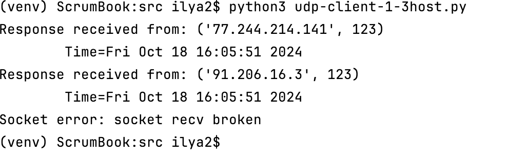
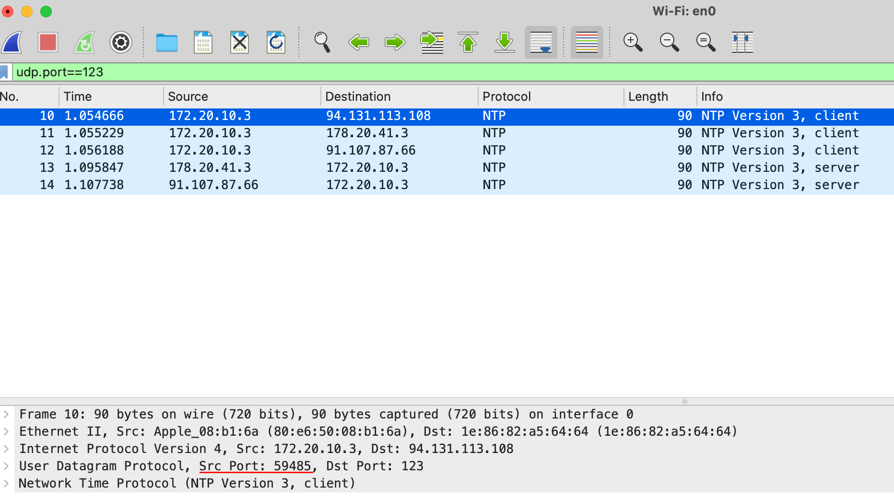
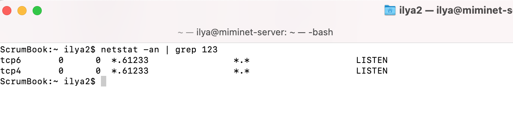
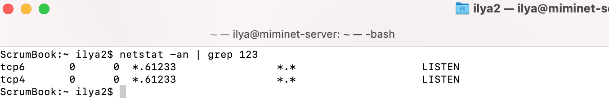
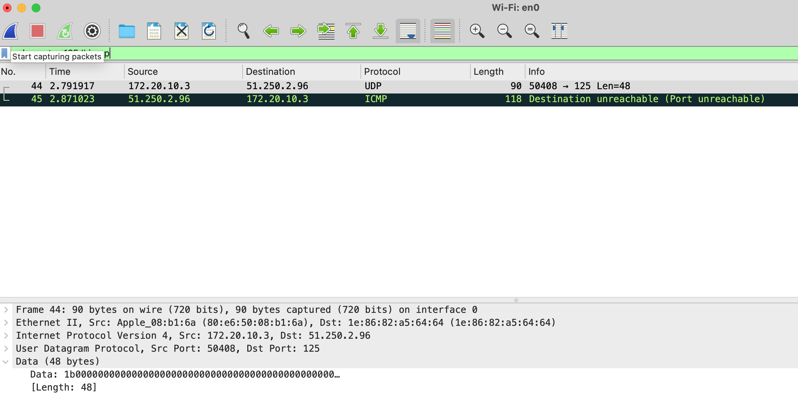

// suppress inspection "PyUnresolvedReferences" for whole file
= UDP-клиент

UDP-клиент во многом очень похож на TCP-клиент. Напишем программу, которая узнает точное время от одного из серверов времени. Для работы с сервером времени используется UDP протокол.

NOTE: Для синхронизации времени ОС используют SNTP (Simple Network Time Protocol) протокол. Сервер SNTP использует для работы порт 123 (UDP). SNTP работает по схеме запрос-ответ. Клиент отправляет запрос на сервер, а в ответ получает информацию о точном времени.

[source,python]
----
import socket
import struct
import time
import select

NTP_SERVER = "2.ru.pool.ntp.org"
PORT = 123
TIME1970 = 2208988800

client = socket.socket(socket.AF_INET, socket.SOCK_DGRAM)

data = '\x1b' + 47 * '\0'

try:
    client.sendto( data.encode('utf-8'), (NTP_SERVER, PORT))
    rdy = select.select([client], [], [], 0.9)

    if not rdy[0]:
        raise RuntimeError("socket recv broken")

    data, address = client.recvfrom(1024)

    if data:
        print ('Response received from:', address)
        t = struct.unpack( '!12I', data )[8]
        t -= TIME1970
        print ('\tTime=%s' % time.ctime(t))
except Exception as e:
    print ("Socket error: " + str(e))
----

Необходимо выполнить следующие действия:

. Создать UDP сокет.
. Отправить запрос на SNTP сервер.
. Получить ответ, достать полученное время и вывести его на экран.

Обратите внимание, в отличие от TCP-клиента у UDP-клиента нет необходимости устанавливать соединение. Как мы знаем, UDP протокол не поддерживает их.

[source,python]
----
NTP_SERVER = "2.ru.pool.ntp.org"
PORT = 123
TIME1970 = 2208988800
----

Переменные NTP_SERVER и PORT содержат имя сервера и порт, на который мы будем отправлять SNTP запрос. Переменная TIME1970 содержит количество секунд прошедших с 1 Января 1900 года по 1 Января 1970 года.

[source,python]
----
client = socket.socket(socket.AF_INET, socket.SOCK_DGRAM)
----

Создание UDP-сокета. Когда мы создавали TCP-сокет, то вторым параметром указывали socket.SOCK_STREAM, для создания UDP-сокета нужно указать socket.SOCK_DGRAM.

[source,python]
----
data = '\x1b' + 47 * '\0'
----

Запрос, который мы будем отправлять на SNTP сервер. Не суть, что именно означает такой запрос. Пока главное понять, что SNTP сервер получив такой запрос сформирует и отправит SNTP-ответ, в котором будет указано точное время.

NOTE: Более подробно про формат SNTP-пакета можно почитать в https://www.rfc-editor.org/rfc/rfc1769#page-5[RFC 1769].

[source,python]
----
client.sendto( data.encode('utf-8'), (NTP_SERVER, PORT))
----

Функция ``sendto`` используется для отправки данных по UDP. Она принимает второй аргумент аналогичный тому, который принимает функция ``connect`` при установке TCP-соединения - это имя сервера или его IP-адрес и порт назначения. Еще раз обратите внимание,  перед отправкой данных по UDP соединение не устанавливается.

Отсутствие установки соединения приводит к тому, что после создания UDP-сокета нельзя вызывать функция ``recv`` или её аналог. На какой входящий порт ожидать UDP-пакет? А когда мы вызовем функцию ``sendto``, то ОС отправит пакет на заданный IP-адрес и порт, а порт источника выберет случайным образом. И именно после этого момента можно будет вызывать функции для получения данных. Теперь, если придет UDP пакет на наш случайно выбранный порт и IP-адрес и порт источника, при этому, будут идентичны тем, что мы указали при sendto - то ОС передаст нам пакет на обработку.

[source,python]
----
rdy = select.select([client], [], [], 0.9)

    if not rdy[0]:
        raise RuntimeError("socket recv broken")
----

UDP - ненадежный протокол передачи данных. Отправив запрос на SNTP сервер не факт, что он дойдет. И еще нет уверенности в том, что ответ не потеряется. Поэтому, есть не малая вероятность вызывать функцию чтения из сокета и зависнуть там на долго. Мы уже знакомы с ``select``, поэтому воспользуемся этой функцией для проверки доступности данных в буфере на чтение.

Я намеренно установил время ожидания менее 1 секунды, чтобы показать такую возможность. Некоторые разработчик, когда им нужно подождать, например, 0.5 секунды, пишут ``select([], [], [], 0.5)``.

[source,python]
----
data, address = client.recvfrom(1024)
----

Функция ``recvfrom`` аналогична ``recv``, только еще возвращает пару IP-адрес и порт источника.

[source,python]
----
    if data:
        print ('Response received from:', address)
        t = struct.unpack( '!12I', data)[8]
        t -= TIME1970
        print ('\tTime=%s' % time.ctime(t))
----

Проверяем, есть ли данные в полученном пакете. Если есть:

* печатаем IP-адрес и порт источника
* достаем из SNTP пакета время с сервера (кому интересно, смотрите подробности в https://www.rfc-editor.org/rfc/rfc1769#page-5[RFC 1769])
* вычитаем из времени 70 лет. SNTP сервер считает время в секундах от 1 Января 1900 года, а модуль ``time`` ожидает, что на вход поступит количество секунд прошедших с 1 Января 1970 года. Поэтому нужно из времени от SNTP сервера вычесть 70 лет.
* печатаем время в консоль.

Результат работы программы представлен ниже:

[source,console]
----
(venv) ScrumBook:src ilya2$ python udp-client-1.py
Response received from: ('192.36.143.130', 123)
        Time=Wed Oct 16 17:50:43 2024
----

NOTE: Если у вас в нашем примере очень часто не приходят пакеты от сервера времени, попробуйте поменять его на 3.ru.pool.ntp.org или 1.ru.pool.ntp.org.

== Отправка на несколько хостов

Когда мы вызываем функцию ``recvfrom``, то помимо самих данных приходит информация об отправителе. В частности, IP-адрес и порт отправителя.

Может показаться - зачем, ведь мы помним, кому мы отправили данные? Дело в том, что UDP-сокет позволяет отправлять данные разным клиентам и на разные порты. Давайте перепишем наш UDP-клиент таким образом, чтобы он отправлял данные сразу на 3 разных сервера времени:

* 1.ru.pool.ntp.org
* 2.ru.pool.ntp.org
* 3.ru.pool.ntp.org

[source,python]
----
import socket
import struct
import time
import select

NTP_SERVER1 = "1.ru.pool.ntp.org"
NTP_SERVER2 = "2.ru.pool.ntp.org"
NTP_SERVER3 = "3.ru.pool.ntp.org"
PORT = 123
TIME1970 = 2208988800

client = socket.socket(socket.AF_INET, socket.SOCK_DGRAM)

data = '\x1b' + 47 * '\0'

try:
    client.sendto( data.encode('utf-8'), (NTP_SERVER1, PORT))
    client.sendto( data.encode('utf-8'), (NTP_SERVER2, PORT))
    client.sendto( data.encode('utf-8'), (NTP_SERVER3, PORT))

    for i in range(3):
        rdy = select.select([client], [], [], 0.9)

        if not rdy[0]:
            raise RuntimeError("socket recv broken")

        data, address = client.recvfrom(1024)

        if data:
            print ('Response received from:', address)
            t = struct.unpack( '!12I', data)[8]
            t -= TIME1970
            print ('\tTime=%s' % time.ctime(t))

except Exception as e:
    print ("Socket error: " + str(e))
----

Запустим код. У меня далеко не всегда удавалось получить 3 ответа, а вот 2 два ответа получаю регулярно.

.Результат отправки SNTP-запроса на 3 различных SNTP-сервера.

Если посмотреть пакеты в сниффере (например, в Wireshark), то мы обнаружим, что все запросы отправились с одного UDP порта. У меня это 59 485, как показано на рисунке ниже.

.Результат работы Wireshark.

В коде мы сразу отправляем 3 SNTP-запроса разным хостам с использованием функции ``sendto``. А раз мы отправили 3 запроса, то ожидаем 3 ответа. Не факт, что все они придут, но мы их ждем! Это означает, что на наш UDP порт (в данном случае 59 485) может прийти три SNTP-ответа (от 1.ru.pool.ntp.org, 2.ru.pool.ntp.org и от 3.ru.pool.ntp.org).

[source,python]
----
    for i in range(3):
        rdy = select.select([client], [], [], 0.9)

        if not rdy[0]:
            raise RuntimeError("socket recv broken")

        data, address = client.recvfrom(1024)

        if data:
            print ('Response received from:', address)
            t = struct.unpack( '!12I', data)[8]
            t -= TIME1970
            print ('\tTime=%s' % time.ctime(t))
----

Поэтому в цикле вызываем функцию ``select`` и ждем ответа. Если ответ пришел, выводим информацию об отправителе и его точно время. А если ответ не пришел, вызываем исключение.

UDP-сокет позволяет отправлять пакеты множеству хостов и затем получать от них ответы.

== UDP-клиент и метод connect

Как известно, протокол UDP не устанавливает соединения и не заботится о надежной доставке данных. Поэтому, при работе с UDP-сокетом, обычно, вызов метода ``connect`` не производится.

При вызове метода ``sendto`` указывается IP-адрес и порт, на который нужно отправить данные. И именно в этот момент наша ОС выбирает порт источника, который будет указан в UDP-пакете. И даже в этот момент никакого соединения не устанавливается.

Чтобы в этом убедиться, проведем эксперимент - перед вызовом ``sendto`` вызовем функцию ``sleep`` из модуля time. Вызов функции ``sleep`` заставит программу уснуть на указанное число секунд, в моем случае, это 20. А в этом время мы посмотрим состояние наших сокетов используя утилиту ``netstat``

[source,python]
----
import socket
import struct
import time
import select

NTP_SERVER = "2.ru.pool.ntp.org"
PORT = 123
TIME1970 = 2208988800

client = socket.socket(socket.AF_INET, socket.SOCK_DGRAM)

data = '\x1b' + 47 * '\0'

try:
    time.sleep(20)
    client.sendto( data.encode('utf-8'), (NTP_SERVER, PORT))
    rdy = select.select([client], [], [], 0.9)

    if not rdy[0]:
        raise RuntimeError("socket recv broken")

    data, address = client.recvfrom(1024)

    if data:
        print ('Response received from:', address)
        t = struct.unpack( '!12I', data)[8]
        t -= TIME1970
        print ('\tTime=%s' % time.ctime(t))
except Exception as e:
    print ("Socket error: " + str(e))
----

Запустим программу, и пока она спит, посмотрим список открытых соединений на нашем хосте.

NOTE: Если у вас ОС Linux или MacOS, то список открытых соединений можно посмотреть командой netstat -an. Если у вас Windows, то наберите в консоли netstat -n

У меня на хосте (MacOS) очень много открытых соединений и чтобы не искать нужное, я отфильтрую их по строке 123 командой ``grep``. Фильтрация происходит по 123, так как именно на этот UDP порт мы отправляем SNTP-запросы.

.Вывод команды netstat в MacOS

Как видно, никаких открытых соединений. А теперь давайте вызовем функцию sleep после функции ``sendto``.

[source,python]
----
try:
    client.sendto( data.encode('utf-8'), (NTP_SERVER, PORT))
    time.sleep(2)
    rdy = select.select([client], [], [], 0.9)
----

На этот раз поспим всего 2 секунды. Снова выполним программу и пока она спит, быстро посмотрим список открытых соединений.

.Вывод команды netstat в MacOS

Вывод команды ``netstat`` оказался аналогичным первому, никаких открытых соединений нет. Это логично, ведь UDP не открывает соединения, а когда мы отправляем данные с помощью функции ``sendto``, то ОС просто запоминает IP-адрес и порт назначения и выбранный случайным образом порт источника.

А вот если вызывать метод ``connect`` на UDP сокет, то ОС:

* сразу выделит порт источника для будущих UDP-пакетов
* добавит к сокету состояние соединения (установлено)

Соединение будет считаться установленным, так как для его установки не требуется отправка каких-либо пакетов.

Зачем это нужно?

Хоть это и не главное достоинство, но после вызова функции ``connect`` на UDP можно вызывать функции ``send`` и ``recv`` вместо ``sendto`` и ``recvfrom``.

[source,python]
----
import socket
import struct
import time
import select

NTP_SERVER = "3.ru.pool.ntp.org"
PORT = 123
TIME1970 = 2208988800

client = socket.socket(socket.AF_INET, socket.SOCK_DGRAM)

data = '\x1b' + 47 * '\0'

try:
    client.connect((NTP_SERVER, PORT))
    client.send( data.encode('utf-8'))

    rdy = select.select([client], [], [client], 0.9)

    if not rdy[0]:
        raise RuntimeError("socket recv broken")

    data = client.recv(1024)

    if data:
        t = struct.unpack( '!12I', data)[8]
        t -= TIME1970
        print ('\tTime=%s' % time.ctime(t))
except Exception as e:
    print ("Socket error: " + str(e))
----

Запустив код мы увидим, что он работает нормально. Если SNTP-ответ доходит до нас, то мы просто печатает точно время, как обычно. А если нет, то получаем сообщение об ошибке.

Теперь с UDP сокетом можно работать также, как и с TCP. Если вы не собираетесь в рамках одного сокета работать с несколькими хостами, то смело вызывайте функцию ``connect`` вы используйте привычные функции ``send`` и ``recv``.

Другим большим преимуществом вызову функции ``connect`` на UDP-сокет является обработка сетевых ошибок.

Когда TCP-клиент пытается установить соединение на закрытый порт, то в ответ он получает TCP-пакет с флагом RST. Таким образом, при вызове функции ``connect`` у TCP-клиента можно сразу сделать вывод о невозможности связаться с удаленной стороной и не отправлять данные. Или, удаленная сторона может закрыть соединение и тогда функция ``recv`` на TCP-клиенте вернет 0 байт.

А что делать в случае с UDP? Например, мы написали UDP-клиента для получения точного времени с SNTP серверов. Отправили SNTP-запрос, а в ответ тишина. Как реагировать на отсутствие ответов:

* SNTP-запрос не дошел до сервера?
* SNTP-запрос не дошел от сервера до нас?
* нет сервера, который слушает порт 123 (UDP)?

В первых двух случаях мы можем повторить отправку данных. А вот в последнем случае нет смысла повторно отправлять данные. Даже если они дойдут до удаленного хоста, никто не будет их обрабатывать.

Да, UDP не устанавливает соединение. И для того, чтобы хоть как-то определить отсутствие готовности удаленной стороны принимать данные используется ICMP сообщения. В частности, если хост получает UDP пакет на порт, который никто не слушает, то ОС в ответ отправляет ICMP сообщение тип=3, код=3 - Destination Port Unreachable.

Получив такое ICMP сообщение, ОС изменит состояние соединения и при попытке отправить или прочитать данные из сокета мы получим ошибку.

NOTE: Еще раз обратите внимание, что соединение - это просто некоторое состояние сокета.

Давайте воспроизведём ошибку. Отправим SNTP-запрос за закрытый порт. Например, на хост miminet.ru и порт 125.

[source,python]
----
import socket
import struct
import time
import select

NTP_SERVER = "miminet.ru"
PORT = 125
TIME1970 = 2208988800

client = socket.socket(socket.AF_INET, socket.SOCK_DGRAM)

data = '\x1b' + 47 * '\0'

try:
    client.connect((NTP_SERVER, PORT))
    client.send( data.encode('utf-8'))

    rdy = select.select([client], [], [], 0.9)

    if not rdy[0]:
        raise RuntimeError("socket recv broken")

    data = client.recv(1024)

    if data:
        t = struct.unpack( '!12I', data)[8]
        t -= TIME1970
        print ('\tTime=%s' % time.ctime(t))
except Exception as e:
    print ("Socket error: " + str(e))
----

Теперь, если мы запустим код то мы получим сообщение ``Connection refused``, как показано ниже.

NOTE: Вы можете не получить это сообщение с первого раза, если по дороге потеряется UDP или ICMP пакет. Попробуйте запустить программу несколько раз.

[source,console]
----
(venv) ScrumBook:src ilya2$ python3 udp-client-3-connect-icmp.py
Socket error: [Errno 61] Connection refused
(venv) ScrumBook:src ilya2$
----

Если во время выполнения программу запустить сниффер Wireshark, то мы увидим ICMP пакет "Destination Port unreachable". И внутри этого сообщения будет находиться наш UDP пакет.

NOTE: Внутри ICMP сообщений с ошибками всегда находится пакет, который вызвал эту ошибку. Таким образом, получив такое ICMP сообщение ОС всегда сможет понять, какой именно пакет вызвал эту ошибку и отреагировать соответствующим образом. В нашем случае ОС установит состояние соединения у нашего сокета на "закрытый".

.UDP и ICMP пакеты в Wireshark

Если вы используете UDP сокет для работы с одним удаленным приложением, то я еще раз рекомендую использовать функцию ``connect``. Это позволит вам обнаруживать и реагировать на ошибки в сети.