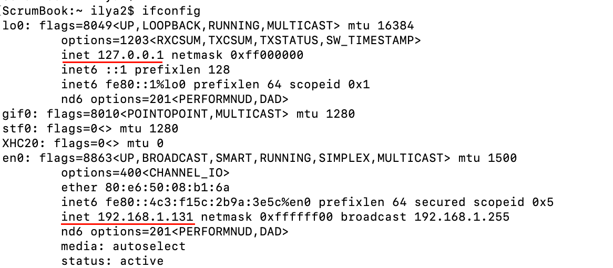

= Сервер

В архтектуре клиент-сервер под сервером понимается программа, готовая обрабатывать данные на определнном IP-адресе и порту. Поэтому, перед началом работы, сервер регистрирует в ОС IP-адрес и порт для своей работы. Например:

* веб-сервер по умолчанию использует для работы порт 80 (TCP) или 443 (TCP) для безопасного соединения.
* почтовый сервер использует порт 25 (TCP)
* SSH - 22 (TCP)
* DNS - 53 (UDP)
* и т.д.

== TCP-сервер

Отличительной особенностью реализации сервера является открытие так называемого серверного сокета. Общая идея такая:

* создаем сокет (socket)
* регистрируем в ОС IP-адрес и порт для работы (bind)
* переводим сокет в режим ожидания соединения от клиентов (listening)
* при подключении нового клиента ОС создает еще один сокет для работы с подключившимся клиентом (accept). Этот сокет еще называют "клиентский сокет"
* выполняем обычную работу с клиентским сокетом (recv, send, select, close/shutdown).

Давайте напишем простой TCP эхо-сервер и подробно разберём его устройство. TCP эхо-сервер будет принимать подключение от клиента и отправлять в ответ все, что клиент пришлёт ему.

[source,python]
----
import socket

HOST = 'localhost'
PORT = 30000
data_payload = 2048
backlog = 5

# Create a TCP socket
sock = socket.socket(socket.AF_INET, socket.SOCK_STREAM)

# Enable reuse address/port
sock.setsockopt(socket.SOL_SOCKET, socket.SO_REUSEADDR, 1)

print("Starting up echo server on %s port %s" % (HOST, PORT))
sock.bind((HOST, PORT))

# Listen to clients, backlog argument specifies the max no. of queued connections
sock.listen(backlog)

while True:
    print("Waiting to receive message from client")
    client, address = sock.accept()
    print("Client connected from %s" % (address,))
    data = client.recv(data_payload)
    if data:
        print("Data: %s" % data)
        s = client.send(data)
        print("sent %s bytes back" % (s,))

        # end connection
    client.close()
----

Разберем этот пример подробней.

[source,python]
----
import socket

HOST = 'localhost'
PORT = 30000
----

Переменные HOST и PORT указывают, какой IP и порт будет слушать TCP-сервер. Как и клиент, сервер может работать только с конкретным IP адресом, поэтому, значение ``localhost`` в последствии превратиться в IP-адрес 127.0.0.1.

Когда сервер слушает только IP-адрес 127.0.0.1, то подключиться к нему можно только с этого же хоста. Многие современные сервера, например, PostgreSQL, можно настраивать (администрировать) подключившись через сокет. Чтобы кто-то случайно или намеренно не смог подключиться из внешней сети и начать настраивать ваш PostgreSQL сервер, по умолчанию, сервер открывает сокет для настройки на адресе 127.0.0.1. Таким образом он гарантирует, что подключиться к нему сможет только локальный пользователь.

NOTE: Другими примером является ваш домашний Wi-Fi маршрутизатор. Многие домашние Wi-Fi маршрутизаторы можно настраивать удаленно, через веб-интерфейс. В целях безопасности, подключиться к веб-интерфейсу, по умолчанию, можно только из внутренней сети. Т.е. веб-сервер слушает не 127.0.0.1, а интерфейс с IP-адресом внутренней сети. Таким образом, настраивать Wi-Fi маршрутизатор могут все, кто смог подключиться к нему через Wi-Fi.

[source,python]
----
data_payload = 2048
backlog = 5
----

Переменная ``data_payload`` содержит размер данных, которые мы будем читать от клиента. Если придет меньге, то хорошо, а если больше, то сервер прочитает первые 2048 байта и все. Этот TCP-эхо-сервер для примера и нет смысла читать данные большими объмами. 2048 байт будет вполне достаточно.

Переменная ``backlog`` указыает на размер очереди на подключение.

[source,python]
----
# Create a TCP socket
sock = socket.socket(socket.AF_INET, socket.SOCK_STREAM)
----

Создаем TCP-сокет и сохраняем его в переменную sock.

[source,python]
----
# Enable reuse address/port
sock.setsockopt(socket.SOL_SOCKET, socket.SO_REUSEADDR, 1)
----

Используем функцию setsockopt для возможности переиспользовать IP-адрес и порт. Что это для чего будет немного дальше. А пока просто подметим это.

[source,python]
----
print("Starting up echo server on %s port %s" % (HOST, PORT))
sock.bind((HOST, PORT))
----

Функция ``bind`` сообщает ОС какой IP-адрес и порт будуший сервер хочет использовать для своей работы. В качестве IP-адрес можно указать и имя, например, ``localhost``. Получив вместо IP-адреса имя, функция bind постарается сопоставить этому имени конкретный IP-адрес.

[source,python]
----
sock.listen(backlog)
----

Функция ``listen`` переведет сокет в режим ожидания соединений от клиентов. Именно этот вызов разрешает клиентам подключаться к нашему серверу. Параметр ``backlog`` сообщает о размере очереди на ожидания клиентов, которые могут успешно подключиться к нашему серверу и ожидать обработку.

[source,python]
----
while True:
    print("Waiting to receive message from client")
    client, address = sock.accept()
    print("Client connected from %s" % (address,))
    data = client.recv(data_payload)
    if data:
        print("Data: %s" % data)
        s = client.send(data)
        print("sent %s bytes back" % (s,))

        # end connection
    client.close()
----

А дальше идет вечный цикл. Предполагается, что любой сервер работает вечно, поэтому, рано или поздно должен встретиться вечный цикл. В этом цикле наш TCP эхо-сервер производит основную работу.

[source,python]
----
client, address = sock.accept()
----

Ожидаем подключения нового клиента. Функция ``accept`` блокирующая и сервер будет находиться в ней до тех пор, пока не подключиться клиент. Как только клиент подключится, функция ``accept`` вернет два значения:

* сокет для работы с клиентом (клиентский сокет)
* IP-адрес и порт клиента.

[source,python]
----
data = client.recv(data_payload)
----

Функция ``recv`` ожидает данные от клиента. Как было сказано в начале, ``recv`` прочитает от клиента не более ``data_payload`` (2048) байт данных. Напомню, что функция recv блокирующая и тут мы тоже будет находиться до тех пор, пока клиент не пришлёт данные или пока сокет не будет закрыт.

[source,python]
----
    if data:
        print("Data: %s" % data)
        s = client.send(data)
        print("sent %s bytes back" % (s,))
----

Если от клиента пришли данные, то мы их печатаем в консоль и отправляем (``send``) эти данные ему обратно, как настоящий эхо-сервер. После отправки данных печатаем в консоль количество байт отправленных данных.

[source,python]
----
    client.close()
----

Вызываем функцию ``close``, которая закроет клиентский сокет. После этого снова возвращаемся в начало нашего вечного цикла и ожидаем подключения следующего клиента.

== Запуск TCP-сервера

Запустим наш TCP-сервер.

[source,console]
----
(venv) ScrumBook:src ilya2$ python tcp-server-1.py
Starting up echo server on localhost port 30000
Waiting to receive message from client
----

Если сервер запустился удачно, то мы увидим сообщение об этом. Теперь, давайте подключимся к нашему серверу из другой консоли. Для этого я использую утилиту netcat (nc).

NOTE: Для подключения к TCP-серверу я использую команду ``netcat`` (nc). В Ubuntu её можно установить командой ``apt install netcat``. В MacOS она устанавливается командой ``brew install netcat``.

При подключении через netcat нужно передать два параметра:

* IP-адрес или имя хоста для подключения. В нашем случае это будет localhost или можно написать 127.0.0.1.
* Номер порта для подключения. В нашем случае это порт 30000.

Ниже результат подключения к нашему серверу через утилиту netcat.

[source,console]
----
ScrumBook:~ ilya2$ nc localhost 30000
Hello TCP-server
Hello TCP-server
ScrumBook:~ ilya2$
----

После подключения я отправил строку Hello TCP-server. Вторая строка Hello TCP-server - это уже ответ от сервера. После получения ответа от сервера соединение было закрыто. Итого, наш сервер отработал, как и задумывалось.

[source,console]
----
(venv) ScrumBook:src ilya2$ python tcp-server-1.py
Starting up echo server on localhost port 30000
Waiting to receive message from client
Client connected from ('127.0.0.1', 57195)
Data: b'Hello TCP-server\n'
sent 17 bytes back
Waiting to receive message from client
----

Если посмотрим в консоль, где запущен TCP-сервер, то обнаружим вывод нескольких дополнительных сообщений:

* Client connected from ('127.0.0.1', 57195) - IP-адрес и порт клиента
* Data: b'Hello TCP-server\n' - строку, которую прислал клиент
* sent 17 bytes back - размер данных отправленных клиенту обратно
* Waiting to receive message from client - ожидание следующего клиента

Мы можем повторить подключение через ``nc``, результат должен быть одинаков.

Итого, для создания сервера необходимо:

. Создать сокет (socket).
. Зарегистрировать в ОС IP-адрес и порт для работы сервера (bind).
. Перевести сокет в состояние прослушивание (listen).
. В вечном цикле:
.. Ожидание подключения клиента (accept).
.. Коммуникация с клиентом (recv/send).
.. Закрытие сокета (close).

=== Обработка ошибок

==== Address already in use

Давайте чуть подробней разберем необходимость опции SO_REUSEADDR. А для этого, давайте посмотрим, что нам покажет утилита ``netstat``. Запустим наш сервер, как обычно, и посмотрим на список текущих сетевых соединений.

[source,console]
----
ScrumBook:.ssh ilya2$ netstat -ant | grep 30000
tcp4       0      0  127.0.0.1.30000        *.*                    LISTEN
ScrumBook:.ssh ilya2$
----

NOTE: У меня на MacOS очень много сетевых соединений, поэтому я использую команду ``grep``, чтобы отфильтровать только нужные мне.

Утилита ``netstat`` сообщает, что порт 30000 открыт и находится в состоянии LISTEN, т.е. готов к подключению новых клиентов.

А теперь давайте подключимся к нашему серверу, отправим сообщение ``Hello`` и снова посмотрим на список сетевых соединений.

[source,console]
----
ScrumBook:.ssh ilya2$ netstat -ant | grep 30000
tcp4       0      0  127.0.0.1.30000        *.*                    LISTEN
ScrumBook:.ssh ilya2$ nc localhost 30000
Hello
Hello
ScrumBook:.ssh ilya2$ netstat -ant | grep 30000
tcp4       0      0  127.0.0.1.30000        *.*                    LISTEN
tcp4       0      0  127.0.0.1.30000        127.0.0.1.58156        TIME_WAIT
ScrumBook:.ssh ilya2$
----

Мы увидим, что появился еще одно соединение на порту 30000, где IP-адрес источника 127.0.0.1 и порт 58156. Это соединение находится в состоянии TIME_WAIT. Это как раз наше соединение, по которому мы передали ``Hello``. Состояние TIME_WAIT - это состояние, когда соединение уже закрыто, но ОС поддерживает его еще некоторое время, чтобы корректно обработать пакеты, которые по разным причинам могли задержаться в сети. Обычно этот таймаут составляет несколько десятков секунд или даже пару минут, зависит от настроек ОС.

Выполним следующие действия:

. Запустим наш сервер (или он уже запущен).
. Подключимся утилитой ``nc``
. Отправим любую строку, например, Hello.
. Получим ответ и вместе с этим сервер закрое соединение.
. Остановим сервер (CRTL+C).
. И снова посмотрим на текущие соединения (netstat)

[source,console]
----
ScrumBook:.ssh ilya2$ netstat -ant | grep 30000
tcp4       0      0  127.0.0.1.30000        *.*                    LISTEN
ScrumBook:.ssh ilya2$ nc localhost 30000
Hello
Hello
ScrumBook:.ssh ilya2$ netstat -ant | grep 30000
tcp4       0      0  127.0.0.1.30000        *.*                    LISTEN
tcp4       0      0  127.0.0.1.30000        127.0.0.1.58824        TIME_WAIT
ScrumBook:.ssh ilya2$ netstat -ant | grep 30000
tcp4       0      0  127.0.0.1.30000        127.0.0.1.58824        TIME_WAIT
ScrumBook:.ssh ilya2$
----

Мы увидим, что осталось только последнее соединение в состоянии TIME_WAIT.

Закомментируйте строку с опцией SO_REUSEADDR.

[source,python]
----
# Enable reuse address/port
# sock.setsockopt(socket.SOL_SOCKET, socket.SO_REUSEADDR, 1)
----

И попробуйте повторить все еще раз:

. Запустите сервер
. Подключитесь утилитой ``nc`` и отправьте любую строку
. После ответа сервера, остановите сервер (CRTL+C).
. Попробуйте снова запустить сервер.

При попытке запустить сервер вы получите ошибку ``Address already in use``

[source,console]
----
Traceback (most recent call last):
  File "tcp-server-1.py", line 15, in <module>
    sock.bind((HOST, PORT))
OSError: [Errno 48] Address already in use
----

Пока есть хоть одно соединение на нашем порту (30000), мы не можем его  использовать. Это не редкое состояние. Когда вы разрабатываете сервер, то вы будете очень часто выключать и включать его снова, для проверки работоспособности. И, чтобы не ждать таймаут TIME_WAIT перед повторным запуском сервера, можно  установить флаг SO_REUSEADDR в 1. Этот флаг разрешает ОС переиспользовать сокет в состоянии TIME_WAIT.

====  Can't assign requested address

Сервер может слушать только назначенные IP-адреса в вашей ОС. Например, сейчас у меня на хосте назначены два IP-адреса:

* 127.0.0.1 (loopback)
* 192.168.1.131 (wi-fi)

.IP-адреса на моём MacOS.

Это означает, что я могу запустить сервер на адресе 127.0.0.1 или на 192.168.1.131 или на обоих сразу. При попытке зарегистрировать не ваш IP-адрес вы получите ошибку ``Can't assign requested address``.

Для примера, давайте запустим наш TCP эхо-сервер на адресе 77.88.8.8. Для этого поменяем переменную HOST в нашем примере.

[source,python]
----
import socket

HOST = '77.88.8.8'
PORT = 30000
----

При попытке запустить такой сервер мы получим ошибку.

[source,console]
----
(venv) ScrumBook:src ilya2$ python tcp-server-3.py
Starting up echo server on 77.88.8.8 port 30000
Traceback (most recent call last):
  File "tcp-server-3.py", line 15, in <module>
    sock.bind((HOST, PORT))
OSError: [Errno 49] Can't assign requested address
----

Если вы хотите принимать соединения на любой из доступным вам сетевых интерфейсов, то передайте пустое поле HOST.

[source,python]
----
import socket

HOST = ''
PORT = 30000
----

Запустив такой сервер и посмотреть netstat вы увидите примерно следующее

[source,console]
----
ScrumBook:.ssh ilya2$ netstat -ant | grep 30000
tcp4       0      0  *.30000                *.*                    LISTEN
ScrumBook:.ssh ilya2$
----

Теперь рядом с номером порта 30000 стоит не 127.0.0.1, как было раньше, а символ *. Этот символ означает, что сервер готов принимать соединения на любой сетевой интерфейс в вашей ОС.

== UDP-сервер

Давайте напишем простой UDP эхо-сервер и на примере разберем его работу.

[source,python]
----
import socket

HOST = ''
PORT = 30000
data_payload = 2048

# Create a TCP socket
sock = socket.socket(socket.AF_INET, socket.SOCK_DGRAM)

print("Starting up UDP echo server on %s port %s" % (HOST, PORT))
sock.bind((HOST, PORT))

while True:
    print("Waiting to receive message from client")
    data, address = sock.recvfrom(data_payload)

    if not data:
        continue

    print("Received %s bytes from %s" % (len(data), address))
    s = sock.sendto(data, address)
    print("Sent %s bytes back" % (s,))
----

Он немного меньше, чем аналогичный TCP сервер:

* нет надобности использовать опцию ``SO_REUSEADDR``, так как UDP сокет не может находиться в состоянии TIME_WAIT.
* нет надобности вызывать функцию ``listen`` и ``accept``, так как UDP не ожидает соединений от клиентов.
* и не нужно в конце закрывать сокет функцией ``close``.

Для работы UDP сервера нужно всего 3 действия:

. Создать UDP сокет (socket).
. Зарегистрировать IP-адрес и порт для работы (bind).
. Обрабатывать запросы клиентов (recvfrom/sendto).

Запустим UDP эхо-сервер и попробуем с ним поработать.

[source,console]
----
(venv) ScrumBook:src ilya2$ python udp-server-1.py
Starting up UDP echo server on  port 30000
Waiting to receive message from client
----

После запуска сервера в консоль выводится сообщение о том, что он готов к работе на порту 30000. Для взаимодейстия с сервером воспользуемся утилитой ``netcat`` (nc).

NOTE: По умолчанию утилита ``nc`` устанавливает TCP соединение. Для отправки UDP пакетов на заданный адрес и порт, нужно установить флаг -4u. Например, ``nc -4u localhost 30000``

[source,console]
----
ScrumBook:~ ilya2$ nc -4u localhost 30000
Hello, UDP server!
Hello, UDP server!
----

Как видно, отправив сообщение "Hello, UDP server!" мы получаем его в ответ. После получения сообщения мы можем дальше продолжать взаимодействовать с сервером.

NOTE: Обратите внимание, что UDP сервер не разрывает соединение после отправки ответа, как это было в TCP сервере. Еще раз напомню - UDP протокол не поддерживает соедиений.

Так как UDP не устанавливает соединений, а работает с датаграммами, то с UDP сервером могут взаимодействовать сразу несколько клиентов. Чтобы в этом убедиться, запустите несколько (2-3) консолей и в каждой запустите команду ``nc -4u localhost 30000``. После этого вы можете поочередно печатать в консолях строки и получать ответы на них.

[source,python]
----
data, address = sock.recvfrom(data_payload)
----

Функция ``recvfrom`` возвращает не только данные, но и IP-адрес и порт клиента. Этого как раз достаточно, чтобы отправить клиенту ответ используя функцию ``sendto``.

[source,python]
----
s = sock.sendto(data, address)
----