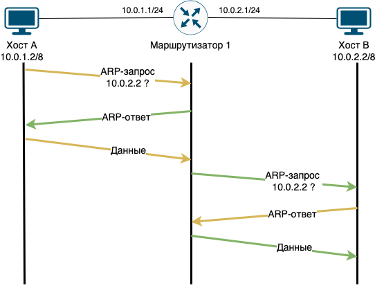

= ARP proxy

ARP Proxy — техника использования ARP-протокола, позволяющая объединить две не связанные на канальном уровне сети в одну. Хосты, находящиеся в этих сетях, могут использовать адреса из одной IP-подсети и обмениваться трафиком между собой без использования маршрутизатора (как им кажется).

.Схема использования ARP Proxy.

Например, на рисунке изображены два хоста A и B, которые находятся на канальном уровне в разных сегментах. На хостах не настроен шлюз по умолчанию. И маски подсетей на маршрутизаторе (/24) и на хостах (/8) отличаются.

Если на маршрутизаторе включён Proxy ARP на обоих интерфейсах, то происходит следующее:

. Хост A хочет отправить данные хосту B. Так как, на хосте A IP-адрес 10.0.1.2 с маской /8, то он считает, что хост B с IP-адресом 10.0.2.2 находится с ним в одной сети (хосты считают, что они в сети 10.0.0.0/8).
. Хосту A необходимо узнать MAC-адрес хоста B. Он отправляет ARP-запрос в сеть.
. Маршрутизатор получает ARP-запрос, но не перенаправляет его, так как получатель в другой сети. Если на маршрутизаторе включён ARP Proxy, то маршрутизатор отправляет хосту A ARP-ответ, в котором подставляет свой MAC-адрес. То есть, для хоста A создается соответствие, что у IP-адреса 10.0.2.2 MAC-адрес интерфейса маршрутизатора (10.0.1.1).
. Теперь хост A может отправить данные.
. Маршрутизатор получается пакет, смотрит на IP-адрес получателя и перенаправляет пакет на него. Маршрутизатор заглядывает в свой ARP кеш, не находит запись и отправляет ARP-запрос на поиск MAC адреса хоста 10.0.2.2.
. Хост B с IP-адресом 10.0.2.2 получает ARP-запрос, сверяет искомый IP со своим. Так как IP-адреса равны, хост B отправляет ARP-ответ.
. Маршрутизатор, получив ARP-ответ, может спокойно пересылать данные, которые получил от хоста A для хоста B.

Хост B аналогичным образом считает, что хост A с ним в одной сети. Хосту B необходимо узнать MAC-адрес хоста A. Он отправляет ARP-запрос в сеть.

Маршрутизатор получает ARP-запрос, но не перенаправляет его, так как получатель в другой сети. Если на маршрутизаторе включён ARP-proxy, то маршрутизатор отправляет хосту B ARP-ответ, в котором подставляет свой MAC-адрес.

Таким образом, Proxy ARP помогает прозрачно объединить два физических сегмента в один.