= DHCP

Для корректной работы хоста в сети интернет у него должны быть настроены: IP-адрес, маска подсети, IP-адрес маршрутизатора по умолчанию и, возможно, ещё  какие-то параметры. Вот если попробовать вспомнить, когда вы подключаетесь к сети дома или в кафе, вы настраиваете все эти параметры? Скорее всего, нет! Это работает DHCP.

DHCP (Dynamic Host Configuration Protocol) - протокол динамической конфигурации хостов, описан в https://datatracker.ietf.org/doc/html/rfc2131[RFC 2131]. Занимается автоматической настройкой сетевых параметров у хостов.

Например, вы установили дома у родителей новый Wi-Fi маршрутизатор, попросили их подключиться к нему и, вместо доступа к сети интернет, сидите и настраиваете на ноутбуке IP-адрес, маску, указываете IP-адрес маршрутизатора по умолчанию и DNS сервер (используется для разрешения имён в IP-адрес, например, ya.ru в 77.88.55.242). Или, вы администратор в компании. К вам в офис привезли и подключили 50 новых ПК для разработчиков. И теперь вам необходимо идти в другое помещение и руками прописывать всем новым ПК сетевые настройки. Конечно, это та работа, которую лучше избежать. Она отнимает время, и есть большая вероятность допустить опечатку. И даже если всё сделать чётко, через несколько недель может оказаться, что всем этим ПК нужно сменить сетевые настройки на другие.

Чтобы не тратить время сетевых администраторов и простых пользователей сети на сетевые настройки, используется DHCP.

DHCP - это протокол прикладного уровня, располагается на 7 уровне модели ISO/OSI, как это показано на рисунке ниже. Прикладной протокол означает, что протокол работает не в ядре вашей ОС (как это делает IP, TCP, UDP, ICMP), а это отдельная программа (сервис в ОС Windows, демон в ОС Linux), которая работает в пользовательском пространстве.

.DHCP в модели ISO/OSI.
image::{docdir}/images/dhcp_1.png[DHCP в модели ISO/OSI.]

Забегая вперёд, скажу, что с позиции архитектуры, DHCP довольно интересный! С одной стороны, он занимается настройкой IP-адреса, маски и т.д, а с другой, использует IP протокол.

== DHCP архитектура

DHCP использует клиент-серверную архитектуру, т.е. DHCP-клиент обращается к DHCP-серверу за настройками. Получив такие настройки от сервера, DHCP-клиент использует их для настройки указанного сетевого интерфейса.

NOTE: У вас на хосте может быть несколько сетевых интерфейсов, поэтому DHCP-клиенту нужно сообщить, какой именно сетевой интерфейс необходимо настроить.

DHCP-клиент и сервер общаются между собой при помощи DHCP сообщений. Формат сообщения изображён на рисунке ниже.

.Формат DHCP пакета. (https://datatracker.ietf.org/doc/html/rfc2131#page-13)
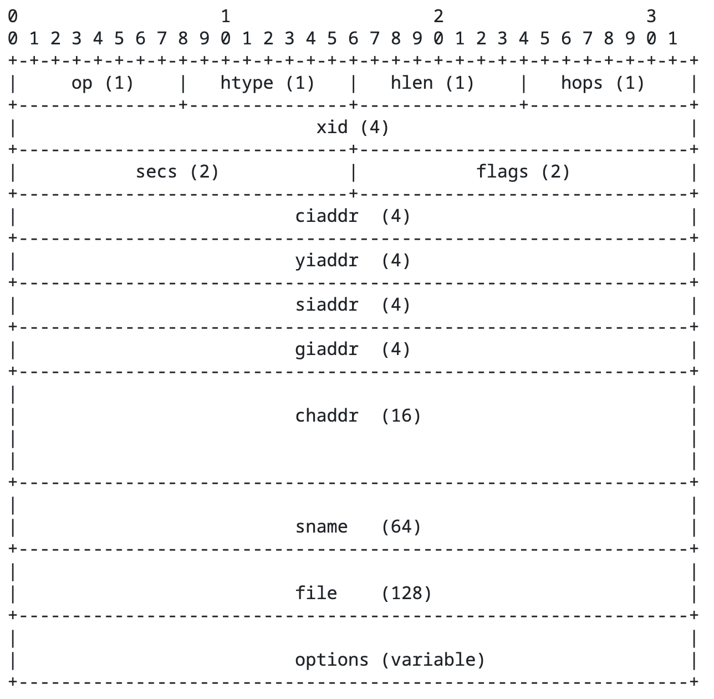

В качестве протокола транспортного уровня DHCP использует UDP. При этом:

* DHCP-сервер использует UDP порт 67
* DHCP-клиент использует UDP порт 68

Разные порты используются, чтобы DHCP-клиент не обрабатывал сообщения, предназначенные для сервера. И наоборот.

Давайте разберёмся с полями в заголовке, они дадут хорошее представление о работе протокола:

* *op* - тип сообщения. Значение 1 = BOOTREQUEST устанавливает клиент, при отправке запроса. Значение 2 = BOOTREPLY устанавливает сервер в ответе.
* *htype* - тип аппаратного адреса, например, значение 1 используется для Ethernet. DHCP протокол может работать не только в Ethernet сети, поэтому клиент имеет возможность сообщить, какой аппаратный адрес он использует.
* *hlen* - размер аппаратного адреса. Значение 6 используется для Ethernet (размер MAC-адреса 6 байт).
* *hops* - число ретрансляторов (DHCP relay agent). DHCP-клиент устанавливает это поле в 0, DHCP ретрансляторы, при пересылке сообщения могут увеличивать этот счётчик на 1. Таким образом, когда сообщение дойдёт до DHCP-сервера, он будет знать, сколько между ним и DHCP-клиентом ретрансляторов (иногда их называют DHCP-агенты).
* *xid* - идентификатор транзакции. Случайное число, однозначно определяющее диалог между клиентом и сервером. Когда сервер формирует ответ, он указывает идентификатор трансляции равным тому, что был получен в запросе.
* *secs* - число секунд с начала процесса получения или обновления адреса, указываемое DHCP-клиентом.
* *flags* - флаги.
* *ciaddr* - текущий IP-адрес клиента. Устанавливается, если DHCP-клиент уже обладает некоторым IP-адресом и выполняет запрос, чтобы обновить или освободить ранее полученный IP-адрес. Также этот флаг означает, что клиент может отвечать на ARP запросы.
* *yiaddr* - IP-адрес, который DHCP-сервер предлагает клиенту.
* *siaddr* - IP-адрес следующего сервера для конфигурации. Обычно используется для загрузки образов по сети.
* *giaddr* - адрес ретранслятора, который ретранслировал DHCP-сообщение.
* *сhaddr* - аппаратный адрес клиента. В это поле DHCP-клиент записывает свой MAC-адрес, когда отправляет запросы на сервер.
* *sname* - имя сервера (опциональное поле).
* *file* - полный путь к файлу для загрузки по сети. Не всегда ПК загружается с локального жёсткого диска (SSD/ HDD). Иногда диска просто нет, а иногда вы просто хотите загрузить образ по сети. Например, вы хотите выполнить автоматическую установку ОС на новые компьютеры в вашем офисе или учебном классе. Ходить по всем компьютерам и в каждый вставлять загрузочную флешку неудобно. Можно создать загрузочный образ с автоматической установкой ОС и загрузить его на ПК по сети.
* *options* - список параметров. Именно в параметрах будет указываться выдаваемая маска подсети, маршрутизатор по умолчанию и другие сетевые параметры.

== DHCP-сервер

Чтобы в вашей сети заработал DHCP необходимо запустить и сконфигурировать DHCP-сервер. Если мы говорим о домашней сети с Wi-Fi маршрутизатором, то там DHCP запускается автоматически. Как только вы включите и выполните первичную настройку вашего Wi-Fi маршрутизатора, DHCP-сервер автоматически запустится и будет готов к работе. Такие DHCP-сервера (дома, в кафе, ресторане, в БЦ, поезде) обычно выдают следующий настройки:

* IP-адрес
* маску подсети
* IP-адрес маршрутизатора по умолчанию
* DNS сервер

Это вполне хватит для простого доступа в интернет. На самом деле DHCP способен на большее. Он может выдавать около 200 различных параметров и настроек, полный список можно посмотреть на сайте IANA (https://www.iana.org/assignments/bootp-dhcp-parameters/bootp-dhcp-parameters.xhtml).

Если вы администратор сети в компании, то, скорее всего, вы будете самостоятельно настраивать и запускать DHCP-сервер на своём оборудовании.

== Взаимодействие DHCP-клиента и DHCP-сервера

Взаимодействие DHCP-клиента и сервера довольно интересное. С одной стороны, DHCP-клиент должен получить сетевые настройки, а с другой, он использует сетевой протокол (IP).

На рисунке ниже представлена обычная схема взаимодействия DHCP-клиента и сервера. Схему взаимодействия буду подкреплять реальными DHCP сообщениями.  Если у вас тоже настройки выдаются автоматически, то вы тоже сможете посмотреть реальные DHCP сообщения. Для этого:

. Запустите Wireshark (это сниффер) и начните захватывать пакеты с вашего основного сетевого интерфейса.
. Если у вас Windows, то запустите командную строку от имени Администратора
.. выполните команду ```ipconfig /release```
.. затем выполните ```команду ipconfig /renew```

. Если у вас MacOS, то в командной строке
.. выполните команду ```sudo ipconfig set en0 none```
.. затем выполните команду ```sudo ipconfig set en0 dhcp```

. Остановите Wireshark и отфильтруйте пакеты по “dhcp”.

.Взаимодействие DHCP-клиента и DHCP-сервера.
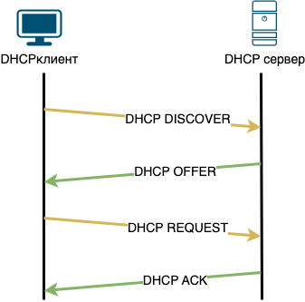

== DHCP DISCOVER

Клиент только что подключился к сети и ничего не знает о ней и не имеет собственных сетевых настроек. Сначала он пытается обнаружить в сети рабочий DHCP-сервер. Для этого DHCP-клиент отправляет сообщение *DHCP DISCOVER* на широковещательный IP-адрес (255.255.255.255). Так как IP-адрес широковещательный, то и MAC-адрес тоже устанавливается широковещательным (FF:FF:FF:FF:FF:FF). Этот запрос получают и обрабатывают все хосты в сети.

Так как своего IP-адреса ещё нет, то сообщение DHCP DISCOVER отправляется от IP-адреса 0.0.0.0. Внутри этого DHCP сообщения можно увидеть, что почти все поля заполнены 0, кроме некоторых:

* поле *op* установлено в 1 (Boot Request).
* в поле *chaddr* (MAC-адрес DHCP-клиента) записан MAC-адрес клиента. Может показаться, зачем вообще нужно это поле? DHCP-сервер получает DHCP DICSCOVER сообщение, обрабатывает его и решает отправить DHCP-клиенту ответ. А куда его отправлять? У клиента еще нет IP-адреса! Единственное, что может в этой ситуации сделать сервер, отправить сообщение на MAC-адрес клиента. Хорошо! А на какой MAC-адрес отправлять? Как мы помним, протоколы независимы друг от друга. Т.е. получив DHCP сообщение на уровне приложения (7-й уровень модели ISO/OSI) мы без понятия какие значения MAC-адреса отправителя и получателя были установлены на канальном уровне (2-й уровень модели ISO/OSI). Другими словами, мы не знаем MAC-адрес отправителя. Вот, чтобы решить эту проблему, поле MAC-адрес отправителя есть в DHCP сообщениях и оно помогает серверу отправить ответ.
* в поле option можно заметить наличие опции Message Type, значение которой установлено в Discover.

.DHCP DICSOVER  в Wireshark.
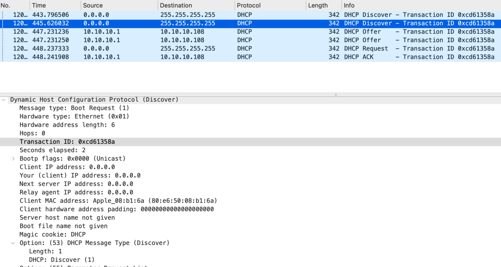

== DHCP OFFER

Получив сообщение DHCP DISCOVER, сервер определяет, может ли он выдать клиенту сетевые настройки. Обычно DHCP-сервер старается запомнить клиента (по MAC-адресу). Если клиент подключается первый раз, то ему выдаются сетевые настройки. Если клиент приходит повторно, то сервер старается ему выдать сетевые настройки, которые были в прошлый раз. Например, в домашней сети вам всегда будет выдаваться один и тот же IP-адрес.

Так как в сообщении DHCP OFFER сервер будет предлагать клиенту конкретный IP-адрес, то сервер должен убедиться, что такого IP-адреса в сети нет. Поэтому перед формированием DHCP OFFER сервер отправляет в сеть ICMP Echo запрос на IP-адрес, который он собирается предложить клиенту. Если ответа на такой запрос не последует, то все в порядке и IP можно выделять.

Получив DHCP DISCOVER и сформировав ответ, сервер отправляет сообщение DHCP OFFER. Сообщение DHCP OFFER сообщает, какие сетевые настройки сервер может выдать клиенту. То есть сервер ещё ничего не выдал, он только предлагает (от английского слова offer).

.DHCP OFFER в Wireshark
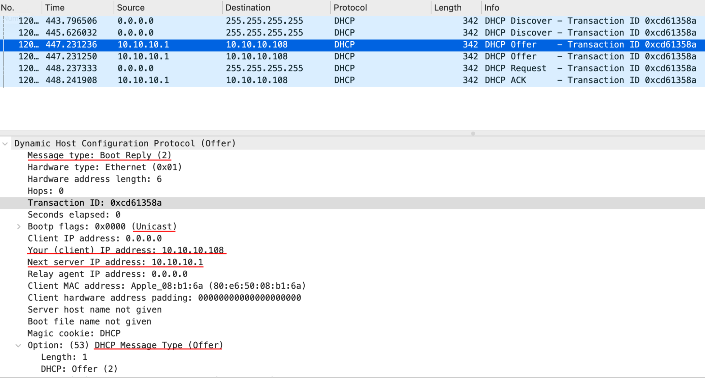

Иногда DHCP OFFER отправляется конкретно получателю (unicast), а иногда широковещательной рассылкой. Это зависит от клиента. Если вы посмотрите на сообщение DHCP DISCOVER, то обратите внимание на поле *Bootp flags*, оно установлено в Unicast. Это будет означать, что сервер может отправлять ответное сообщение прямо на MAC-адрес клиента. В противном случае, если поле *Bootp flags* будет установлено в Broadcast, то ответные пакеты от DHCP-сервера будут отправлять на широковещательный адрес. В нашем случае сообщение DHCP OFFER отправилось прямо получателю.

Обратите внимание на IP получателя (колонка Destination), он равен 10.10.10.108. DHCP OFFER отправляется прямо клиенту, у которого ещё нет своего IP-адреса. А отправлять пакеты на IP-адрес 0.0.0.0 нельзя. Поэтому DHCP-сервер в качестве IP-адреса получателя ставит предлагаемый клиенту IP-адрес.

В сообщение DHCP OFFER уже можно увидеть заполненные поля *yiaddr* (10.10.10.108 - IP-адрес, который DHCP-сервер предлагает клиенту) и *siaddr* (10.10.10.1 - IP-адрес следующего сервера для конфигурации).

.Поля options в сообщение DHCP OFFER.
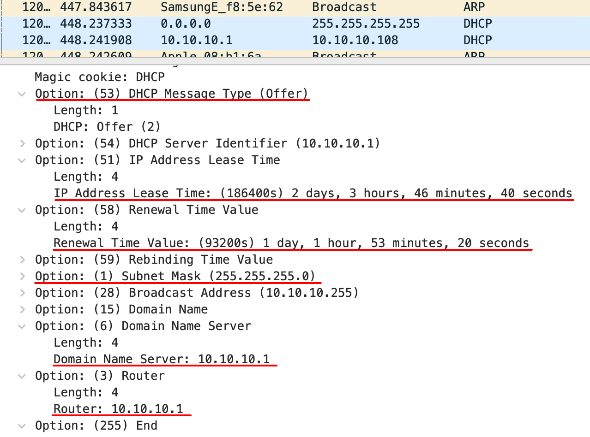

Если в Wireshark пролистать DHCP OFFER сообщение чуть ниже, то можно увидеть предлагаемые опции:

* *IP Address Lease Time* равен 186 400 секунд. Это время, на которое выдаётся IP-адрес. DHCP-сервер не выдаёт IP-адреса навсегда, он сдает их в аренду на конкретное время. Каждый раз, когда DHCP-сервер выдает IP-адрес, он указывает продолжительность аренды. Например, в кафе пришёл клиент и подключился к местному Wi-Fi. Он попил кофе, проверил почту и ушел. Выданный IP-адрес ему больше не нужен, при этом вы не можете этот IP-адрес выдать другому клиенту кафе. Чтобы зря не тратить IP-адреса, их сдают в аренду на время.
* Помимо *IP Address Lease Time* важной является опция *Renewal Time Value*. Это время, через которое DHCP-клиент должен заново продлить аренду. Обычно оно равняется половине времени *IP Address Lease Time*. То есть DHCP-клиент, получив адрес на 186 400 секунд, должен будет через 93 200 секунд продлить аренду выданного адреса. Если клиент не продлит аренду, то через 186 400 секунд DHCP-сервер будет считать, что данный IP-адрес свободен и снова сможет быть выдан.
* Опция *Subnet mask* (маска подсети) со значением 255.255.255.0
* Опция *Domain Name Server* (DNS сервер) содержит IP-адрес DNS-сервера. Он необходим, чтобы разрешать DNS имена (yandex.ru) в IP-адрес.
* Опция *Router* (маршрутизатор по умолчанию) со значением 10.10.10.1.

Вот так, в сообщении DHCP OFFER DHCP-сервер предлагает клиенту сетевые настройки. Ещё раз обращаю внимание, что в сообщении DHCP OFFER, DHCP-сервер только предлагает сетевые настройки. То есть они ещё никому не выданы.

Получив сообщение DHCP OFFER клиент принимает решение, устраивают ли его данные параметры или нет. Он может так делать. На практике DHCP-клиент принимает любое сообщение DHCP OFFER.

== DHCP REQUEST

Приняв DHCP OFFER клиент генерирует сообщение DHCP REQUEST. На сетевом и канальном уровне стоят широковещательные адреса (255.255.255.255 и FF:FF:FF:FF:FF:FF соответственно). Может показаться, зачем так, ведь клиент уже знает IP и MAC-адрес DHCP-сервера, когда он получил DHCP OFFER. Сообщение DHCP REQUEST отправляется на широковещательный адрес специально. Дело в том, что в сети могут находиться несколько DHCP-серверов и клиент мог получить несколько DHCP OFFER. Выбрав какой-то один DHCP-сервер, клиент отправляет сообщение DHCP REQUEST на широковещательный адрес, чтобы другие DHCP-сервера получили это сообщение и поняли, что клиент выбрал не их, и освободили от резерва предлагаемый IP-адрес.

.DHCP REQUEST в Wireshark.
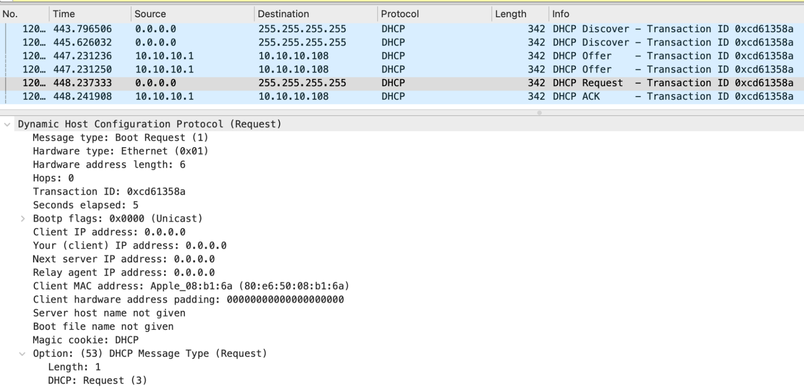

В самом сообщении DHCP REQUEST, как и в случае с DHCP OFFER, заполнено поле op (Boot Request) и поле chaddr (MAC-адрес клиента). А если посмотреть опции, то можно увидеть:

* *DHCP Server Identifier* (опция в конце списка) равен 10.10.10.1 указывает на DHCP-сервер, который выбрал клиент.
* *DHCP Message Type* (тип DHCP сообщения) равен Request.
Client Identifier (идентификатор клиента) содержит MAC-адрес клиента.
* *Requested IP Address* (запрашиваемый IP-адрес) равен 10.10.10.108. Тот самый IP-адрес, который DHCP-сервер предлагал в DHCP OFFER в поле *yiaddr*.

.Опции в сообщении DHCP REQUEST в Wireshark.
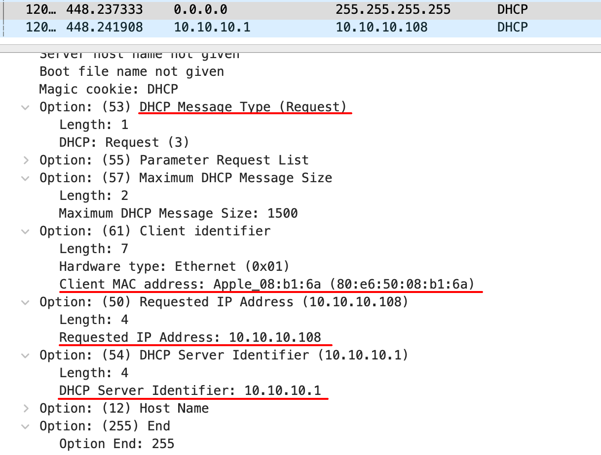

== DHCP ACK/NACK

Если всё хорошо, то DHCP-сервер, получив такое сообщение, отправит клиенту сообщение DHCP ACK. В котором, как и в сообщение DHCP OFFER, в поле yiaddr будет прописан выдаваемый клиенту IP-адрес, а в опциях будут:

* маска подсети
* DNS сервер
* время аренды
* время обновления аренды
* маршрутизатор по умолчанию
* и другие параметры

Только после получения DHCP ACK клиент применяет выдаваемые сетевые параметры.

Если, по какой-то причине DHCP-сервер передумал выдавать клиенту  IP-адрес, то в ответ на DHCP REQUEST сервер отправит DHCP NACK. Например, DHCP-сервер в DHCP OFFER предложил один IP-адрес, а клиент в сообщении DHCP REQUEST запрашивает другой.

.Взаимодействие DHCP-клиента и сервера, когда в сети два DHCP-сервера.
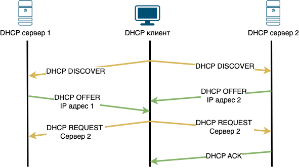

Подведём итог взаимодействия DHCP-клиента с сервером:

* DHCP-клиент отправляет широковещательное сообщение DHCP DISCOVER для поиска DHCP-сервера.
* Все DHCP-сервера в сети, которые получили сообщение DHCP DISCOVER, отвечают сообщением DHCP OFFER (конкретно клиенту или широковещательно, в зависимости от клиента). В этом сообщении они предлагают сетевые настройки (IP-адрес, маска подсети, маршрутизатор по умолчанию и т.д.). При этом предлагаемый IP-адрес резервируется на короткое время.
* Получив несколько сообщений DHCP OFFER от серверов, DHCP-клиент выбирает один сервер (обычно это тот, от кого быстрей пришёл DHCP OFFER) и отправляет широковещательное сообщение DHCP REQUEST. В этом сообщении DHCP-клиент указывает, какой IP-адрес он хочет получить.
* Все DHCP-сервера в сети получают DHCP REQUEST сообщение. Если идентификатор сервера не равен собственному, то DHCP-сервер освобождает от резерва предлагаемые IP-адрес. Если же идентификатор сервера равен собственному, то такой DHCP-сервер формирует сообщение DHCP ACK и помечает предлагаемый IP-адрес как выделенный.
* Получив сообщение DHCP ACK, клиент применяет выданный IP-адрес и другие сетевые настройки.

== DHCP RELEASE

Сообщение DHCP RELEASE клиент отправляет серверу в случае, когда он больше не хочет занимать выделенный ему IP-адрес. Получив такое сообщение, DHCP-сервер возвращает IP-адрес в список свободных. Многие операционные системы отправляют сообщение DHCP RELEASE во время выключения или перезагрузки.

Подтверждение на сообщение DHCP RELEASE не требуется.

.Сообщение DHCP RELEASE.
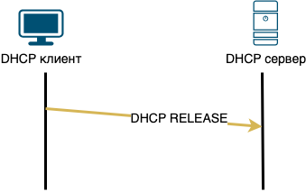

Вы и сами можете инициировать отправку сообщения DHCP RELEASE:

* Если у вас ОС Windows, в командной строке от имени Администратора выполните команду ```ipconfig /release```
* Если у вас MacOS, в терминале выполните команду ```sudo ipconfig set en0 none```
* Если у вас ОС Linux, в терминале выполните команду ```sudo ifdown eth0``` (при условии, что ваш основной сетевой интерфейс eth0).

== DHCP (обновление адреса)

Когда хост получает IP-адрес от DHCP-сервера, то вместе с этим, через опции, он получает время аренды (*IP Address Lease Time*) и время обновления аренды (*Renewal Time Value*). Время обновления аренды, как правило, равно половине времени аренды.

Если убрать время обновления аренды и оставить только время аренды, то когда оно закончится, DHCP-сервер будет считать, что IP свободен. А хост, который его арендовал, вынужден будет обнулить все выданные сетевые настройки, включая IP-адрес и маску.

Конечно, хост повторно может запросить сетевые настройки. Но в таком случае будет небольшое время, когда у хоста опять не будет сетевых настроек и он не сможет работать в сети. Представим, что вы сидите на важной видеоконференции, ведёте доклад как вдруг сеть пропала. Все ждут, пока ваш хост заново получит сетевые настройки.

Помимо простоя может случиться ситуация, когда в этот небольшой промежуток на DHCP-сервер придёт запрос от другого хоста, и ваш предыдущий IP-адрес будет выдан другому хосту. А вам в таком случае выдадут новый. Это может привести к некорректной работе некоторых сетевых приложений.

Чтобы избежать таких проблем, используют время обновления аренды. Например, пусть DHCP выдал IP-адрес на 48 часов. А время обновления аренды - 24 часа. Это означает, что после истечения первых 24 часов выданный IP всё ещё будет числиться за хостом, но нужно обновить аренду. У хоста будет почти 24 часа, чтобы обновить аренду и спокойно продолжить работать.

.Схема обновления сетевых настроек в DHCP.
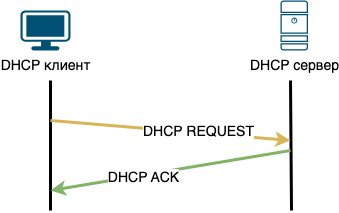

Обновления сетевых настроек происходит путём повторной отправки сообщения DHCP REQUEST и получения на него DHCP ACK.

Попробуйте самостоятельно запустить процесс обновления сетевых настроек. Если у вас ОС Windows, в командной строке от имени Администратора выполните команду ```ipconfig /renew```.

Если у вас MacOS:

. Нажмите кнопку “Apple” и перейдите в “Системные настройки”.
. Выберите “Сеть”
. Нажмите на Wi-Fi или Ethernet (в зависимости от подключения) в меню слева и кликните “Дополнительно”.
. В меню сверху выберите TCP/IP. Если выбрано получение IP-адреса “Используя DHCP”, вы сможете увидеть кнопку “Запросить адрес DHCP”, как на рисунке ниже.

.Обновление сетевых настроек через DHCP в MacOS.
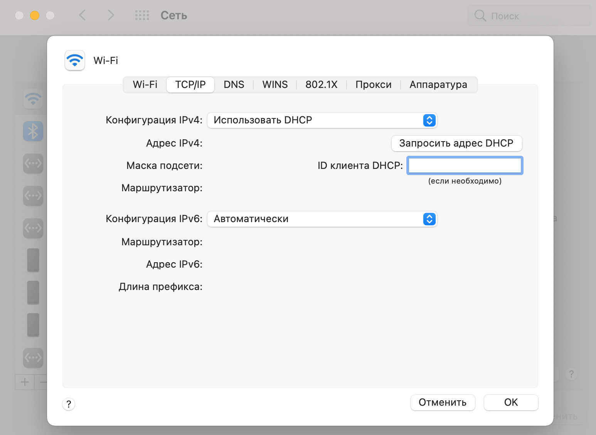

== DHCP Relay (ретранслятор)

В некоторых случаях DHCP-клиент и сервер могут находиться в разных сегментах сети. В такой ситуации DHCP-запросы клиента не смогут дойти до сервера, поскольку маршрутизаторы не передают широковещательные сообщения. Для решения этой проблемы используются DHCP Relay (ретранслятор).

.Схема сети, когда между DHCP-клиентом и сервером есть маршрутизатор.
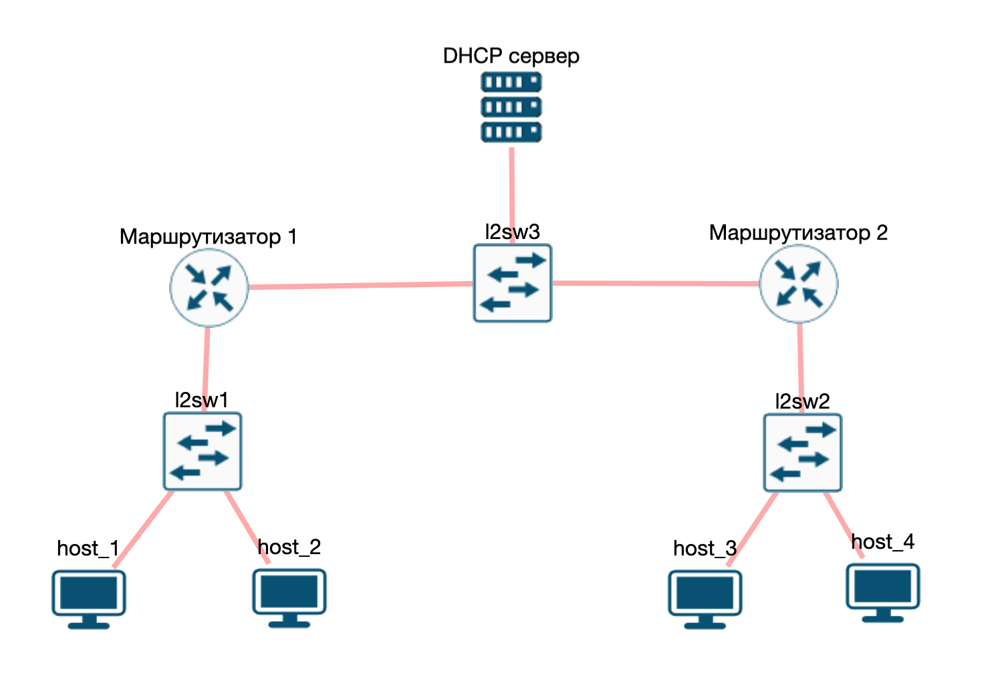

Например, сеть вашей компании насчитывает несколько офисов. Для каждого офиса выделена своя IP сеть. Хосты находятся за маршрутизаторами и не имеют прямого доступа к DHCP-серверу.  Чтобы в каждом офисе не настраивать свой отдельный DHCP-сервер, можно настроить один общий на всех. А для доступа к DHCP-серверу на маршрутизаторах запустить DHCP Relay (ретранслятор).

. Когда хост подключается к сети, он отправляет широковещательное сообщение DHCP DISCOVER.
. DHCP-ретранслятор получает это сообщение:
.. добавляет в поле *giaddr* свой IP-адрес
.. увеличивает поле *hops*
.. отправляет DHCP DISCOVER сообщение прямиком на DHCP-сервер. Он может это сделать, так как во время настройки DHCP-ретранслятора указывается IP-адрес DHCP-сервера, на который необходимо ретранслировать сообщения.
. DHCP-сервер, получив сообщение DHCP DISCOVER, использует поле *giaddr*, чтобы понять, из какой подсети пришёл запрос. Определив подсеть, DHCP-сервер зарезервирует необходимый IP-адрес и сформирует сообщение DHCP OFFER.
. DHCP-сервер отправит DHCP OFFER прямо на DHCP-ретранслятор, используя поле *giaddr*.
. DHCP-ретранслятор, получив DHCP OFFER от DHCP-сервера переправит его прямо клиенту.

DHCP-ретранслятор будет работать подобным образом с сообщениями DHCP REQUEST и DHCP ACK.

== DHCP - это улучшенный BOOTP

В описании протокола и стандарта можно встретить название полей (bootp flags) или ссылки на BOOTP сообщения. Это всё потому, что DHCP является улучшением протокола BOOTP.

BOOTP (bootstrap protocol) - протокол прикладного уровня (7-й уровень модели ISO/OSI), используемый для автоматического получения клиентом IP-адреса и, если необходимо, ссылки на загрузочный образ. BOOTP был разработан для бездисковых компьютеров (тонкие клиенты). Его описание можно найти в https://datatracker.ietf.org/doc/html/rfc951[RFC 951].

Для работы он использует UDP протокол и два порта: 67 (сервер) и 68 (клиент). С развитием сети, возможностей BOOTP стало не хватать и ему на смену пришёл DHCP.

== Безопасность в DHCP

DHCP не использует никаких механизмов аутентификации или шифрования. Всё это, вместе с широковещательными запросами, приводит к проблемам с безопасностью. Не буду углубляться в эту тему тут, просто перечислю две наиболее популярные атаки:

. DHCP Starvation - сетевая атака, которая позволяет зарезервировать все выдаваемые IP-адреса или, другими словами, “истощить” DHCP-сервер. Как мы знаем, DHCP-сервер резервирует IP-адрес при получении DHCP DISCOVER запроса. Чтобы один и тот же IP-адрес выдавался одному клиенту, DHCP-сервер запоминает MAC-адрес клиента. Для проведения атаки в сеть отправляется множество DHCP DISCOVER запросов с поддельных MAC-адресов. Проведя такую атаку, новый клиент не сможет подключиться к сети, так как для него не будет свободных IP-адресов.
. Rogue DHCP (он же  DHCP Spoofing) - запуск поддельного DHCP-сервера, который будет выдавать клиентам неверные сетевые настройки. Это могут быть просто нерабочие сетевые настройки или такие, чтобы весь трафик шёл не через маршрутизатор, а через специальный поддельный сервер (атака Man-in-the-Middle). Как известно, клиент принимает DHCP OFFER, который пришёл быстрей всего. Для атаки достаточно развернуть свой DHCP-сервер и стараться отправлять DHCP OFFER быстрей всех.

Поэтому будьте внимательны, когда пользуетесь DHCP в публичных местах.