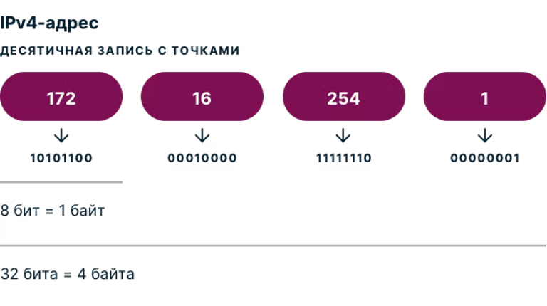
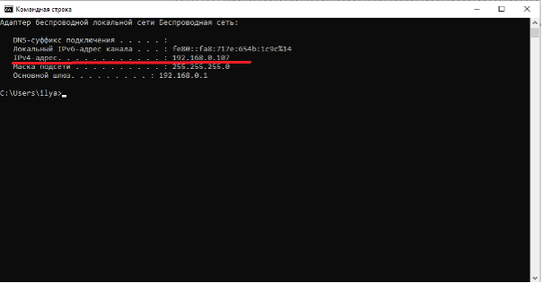
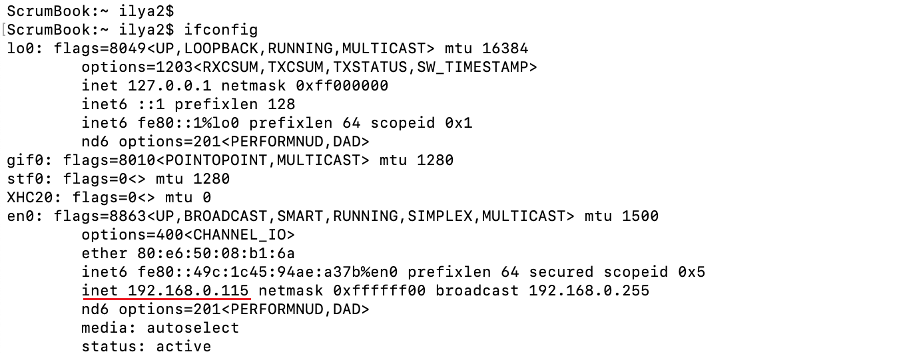
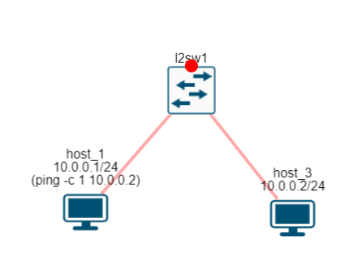
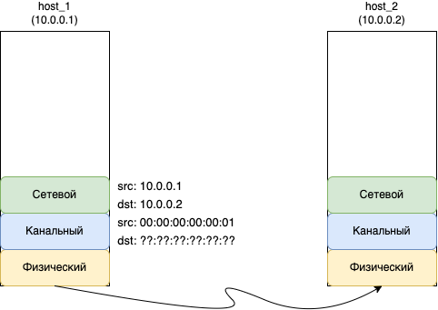

= IP адреса

В глобальной сети Интернет на сетевом уровне работает протокол IP (Internet Protocol), который описан в https://www.rfc-editor.org/rfc/rfc793[RFC 791]. А для адресации хостов используются IP адреса.

IP адрес представляет собой поле в 4 байта (32 бита) и обычно записывается как 4 десятичных числа разделенных точкой. Например:

* 192.168.1.1
* 172.2.5.66
* 12.153.45.3
* и так далее.

Каждое число соответствует 8 битам поля адреса, как показано на рисунке ниже.

.Формат IP адреса. (https://www.expressvpn.com/ru/what-is-my-ip)

Поэтому, ни одно число в IP адресе не может быть более 255.

Если ваш компьютер  или ноутбук подключен к сети, то вы можете посмотреть ваш IP адрес. В ОС Windows  в командной  строке выполните команду ipconfig или ipconfig /all. В появившемся результате найдите свое сетевое подключение (у меня это Беспроводная сеть) и найдите строку “IPv4 адрес”. У меня это 192.168.0.107, как показано на рисунке ниже.

.IP адрес в Windows.

Если у вас MacOS или Linux, в консоли выполните команду ifconfig. На рисунке ниже представлен вывод команды ifconfig под MacOS. К сожалению, поиск нужного интерфейса может занять время, у меня он называется en0. А сам IP адрес указан в поле inet.

.IP адрес в MacOS.

IP адрес - это уникальный глобальный идентификатор в рамках всей сети Интернет. Когда ваш хост хочет отправить пакет для какого-нибудь хоста, он отправляет его определенный IP адрес.

Давайте разберем на примере, как это происходит. Сделаем небольшую сеть, как показано на рисунке ниже, из 2-х хостов и 1 свитча. И назначим IP адреса:

* хост 1 - 10.0.0.1
* хост 2 - 10.0.0.2

.Сеть из двух хостов. (https://miminet.ru/web_network?guid=d9012b77-fd52-48b0-b618-a3c3f55caf15)

Для отправки IP пакета воспользуемся утилитой ping. Эта утилита отправляет на указанный IP адрес специальный ICMP запрос, получив который хост должен отправить ICMP ответ. Если мы попробуем отправить пакет от хоста 1 на хост 2, то у хоста 1 возникнут проблемы с MAC адресом получателя.

.Какой MAC адрес получателя?

На сетевом уровне протоколом IP будет установлен:

* IP адрес отправителя (это наш IP адрес, мы его знаем)
* IP адрес получателя, его мы указали аргументом для команды ping - это 10.0.0.2.

Далее пакет спускается на канальный уровень, где необходимо заполнить MAC адреса:

* MAC адрес отправителя мы знаем - это наш MAC
* А вот какой ставить MAC адрес получателя?

Мы не можем оставить это поле пустым, иначе, как хост поймет, что на канальном уровне пакет пришел для него, а не для кого-то другого. Задачу сопоставления MAC адреса по IP адресу решает ARP.