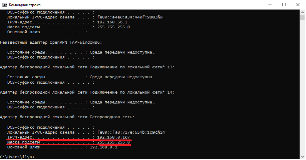
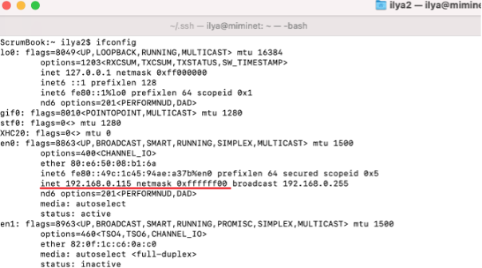

== Где посмотреть свой IP адрес и маску

Вы можете посмотреть ваш IP адрес на вашем же хосте. Если у вас Windows, в командной строке выполните команду ipconfig (или ipconfig /all) и в выводе команды найдите свое подключение. У меня это Беспроводная сеть, как на рисунке ниже.

.Значение IP адреса и маски под Windows.

Мой IP адрес под Windows 192.168.0.107/255.255.255.0.

А если у вас MacOS или Linux, выполните в консоле команду ifconfig и найдите в выводе свое подключение. У меня это en0, как показано на рисунке ниже. Мой IP адрес 192.168.0.115, а маска 255.255.255.0. Обратите внимание, как MacOS пишет маску, в шестнадцатеричной системе.

.Значение IP адреса и маски под MacOS
