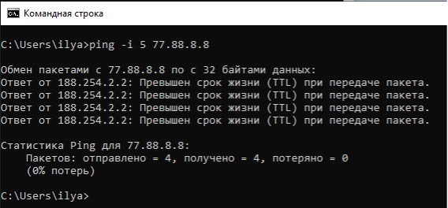
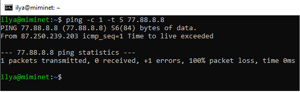

= Практика по TTL

Вы можете самостоятельно попробовать сгенерировать такую ситуацию. Если у вас Windows, в Командной строке выполните команду ping -i 5 77.88.8.8.

.Превышен срок жизни (TTL) под Windows.

Под Windows TTL устанавливается опцией -i.

Если у вас Linux или MacOS, то в консоли выполните команду ping -c 1 -t 5 77.88.8.8. как показано на рисунке ниже.

.Превышен срок жизни (TTL) под Linux.

Играясь с опцией TTL можно выяснить, сколько маршрутизаторов между вами и конечным хостом.
