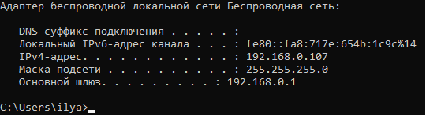
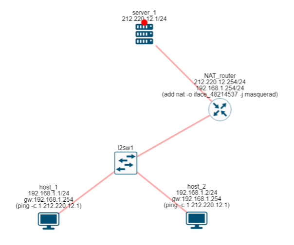
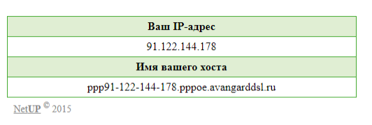
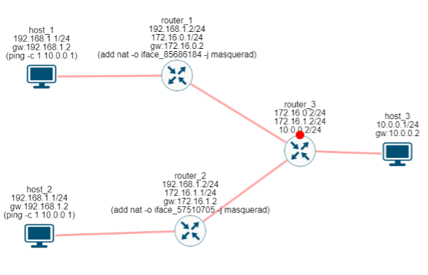
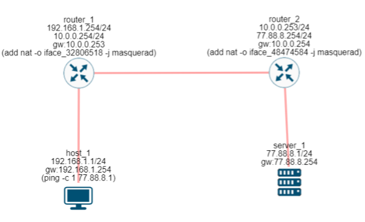

= NAT (Network Address Translation)

== Частные IP сети

Когда мы говорили про IP адреса, возможно у кого-то из вас возникал вопрос. IP адрес длиной 32 бита, значит всего IP адресов может быть чуть больше 4 млрд. И мы говорили о том, что IP адрес это уникальный идентификатор хоста в Интернет. Что, сейчас в сети меньше 4 млрд. хостов? Не верю. И будете абсолютно правы!

Создатели TCP/IP, Боб Кан и Винтон Серф, не ожидали, что сеть будет развиваться так быстро. И уже в 90-х годах пришлось задуматься над тем, как решать проблему нехватки IP адресов.

Так появился NAT (Network Address Translation или по-русски преобразование сетевых адресов) - механизм, позволяющий на лету изменять IP адрес отправителя.

Для начала, из всего диапазона IP выделили несколько IP сетей, так называемые частные IP сети или их еще называют серые IP сети:

* 10.0.0.0/8
* 172.16.0.0/12
* 192.168.0.0/16

Эти сети описаны в https://datatracker.ietf.org/doc/html/rfc1918[RFC 1918]. IP адреса из этих сетей не могут быть использованы в сети Интернете. Вместо этого, эти сети могут использовать в частных нуждах: дома, в офисе, в кафе и ресторанах, на даче, в гостиницах и так далее.

Посмотрите IP на своем устройстве (ноутбук или ПК). С большой вероятностью у вас будет IP адрес из частной сети, как у меня.

.Серый IP адрес.

Чтобы хост с IP адресом из частной сети мог обмениваться данными с хостами в сети Интернет, его IP адрес будет подменяться на IP адрес маршрутизатора. Такая функция подмены IP адреса и называется NAT.

== NAT

Давайте сделаем сеть как показано на рисунке ниже. Нам понадобится 2 хоста, 1 маршрутизатор и 1 сервер.

.NAT. (https://miminet.ru/web_network?guid=6166e87e-571c-4495-a712-f2416af71dfd)

Оба хоста будут находиться в частной сети, пусть это будет 192.168.1.0/24, а внешний интерфейс маршрутизатора и сервер будут находиться в нормальной (белой) IP сети 212.220.12.0/24. На NAT маршрутизаторе включим маскарадинг на внешний интерфейс и с обоих хостов выполним команду ping на сервер.

Если запустить анимацию сети, то можно будет увидеть, что когда пакет проходит через маршрутизатор, то его IP отправителя меняется на IP адрес маршрутизатора. Т.е. со стороны сервера выглядит так, словно ICMP-запрос ему отправляет хост с IP адресом 212.220.12.254. И он ничего не знает про то, что на самом деле пакет был от хоста 1 или 2, с IP адресами из серых сетей.

Когда пакет возвращается, NAT маршрутизатор помнит о подмене IP адреса, возвращает исходный IP адрес и отправляет пакет обратно в серую сеть.

Таким образом, NAT прячет исходные IP адреса хостов и позволяет большому количеству хостов с серыми IP адресами обмениваться данными с серверами в Интернете.

Отсюда и высказывание “хост спрятан за NAT”.

== Домашний маршрутизатор

Обычно домашние маршрутизаторы сразу идут с включенной функцией NAT. Для этого у них есть специальный порт, куда должен входить провод от провайдера. Все пакеты, которые выходят из этого порта предварительно проходят через NAT.

== myip.ru

Если у вас дома, на работе или в кафе используется частный IP адрес, то вы можете зайти на сайт https://myip.ru/ и посмотреть, с какого белого IP адреса вы выходите в Интернет. У меня это 91.122.144.178

.myip.ru.

== Два и более одинаковых серых адреса

Благодаря использованию NAT, теперь разные хосты могут иметь одинаковые IP адреса, как на рисунке ниже.

.Одинаковые IP за NAT. (https://miminet.ru/web_network?guid=19e7c6b6-9541-4602-8c78-d0c64c069b41).

Хост 1 и 2 имеют одинаковые IP адреса, но находятся за разными маршрутизаторами. Хост 1 за маршрутизатором 1, а хост 2 за маршрутизатором 2. В итоге, каждый из них выходит в сеть с разными IP адресами. Хост 1 с IP адреса 172.16.0.1, а хост 2 с IP адреса 172.16.1.1

== NAT цепочка

Маршрутизаторы с функцией NAT могут располагаться в цепочку и тогда IP адрес отправителя в исходном пакете будет изменен несколько раз, как на рисунке.

.NAT цепочка. (https://miminet.ru/web_network?guid=4e882fd3-975c-46af-b2f3-8e088cd1b911).

. Изначально пакет отправляется с хоста 1 (IP адрес отправителя 192.168.1.1).
. Проходя через маршрутизатор 1 его IP адрес меняется на 10.0.0.254, так как на нем работает NAT.
. Проходя через маршрутизатор 2 его IP адрес меняется на 77.88.8.254
. В итоге, сервер 1 получает ICMP-запрос с IP адресом отправителя 77.88.8.254.

Во время обратного следования пакета каждый NAT маршрутизатор сделает обратную подмену IP. И хост 1 получит ответ от сервера 1 и о том, что на пути следования пакета его IP адрес менялся, не догадается.

