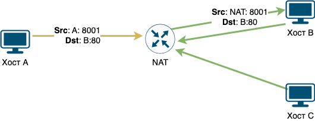
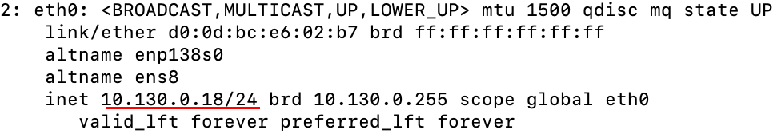
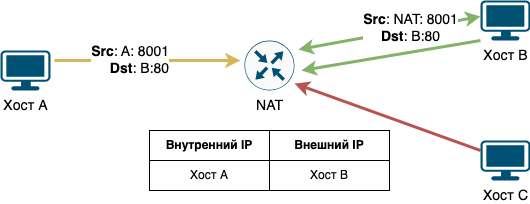
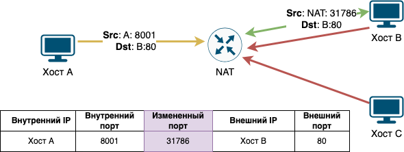
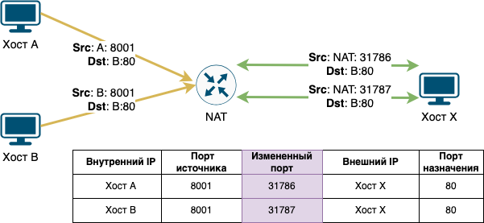

= Разновидности NAT

NAT - это не простая подмена IP-адреса, от чего у NAT есть несколько разновидностей. При попытке разобраться в разновидностях NAT непременно встречаешься с их различной трактовкой и классификацией. Какой-то единой терминологии нет. Поэтому, когда идёт речь про NAT, вместо названий лучше уточнять детали его реализации.

== Full-cone NAT (статический NAT)

Однозначная (взаимная) трансляция между парами “внутренний адрес: внутренний порт” и “публичный адрес: публичный порт”. Применяют для отображения одного внутреннего IP-адреса на один внешний IP-адрес (1 к 1). То есть, если во внутренней сети будет 10 хостов с различными IP-адресами, то для доступа в интернет им потребуется 10 внешних адресов.

Такой NAT особенно полезен, когда устройство должно быть доступным снаружи сети. Один внутренний IP-адрес и порт отображаются в один внешний IP-адрес и порт. Поэтому, если кто-то снаружи пришлёт пакет на внешний IP-адрес и порт, этот пакет будет проброшен на внутренний IP-адрес и порт.

.Full-cone NAT.

Такой NAT используется чаще всего в корпоративных сетях, когда необходимо, чтобы какой-либо IP-адрес всегда был доступен из глобальной сети.

Например, когда вы покупаете сервер в облаке и внешний IP-адрес для доступа к нему. Сервер miminet.ru расположен по IP-адресу 51.250.2.96. А когда я подключаюсь к нему для выполнения работ по настройке и смотрю IP-адреса своих сетевых интерфейсов, то вижу IP-адрес 10.130.0.18, как на рисунке ниже.

.Пример использования Full-cone NAT.

== Address-restricted-cone NAT

Работает как Full-cone NAT с ограничением по IP-адресу. Один внутренний IP и порт отображаются в один внешний IP-адрес и порт (как Full-cone NAT). Этот тип NAT отличается от Full-cone NAT тем, что во внутреннюю сеть может отправлять пакеты только тот хост, на чей IP-адрес был ранее отправлен пакет через NAT (в нашем случае это хост B).

Когда хост А отправит пакет на хост B, NAT добавит в специальную таблицу IP-адрес хоста B и отправит пакет на хост B.

Получив пакет на внешний интерфейс, NAT маршрутизатор попробует найти IP-адрес отправителя в своей таблице. Если такой IP-адрес будет в таблице (пакет от хоста B), то такой пакет можно отправить обратно хосту А. Обратите внимание, хост B в этом случае может отправлять пакеты с любого порта и на любой порт (имеется в виду TCP или UDP порт).

Хост C в этом случае не может обмениваться пакетами с хостом A.

.Address-restricted-cone NAT.

== Port-Restricted-Cone NAT

Port-Restricted-Cone NAT работает как Address-restricted-cone NAT, только добавляется ещё и ограничение на порт. Разница в том, что внешний хост может отправить пакеты только в ответ на полученные.

.Port-restricted-cone NAT.

Когда хост А отправит пакет на хост B, NAT добавит в специальную таблицу IP-адрес хоста A и B, а также порт (TCP или UDP) источника и назначения. После этого NAT отправит пакет на хост B.

Получив пакет на внешний интерфейс, NAT маршрутизатор попробует найти IP-адрес и порт отправителя в своей таблице. Если такой IP-адрес и порт будут в таблице (пакет от хоста B с порта 80), то такой пакет можно отправить обратно хосту А на порт 8001. Обратите внимание, хост B в этом случае может отправлять пакеты только с номером порта 80 и только на порт 8001.

== Port Address Translation (PAT)

Трансляция портов (PAT) или ещё иногда его называют Symmetric NAT - наиболее закрытый из всех типов NAT.

.PAT.

Когда хост А отправляет пакет на хост B, то NAT не только меняет IP-адрес источника на свой, но ещё и подменят порт источника на свой. На рисунке выше, хост А отправил пакет, в котором IP-адрес источника хост A, порт источника 8001. Во время пересылки пакета PAT поменял IP-адрес источника на свой (NAT) и порт источника с 8001 на 31786.

В этом случае хост B может отправлять только ответные пакеты с порта 80 на IP-адрес NAT и порт 31786. Получив такой пакет NAT найдёт в своей таблице нужное соответствие, поменяет IP-адрес назначения на хост A и порт назначения на 8001 и отправит такой пакет хосту A.

== One-to-Many

One-to-Many, он же Many-to-One, он же Source NAT (SNAT), он же NAPT (network address and port translation), IP masquerading и ещё его называют NAT overload - пожалуй, наиболее распространённый вид NAT. Так как он самый популярный, то под термином NAT часто подразумевают именно его.

One-to-Many - вид NAT, когда множество внутренних IP-адресов транслируются в один внешний. Например, у вас дома, все ваши домашние сетевые устройства (ПК, ноутбук, телефоны, телевизор, умная колонка и т.д.) имеют серые IP-адреса. Ваш домашний маршрутизатор транслирует все эти IP-адреса в один (который выдал провайдер).

.One-to-Many NAT.

Раз несколько внутренних IP-адресов транслируются в один внешний, то может возникнуть путаница. Когда несколько хостов (например, хост A и B) из внутренней сети отправят пакет на один внешний IP-адрес (хост X). В ответ придёт два ответа (для хостов A и B). Как NAT определит, какой ответ для хоста A, а какой для хоста B? Чтобы избежать такой путаницы, NAT подменяет ещё и порт источника. Таким образом, даже если несколько устройств из внутренней сети отправят пакеты для одного внешнего IP-адреса и на один порт, NAT сможет точно определить, какой ответ для кого предназначается.

Такой вид NAT, как правило, работает у вас дома.

== NAT traversal

Говоря о NAT, стоит упомянуть о NAT traversal. NAT traversal - это техника для установки и поддержания соединения, когда между двумя хостами находиться NAT.

NAT traversal востребованная техника, особенно для организации пиринговой файлообменной сети (например, Bittorrent) или для VoIP.

На данный момент уже придумано много различных NAT traversal техник, их короткие описания вы можете найти в Wikipedia - https://en.wikipedia.org/wiki/NAT_traversal#Techniques

А для тех, кто хочет узнать немного больше, рекомендую статью Брайн Форда (Bryan Ford) https://bford.info/pub/net/p2pnat/[Peer-to-Peer Communication Across Network Address Translators].
