= PMTUD (Path MTU Discovery)

PMTUD (Path MTU Discovery) - это метод для определения максимальной единицы передачи (MTU - maximum transmission unit) между двумя IP хостами. Обычно это делается, чтобы избежать фрагментации в IP.

== MTU (maximum transmission unit)

Рассмотрим пример. На рисунке ниже изображена простая сеть с двумя маршрутизаторами. Хост 1 отправляет ICMP эхо-запрос размером 1472 байта на сервер 1.

.Отправка IP пакета максимального размера (1500 байт). (https://miminet.ru/web_network?guid=d59b4299-b0e4-4e6a-bf2c-78d52d8f2525).
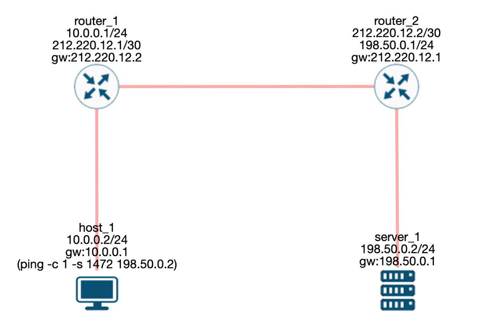

Как известно, стандартный размер Ethernet пакета может передавать до 1500 байт данных. В примере выше отправляется ICMP эхо-запрос с 1472 байтами данных. Вот как мы получили эту цифру:

* 20 байт - IP заголовок
* 8 байт - ICMP заголовок
* 1500 - 20 - 8 = 1472 байта данных

То есть, 1472 байта данных - это максимальный размер, который мы можем отправить в одном ICMP эхо-запросе через Etherhet. Если мы попробуем отправить 1473 байта данных, то такой IP пакет уже не поместится в Ethernet пакет и он будет разбит на два пакета.

NOTE: Вы можете скопировать приведённую сеть в примере и поменять размер передаваемых данных в ICMP эхо-запросе на 1473. Затем запустите эмуляцию и убедитесь, что теперь вместо одного IP пакета, хост 1 отправляет 2 пакета.

Чтобы протоколы сетевого уровня (например, IP) знали максимальное количество байт данных, которые можно отправить, используется параметр MTU (maximum transmission unit). Например, в MacOS этот параметр можно найти в настройках сети.

.MTU в MacOS.
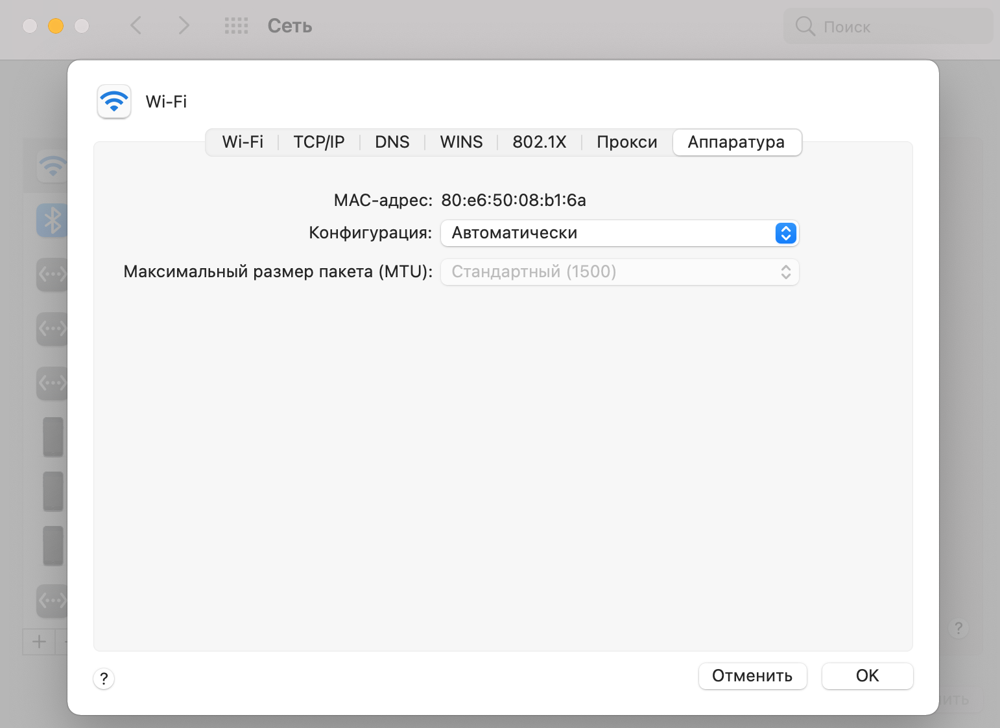

Или можно в терминале набрать команду ifconfig и увидеть текущее значение MTU рядом с каждым интерфейсом.

.Значения MTU у каждого интерфейса в MacOS.
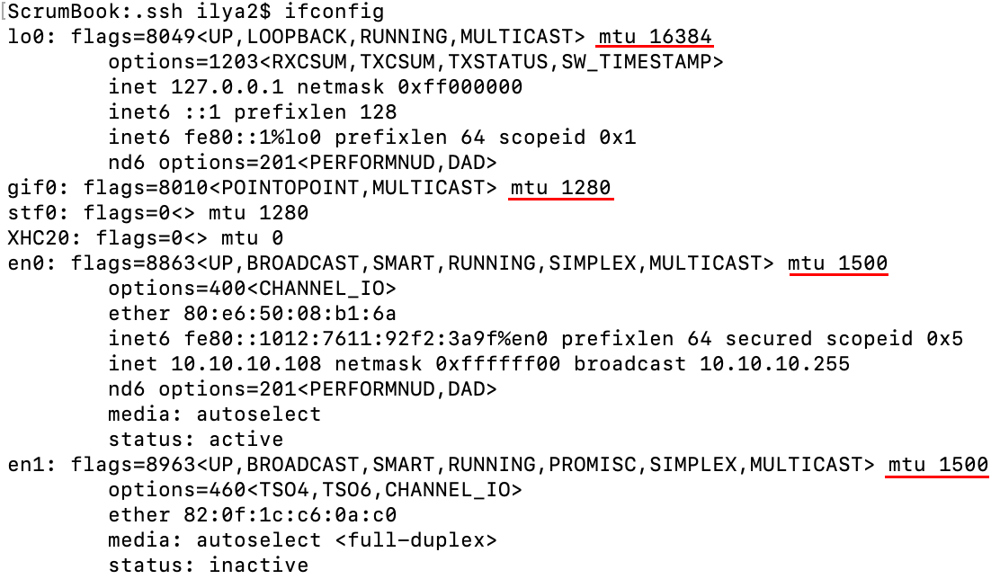

Если у вас Linux, то вы можете посмотреть текущие значения MTU командой ip a (или ifconfig). Ниже приведён пример вывода команды ```ip a```

.Значения MTU у каждого интерфейса в Linux.
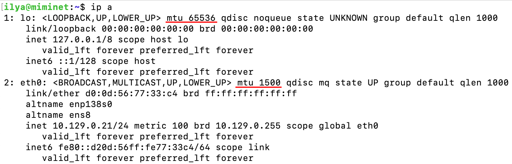

NOTE: Обратите внимание, что у Loopback интерфейсов (lo) MTU больше чем 1500. У MacOS значение MTU 16384, а у Linux 65536. Это потому, что loopback-интерфейс полностью программный и по умолчанию не отправляет данные в сеть. Вместо этого он обрабатывает их на этом же хосте.

Если мы отправим в сеть ICMP запрос данными превышающими 1472 байта данных, то такой IP пакет будет фрагментирован. Это нормальное поведение. А вот если мы попробуем отправить такой пакет и установим флаг в “Don’t fragment” в IP пакете, то мы получим сообщение об ошибке, что такой пакет нельзя отправить в сеть, так как он слишком большой и стоит запрет на его фрагментацию.

Например, на Linux хосте выполним команду ```ping -s 1473 -M do 8.8.8.8```. Давайте разберём, что означает эта команда и параметры:

* *ping* - отправляет ICMP эхо-запрос на указанный IP-адрес (в нашем случае это 8.8.8.8).
* параметр *-s* указывает на размер передаваемых данных в ICMP эхо-запросе. В нашем случае это 1473 байта. Это означает, что в один пакет мы не поместимся (1473 + 8 байт ICMP заголовок + 20 байт IP заголовок = 1501 байт). Значит нужно будет фрагментировать этот пакет.
* параметр *-M do* указывает, что мы хотим установить бит Don’t fragment, который запрещает фрагментировать IP пакет.

В результате получим сообщение, что сообщение слишком длинное (1501 байт), а MTU всего 1500.

.Отправка большого ICMP эхо-запроса с запретом на фрагментацию.
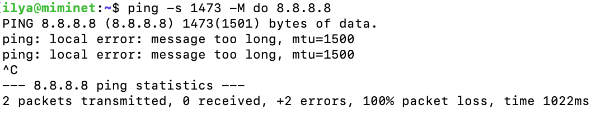

Если маршрутизатор получит IP пакет, который он не сможет дальше переслать из-за того, что он не пролазит в установленный MTU и в нём стоит флаг Don’t fragment, то в ответ мы получим ICMP сообщение с типом 3 (Destination unreachable) и кодом 4 (fragmentation needed and DF set) - нужна фрагментация, но стоит флаг DF.

На самом деле это не такая уж и редкая проблема. Давайте вернёмся к нашему примеру с двумя маршрутизаторами, где мы отправляли IP пакет максимального размера и у нас всё отлично работало. А теперь давайте все оставим как есть, только между маршрутизаторами 1 и 2 установим IPIP туннель. В этот туннель мы будем отправлять пакеты для хостов 1 и 2. Например, наш провайдер, по своим соображениям, решил поднять туннель между своими маршрутизаторами, и теперь наши пакеты попадают в этот туннель. Или это вы решили поднять туннель между удаленными офисами.

.Отправка IP пакета максимального размера по пути с IPIP туннелем. (https://miminet.ru/web_network?guid=cd8c557b-52df-4a85-9fe4-3f570dd7527f)
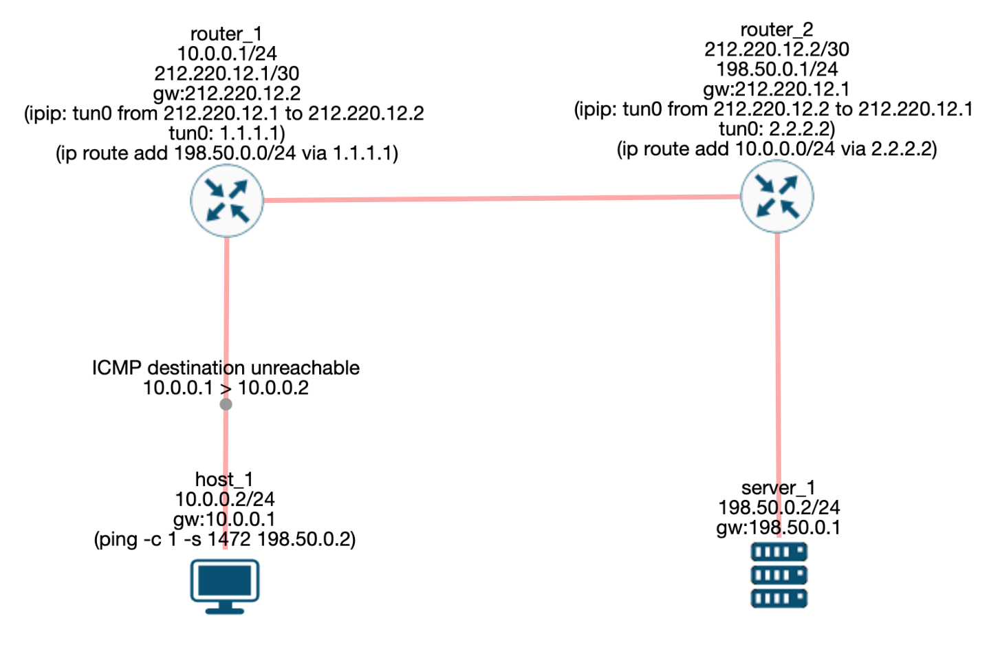

И снова запустим на ping с размером передаваемых данных 1472. Видно, как вдруг всё поломалось. ICMP эхо-запрос больше не доходит до сервера. А в ответ мы получаем ICMP сообщение с кодом 3 и типом 4.

Это происходит по той причине, что мы пытаемся отправить пакет максимального размера в IPIP туннель. При попытке отправить его в IPIP туннель он увеличиться ещё на 20 байт (добавить новый IP заголовок). Как итог, его размер станет 1520 байт, а это больше чем MTU=1500.

.IP пакет максимального размера попал в IPIP туннель.
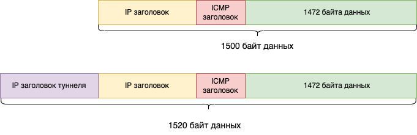

Т.е. если во время маршрутизации нашего пакета он перестанет пролазить в сеть и будет стоять флаг Don’t fragment. То он будет отброшен, а в ответ мы получим ICMP сообщение об этой ошибке (тип=3, код=4).

Конечно, эту проблему легко решить путём снятия бита DF (Don’t fragment), что разрешит маршрутизатору фрагментировать полученный IP пакет. Для этого добавим к команде ping параметр ```-M dont```, как показано на рисунке ниже.

.Отправка IP пакета максимального размера по пути с IPIP туннелем и снятым флагом DF. (https://miminet.ru/web_network?guid=8e498f62-6784-44bb-af39-70dfc42cea6c)
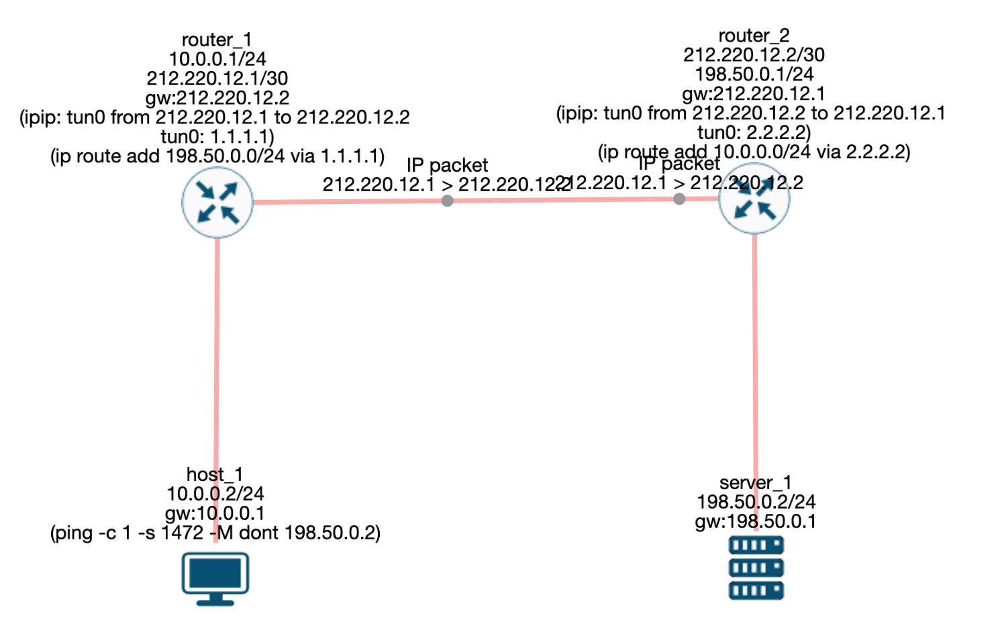

В результате между маршрутизатором 1 и маршрутизатором 2 будет передан не один пакет, а два. На маршрутизаторе 2 произойдёт сборка двух пакетов в один и исходный пакет будет передан на сервер. При отправке ответа от сервера к хосту 1 произойдёт аналогичная ситуация, только собирать пакеты уже будет маршрутизатор 1.

== Разные MTU

Обычно MTU относят к сетевому уровню, указывая таким образом, какой максимальный размер данных можно упаковать в протокол канального уровня. Полностью его стоит называть L3 MTU или IP MTU. Но так как очень часто именно с ним идёт работа, то он превратился просто в MTU. Но, не только на сетевом уровне имеется MTU.

L2 MTU / Ethernet MTU / Hardware MTU - это MTU для технологии канального уровня. L2 MTU должен быть больше чем MTU. Вот передали мы 1500 байт данных на канальный уровень, их же ещё нужно упаковать в Ethernet. После добавления Ethernet заголовка размер фрейма вырос до 1518 байт.

.L2 MTU.
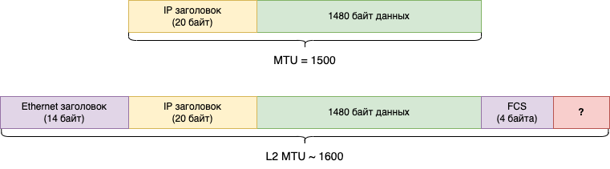

А ещё мы знаем, что в Ethernet заголовок может быть добавлен VLAN tag, что ещё увеличит размер фрейма. Часто L2 MTU устанавливается на все случаи жизни и равен он что-то около 1600. Этот параметр вы увидите нечасто, но если встретите, теперь будете знать, что он означает.

NOTE: Разные производители оборудования по-разному считают L2 MTU. Кто-то включает в расчёт Ethernet заголовок, кто включает дополнения как VLAN Tag, но при этом не включают Ethernet заголовок. Поэтому внимательно читайте документацию от производителя.

TCP MSS - определяет максимальный размер данных, которые могут быть переданы в одном TCP пакете. Это ещё один параметр, с помощью которого можно влиять на максимальный размер передаваемого пакета.

.TCP MSS, MTU и L2 MTU.
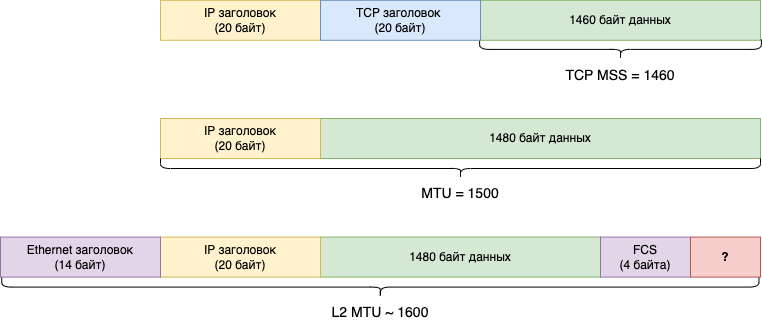

Например, если вы установите TCP MSS в 1400, то максимальный размер ваших IP пакетов станет 1440 байт (1400 байт данных + 20 байт TCP заголовок + 20 байт IP заголовок).

== Проблема фрагментации IPv4

На первый взгляд может показать, что проблемы с фрагментацией нет никакой. Просто давайте не ставить этот чёртов бит Don’t fragment в IP пакете и всё. В целом да, все так, если пренебрегать эффективностью и скоростью.

=== Эффективность оборудования

Когда речь идёт о вашем домашнем компьютере или ноутбуке, или даже телефоне, то без разницы, будет ваш хост фрагментировать пакеты или нет. Это не является проблемой. Но если говорим о маршрутизаторах и коммутационном оборудовании у провайдеров или компаний, то оказывается, что разница есть, и очень большая.

Оборудования у провайдеров и в центрах обработки данных (ЦОД) крупных компаний (Яндекс, Вконтакте, Mail.ru и т.д.) работают с трафиком не с 10-100 Мбит/сек, как ваш домашний маршрутизатор. Они работают с десятками и даже сотнями гигабит в секунду. Давайте сделаем грубый расчёт для канала всего в 1 гигабит/сек:

. Скорость 1 Гбит/сек = 125 000 000 байт в секунду (1 000 000 000 / 8).
. Если в канал со скоростью 125 000 000 байт в секунду отправлять Ethernet пакеты максимального размера (1518 байт = 1514 + 4 байта CRC32), то получится 82 345 пакета. Давайте округлим до 82 000.
. Пусть у нас будет дуплексный канал. 82 000 пакетов мы отправляем и столько же получаем на вход. Итого, получим 164 000 пакетов в секунду. Вот с такой скоростью должен работать маршрутизатор.

. И это расчёты всего для 1 Гбит/канала. А если у вас 5, 10, 100 Гбит/канал?! Можете сами прикинуть, насколько быстрым должен быть такой маршрутизатор.

NOTE: При грубом расчёте не учитывались: преамбула, SFD и межпакетный интервал.

NOTE: Сетевое оборудование для построения крупных компьютерных сетей, как правило, достаточно дорогое. Оно должно не просто работать, а очень и очень быстро!

Маршрутизатор хочет заниматься маршрутизацией, т.е. пересылкой пакета из одной сети в другую. И он хочет делать это как можно быстрей. Фрагментация пакета приведёт к двум проблемам:

. Для фрагментации пакета нужно потратить немного процессорного времени и памяти. Это не сложно, если нужно фрагментировать немного. Но если вы проложили туннель и теперь вам нужно фрагментировать половину трафика (например, 82 000 пакетов в секунду), то это уже много.
. Фрагментация пакета не так сложна, как его обратная сборка.
.. *Память*. При получении фрагмента маршрутизатор вынужден выделить сразу достаточно места в памяти, вплоть до 64 Кбайт (максимальный размер IP пакета), для размещения всего IP пакета. Нельзя сказать, какой размер оригинального IP пакета, пока маршрутизатор не получит пакет с флагом More fragmetns (MF) равным 0.
.. *Время сборки*. При получении IP фрагмента маршрутизатор будет вынужден ждать остальные фрагменты и держать пакет в памяти. И все это время данные будут просто лежать в буфере маршрутизатора. Это негативно отразится на общей скорости передачи.
.. *Потеря фрагмента*. Если какой-то IP фрагмент потеряется, тогда пакет будет лежать в буфере маршрутизатора длительное время, пока не сработает таймаут. В этом случае маршрутизатор отправит ICMP сообщение c типом 11 и кодом 1 - время сборки IP пакета истекло (fragment reassembly time exceeded).
.. *Процессор*. Сборка фрагментов тоже не бесплатное занятие. Как и создание фрагментов, сборка потребует небольшого ресурса центрального процессора. И, как в случае с фрагментацией, собирать несколько пакетов несложно. Сложно собирать по несколько десятков тысяч пакетов в секунду.

=== Эффективность канала

Эффективность использования канала для передачи данных напрямую зависит от соотношения служебной информации к передаваемым данным. Каждый провайдер и администратор корпоративной сети стремится выжать максимум из своих каналов.

Рассмотрим пример с IPIP туннелем, в который мы отправим IP пакет максимального размера со снятым DF флагом.

.Отправка IP пакета максимального размера по пути с IPIP туннелем и снятым флагом DF. (https://miminet.ru/web_network?guid=8e498f62-6784-44bb-af39-70dfc42cea6c)
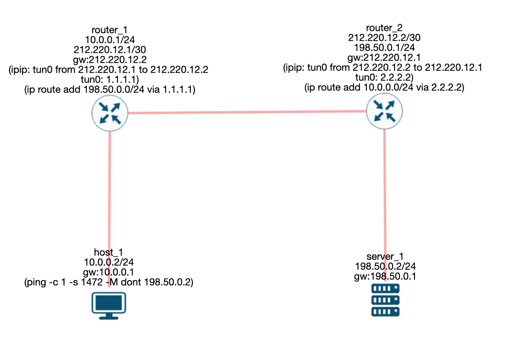

Хост 1 отправил IP пакет максимально возможного размера:

* 1472 байта данных + 8 байт ICMP заголовок + 20 байт IP заголовок) = 1500 байт данных.
* добавим к этому Ethernet заголовок 14 байт + 4 байта CRC32
* общий размер пакета 1518 байт, из которых 1472 байта данных.

С позиции эффективности использования канала - это лучший пакет. Придя на маршрутизатор 1 этот пакет отправляется в IPIP туннель, и теперь он не влазит в канал, необходимо фрагментировать пакет. Не влезло всего 20 байт. Это значит, что маршрутизатор 1 отправит на маршрутизатор 2 два IP пакета. В одном будет 1452 байт данных, а во втором всего 20. Для второго пакета получается:

* 20 байт данных + 20 байт IP заголовка
* 14 байт Ethernet заголовок + 4 байта CRC32
* размер пакета 58 байт. Это меньше минимального размера Ethernet фрейма, поэтому этот пакет дополнится до 64 байт случайными данными.
* итого 64 байта из которых всего треть (20 байт) данных.

Чем больше будет таких маленьких пакетов, тем меньше будет эффективность использования канала.

По этим причинам хосты обычно отправляют IP пакеты в сеть с установленным флагом DF (Don’t fragment).

== PMTUD

Чтобы снизить проблему с фрагментацией IPv4 пакетов появилась техника, позволяющая узнать максимально допустимый MTU на всем пути следования пакета, и адаптировать свой MTU под максимально допустимый. Эта техника называется Path MTU Discovery (PMTUD) и она описана в https://datatracker.ietf.org/doc/html/rfc1191[RFC 1191].

В основе работы PMTUD лежит ICMP сообщение с типом 4 и кодом 3 (Destination Unreachable: fragmentation needed and DF set):

* при отправке пакетов хост запрещает фрагментировать IPv4 пакеты путем установки флага DF в 1.
* если на пути следования пакета какой-то маршрутизатор не сможет отправить его дальше из-за MTU, то такой пакет будет отброшен, а сам маршрутизатор отправит ICMP сообщение “fragmentation needed and DF set”. В этом сообщении маршрутизатор сообщит свой MTU, чтобы хост смог адаптировать размер новых пакетов.
* получив такое ICMP сообщение хост адаптирует свой MTU под новое значение.
* вновь отправляемые пакеты успешно проходят MTU.

Таким образом, используя PMTUD хост может определить, что на пути следования пакета где-то есть маршрутизатор с меньшим MTU, чем у него, и адаптировать свой MTU.

На рисунке ниже показана схема сети с хостом, двумя маршрутизаторами и сервером. Между маршрутизаторами поднят IPIP туннель.

.Path MTU Discovery. (https://miminet.ru/web_network?guid=a98dd32f-c167-4c8d-b61c-1972dcd9feac)


Хост 1 отправляет 1500 байт данных по TCP. 1500 байт в любом случае не влезут в один IP пакет, поэтому, будет отправлено два пакета с данными: один максимально большой, второй маленький.

Запустим эту сеть и посмотрим, что происходит:

* пропустим этап с отправкой ARP пакетов и установкой TCP соединения.
* на 13-м шаге хост 1 отправляет сразу 4 пакета:
** завершение установки TCP соединения (SYN, SYN+ACK, *ACK*)
** большой пакет с данными
** маленький пакет с оставшимися данными
** пакет закрытия соединения (FIN+ACK)
* маршрутизатор 1 получает все 4 пакета и:
** все пакеты, кроме большого пакета с данными он маршрутизирует дальше. Можно заметить, как 3-и IP пакета попали в туннель и отправились на маршрутизатор 2.
** большой пакет с данными отбрасывается и генерируется ICMP сообщение “Destination Unreachable: fragmentation needed and DF set”.
* хост 1 получает ICMP сообщение и адаптирует свой MTU. Теперь он отправляет не 1 пакет с данными, а два.
* маршрутизатор 1 получает эти два пакета и успешно отправляет их дальше.

Используя технику PMTUD хост может автоматически адаптировать свой MTU. Все современные ОС поддерживают и используют PMTUD. Ели вы запустите сниффер на своем компьютере, то сможете обнаружить, что у больших IP пакетов стоит флаг DF.

== Черная дыра (BlackHole)

Одной из проблем работы PMTUD является некорректная настройка на маршрутизаторах и фаерволы.

Некоторые неопытные сетевые администраторы блокируют маршрутизацию и генерацию любых ICMP сообщений. Это приводит к тому, что хост не получает ICMP сообщения “Destination Unreachable: fragmentation needed and DF set”. При этом, его IP пакеты не доходят до получателя из-за проблем с MTU на одном из маршрутизаторов. Создается ощущение, что пакеты словно отправляются в черную дыру, от сюда и название этой проблемы.

Симптом такой проблемы обычно выглядит следующим образом:

. хост успешно устанавливает соединение до сервера, например, до веб-сервера
. при попытке скачать страницу или файл с веб-сервера все зависает и никакие данные не передаются
. новое соединение устанавливается, но данные не скачиваются или не отправляются.

== TCP MSS

https://www.rfc-editor.org/rfc/rfc2923[RFC 2923] (TCP Problems with Path MTU Discovery) описывает не только эту, но и другие проблемы, которые могут возникнуть при PMTUD. Помимо описания проблем данный документ предлагает и их решения.

Одно из решений для черной дыра является изменение MSS параметра у TCP. MSS (Maximum Segment Size) - определяет максимальный размер данных, которые TCP готов принять в одном IP пакете. Во время установки TCP соединения каждая сторона объявляет свой размер MSS. Например, если MSS будет равен 1400, это означает, что в один TCP пакет не будет содержать более 1400 байт данных.

Если TCP может успешно устанавливать соединение и отправлять небольшие порции данных, но обнаруживает потерю при отправке больших сегментов данных, то он начинает уменьшать MSS до тех пор, пока пакеты не перестанут теряться.