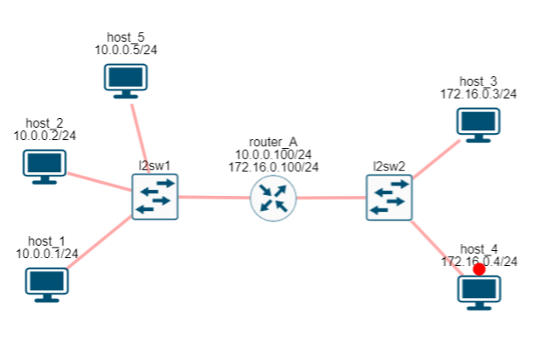
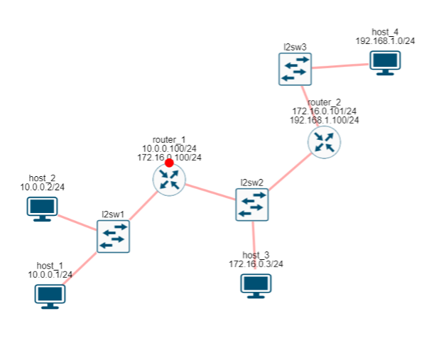

= Маршрут по умолчанию

Давайте вернемся к нашей сети из 5 хостов и двух сетей, как на рисунке ниже.

.Сеть из 5 хостов, 2-х свитчей и 1 маршрутизатора. (https://miminet.ru/web_network?guid=7714de3c-1b74-4e3e-a33e-665662d71713).

Раньше, используя классовую адресацию, наша таблица маршрутизации на хосте 1 выглядела как в таблице ниже.

[cols="1,1"]
|===
^|IP адрес назначения
^|IP адрес маршрутизатора

^|10.0.0.0
^|10.0.0.1

^|172.16.0.0
^|10.0.0.100
|===

Но теперь мы знаем про бесклассовую адресацию и давайте перепишем таблицу маршрутизации для хоста 1. Выглядеть она будет как в таблице.

[cols="1,1"]
|===
^|IP адрес назначения
^|IP адрес маршрутизатора

^|10.0.0.0/24
^|10.0.0.1

^|172.16.0.0/24
^|10.0.0.100
|===

А теперь давайте добавим еще один сегмент сети и новую IP сеть, как на рисунке ниже.

.3 сегмента сети и 3 IP сети. (https://miminet.ru/web_network?guid=6547afac-26fc-474e-8e4e-9446992ab96c).

Теперь, чтобы хост 1 смог отправить пакет на хост 4 (в сеть 192.168.1.0/24) ему нужно добавить еще одну запись в свою таблицу маршрутизации.

[cols="1,1"]
|===
^|IP адрес назначения
^|IP адрес маршрутизатора

^|10.0.0.0/24
^|10.0.0.1

^|172.16.0.0/24
^|10.0.0.100

^|192.168.1.0/24
^|10.0.0.100
|===

Получается, что каждый раз при появлении новой IP сети мы (хост 1) должны будем добавлять ее в свою таблицу маршрутизации. Это не очень удобно, так как будет тормозить масштабирование сети. Каждый раз при появлении новой сети нам нужно будет добавлять ее к себе в таблицу маршрутизации.

Если эти новые IP сети будут появляться за маршрутизатором 1, то для нас это будет означать, что при добавлении нового маршрута в свою таблицу, в качестве IP адреса маршрутизатора, мы всегда будем ставить 10.0.0.100

Раз так, может быть мы тогда для всех неизвестных нам IP сетей сразу поставим маршрутизатор 10.0.0.100? Ведь какая разница, добавится там 192.168.1.0/24 или какая-нибудь еще IP сеть, все равно адрес маршрутизатора 10.0.0.100.

Получается, нам нужно добавить в таблицу маршрутизации такую запись, которая бы означала “для всех остальных IP сетей кроме моей идти на маршрутизатор”. В нашем случае это “для всех остальных IP сетей кроме 10.0.0.0/24 идти на 10.0.0.100”.

Инженеры решили этот вопрос вот так:

. Запись  “для всех остальных IP сетей кроме моей идти на маршрутизатор” выглядит как 0.0.0.0/0. Т.е. нулевая сеть с маской 0. Получается, что в эту сеть попадает абсолютно любой IP адрес. Для любого IP адреса применив маску 0 получим 0.0.0.0.

. Введем порядок просмотра записи в таблице маршрутизации. Она просматривается от большей маски к меньшей. Т.е. первой будет просматриваться запись с маской 32, потом с 31, потом с 30 и так далее до 0.

Получается, что теперь таблица маршрутизации для хоста 1 будет выглядеть вот как в таблице.

[cols="1,1"]
|===
^|IP адрес назначения
^|IP адрес маршрутизатора

^|10.0.0.0/24
^|10.0.0.1

^|0.0.0.0/24
^|10.0.0.100
|===

Если хост 1 будет отправлять пакет на хост 2 (10.0.0.2), то его IP адрес попадет в первую запись (10.0.0.0/24). Так как маска 24 больше 0, то сначала мы будем смотреть ее.  А если IP адрес назначения будет из других сетей, например 172.16.0.0/24, 192.168.1.0/24 и так далее, то он не попадет под запись 10.0.0.0/24, но будет попадать во вторую запись. Таким образом, для всех не наших сетей мы будем отправлять пакет на маршрутизатор.

Вот такая запись (0.0.0.0/0) и называется маршрутом по умолчанию или Default gateway.