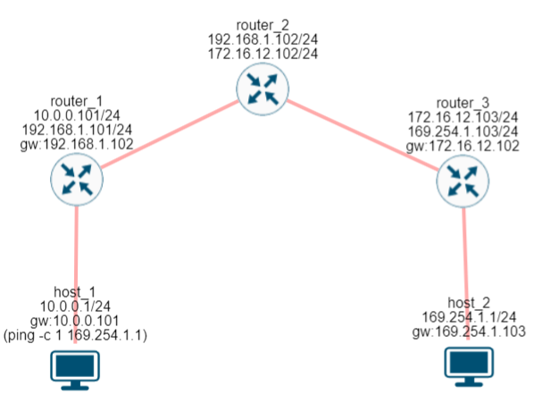
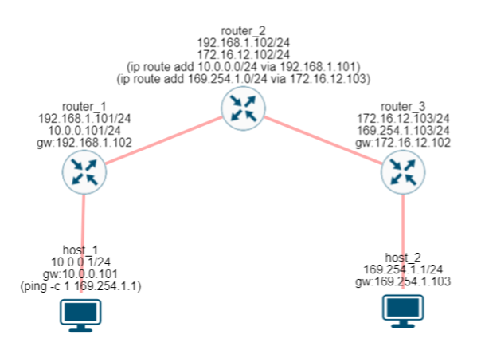

= Default Free Zone (DFZ)

Маршрут по умолчанию очень удобная запись, но на самом деле она не совсем решает проблему, а лишь перекладывает ее. Рано или поздно должен появиться маршрутизатор, который знает маршруты до всех сетей.

Default free Zone (DFZ) - это такой набор маршрутизаторов, которые вместе содержат все маршруты до всех сетей. Давайте построим сеть, как показано на рисунке ниже.

.Маршрута по умолчанию недостаточно. (https://miminet.ru/web_network?guid=bcbdb588-21a0-4c28-b84f-f03edf06ae29).

Нам понадобится 2 хоста и 3 маршрутизатора:

. Хост 1 и маршрутизатор 1 в IP сети 10.0.0.0/24
. Маршрутизатор 1 и маршрутизатор 2 в IP сети 192.168.1.0/24
. Маршрутизатор 2 и маршрутизатор 3 в IP сети 172.16.12.0/24
. Ну и маршрутизатор 3 и хост 2 в IP сети 169.254.1.0/24

И пропишем маршруты по умолчанию:

* хост 1 на маршрутизатор 1
* маршрутизатор 1 на маршрутизатор 2
* хост 2 на маршрутизатор 3
* маршрутизатор 3 на маршрутизатор 2

Это пример сети, когда мы не можем обойтись только маршрутами по умолчанию.  Если мы на маршрутизаторе 2 сделаем маршрут по умолчанию на маршрутизатор 3, то пакет от хоста 1 до хоста 2 сможет дойти. Но вот обратно нет, так как маршрутизатор 2 ничего не знает про сеть 10.0.0.0/24, а маршрут по умолчанию указывает на маршрутизатор 3.

А если мы на маршрутизаторе 2 сделаем маршрут по умолчанию на маршрутизатор 1, то картина будет обратной. От хоста 2 до хоста 1 пакеты будут доходить, а вот обратно нет.

.Default Free Zone (https://miminet.ru/web_network?guid=8de49b2d-563c-4519-9119-41be6939dd7b).

Чтобы такая сеть работала нам нужно:

. Либо на маршрутизаторе 2 добавить в таблицу маршрутизации информацию про обе IP сети: 10.0.0.0/24 и 169.254.1.0/24 (как сделано на рисунке).

. Либо на маршрутизаторе 2 добавить в таблицу маршрутизации маршрут по умолчанию и информацию про одну из двух IP сетей. Например, в качестве маршрута по умолчанию выбрать маршрутизатор 1 и добавить информацию про IP сеть 169.254.1.0/24.

В первом случае в DFZ будет только маршрутизатор 2, так как он сам будет знать про все маршруты. А его таблица маршрутизации будет как в таблице

[cols="1,1"]
|===
^|IP сеть назначения
^|IP адрес маршрутизатора

^|192.168.1.0/24
^|192.168.1.102 (сам маршрутизатор 2)

^|172.16.12.0/24
^|172.16.12.102  (сам маршрутизатор 2)

^|10.0.0.0/24
^|192.168.1.101  (на маршрутизатор 1)

^|169.254.1.0/24
^|172.16.12.103  (на маршрутизатор 3)
|===

Во втором случае в DFZ будет маршрутизатор 2 и 1. Так как вместе они будут иметь маршруты до всех сетей.
