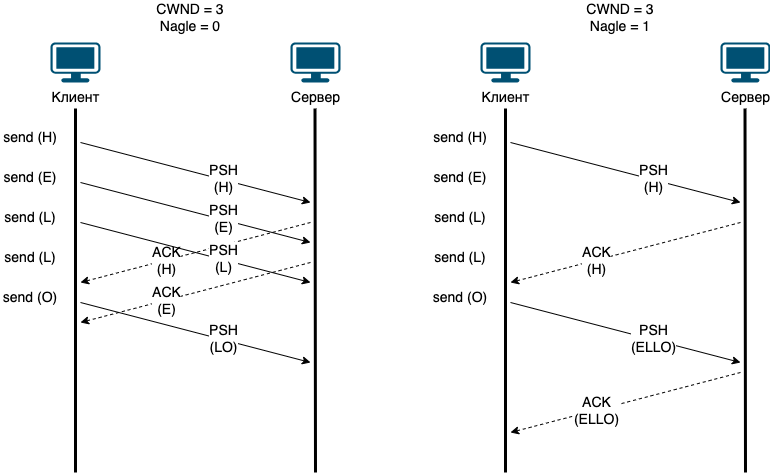

= Алгоритм Нагла (Nagle algorithm)

Алгоритм Нагла или еще его называют Алгоритм Нейгла или https://datatracker.ietf.org/doc/html/rfc896[RFC 896], в которой он был впервые описан. Нагл работал над увеличением эффективности TCP/IP. Наблюдая за работой сети он обнаружил, что сетевые устройства довольно часто не справлялись со входящим трафиком и начинали размещать пакеты в буфере на отправку. Т.е. происходило переполнение, увеличивался RTT и отправитель начинал снижать скорость отправки новых пакетов в сети. При этом, объем передаваемых данных был не так уж и велик.

При детальном наблюдении оказалось, что в сеть очень часто отправлялись TCP пакеты с маленьким объемом данных, иногда даже с 1 байтом. Передача TCP пакета с 1 байтом полезных данных приводит к огромным накладным расходам в 5400% (20 байт TCP заголовок + 20 байт IP заголовок + 14 байт Ethernet заголовок).

Идея алгоритма Нагла в уменьшении количества маленьких TCP пакетов в сети. Нагл предложил алгоритм, который должен задерживать отправку небольших порций данных в сеть, если у отправителя есть неподтвержденные данные (т.е. отправитель еще не получил на них пакет с флагом ACK).

.Обмен данными с выключенным (левый рисунок) и включенным (правый рисунок) алгоритмом Нагла.

На рисунке показано, как алгоритм Нагла уменьшает количество небольших пакетов в сети. Слева на рисунке клиент хочет передать на сервер слово HELLO, при этом, он отправляет по одной букве. Сначало отправляется “H”, потом “E”, затем “L” и так далее. Если алгоритм Нагла будет выключен, то клиент будет отправлять эти буквы в тот момент, когда поступила такая команда от программы (команда send). При условии, что есть такая возможность.

На рисунке справа алгоритм Нагла включен и мы видим, как клиент отправив одну букву “H”, ждет, пока придет подтверждение. Он не отправляет мелкие пакеты в сеть, а копит эти данные. Он отправит накопленные данные:

* Когда данные будут подтверждены (придет ACK на “H”).
* Или когда данных накопится достаточно, чтобы отправить целый пакет.

В нашем случае мы ждем подтверждения и только потом отправляем накопившийся буфер “ELLO”.

Алгоритм Нагла выглядит вот так:

 if there is new data to send then
    if the window size ≥ MSS and available data is ≥ MSS then
        send complete MSS segment now
    else
        if there is unconfirmed data still in the pipe then
            enqueue data in the buffer until an acknowledge is received
        else
            send data immediately
        end if
    end if
end if

Алгоритм Нагла - https://en.wikipedia.org/wiki/Nagle%27s_algorithm

== Когда стоит отключать алгоритма Нагла

Алгоритм Нагла не всегда полезен. Если у вас интерактивный трафик, например, вы подключились через консоль на удаленный сервер или через удаленный рабочий стол. В этом случае нужно, чтобы интерфейс был отзывчивым для этого необходимо отключать алгоритм Нагла в приложении.

