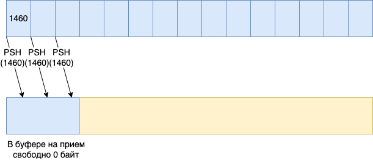

= Скользящее окно (Sliding Window)

Решение отправлять сразу несколько пакетов для увеличения скорости передачи данных очевидное, но есть проблема. Несколько пакетов - это сколько, 2, 5, 15 или можно сразу 150? Как узнать?

Во время обмена данными между хостами, получаемые данные не попадают сразу в приложение пользователя. Сначала они попадают в буфер приема и только потом, оттуда, они попадают в пользовательское приложение.

Современные ОС многопользовательские, поэтому, во время получения пакета для приложения А, на процессоре может исполняться совсем другое приложение. И чтобы полученные данные не выбрасывать, они помещаются во временную память - буфер для приема данных.

Этот буфер не бесконечный, поэтому, если данных придет больше, чем в него помещается, то они будут отбрасываться до тех пор, пока в буфере не освободится место.

Для избежания переполнения буфера во время приема пакетов в TCP заголовке есть поле Окно (Window), его еще называют Скользящее окно (Sliding Window). Это поле размером в 2 байта (16 бит) и оно сообщает о размере свободного места в буфере на прием. Изначально это место измерялось в байтах. Соответственно, максимальное значение было 65 535 байт. Как не сложно догадаться, теперь этого недостаточно и сейчас используются различные опции, которые позволяют передавать в поле Окно большие значения.

Для тех, кому интересно, ищите по ключевым словам:

* Window scaling
* https://datatracker.ietf.org/doc/html/rfc7323[RFC 7323]
* https://datatracker.ietf.org/doc/html/rfc1323[RFC 1323]

А мы продолжим. Давайте нарисуем небольшую сеть из двух хостов, как показано на рисунке ниже.

.Обмен данными по TCP в сети из двух хостов. (https://miminet.ru/web_network?guid=63f69e1e-81ab-43e3-832a-876fc7c8c6f1)
image::images/2_host_data_exchange.png[Обмен данными по TCP в сети из двух хостов. (https://miminet.ru/web_network?guid=63f69e1e-81ab-43e3-832a-876fc7c8c6f1).]

Итак, поле Window сообщает информацию о размере свободного места в буфере на прием. Во время установки соединения (3-х разовое рукопожатие: SYN, SYN+ACK, ACK) обе стороны обмениваются информацией о свободном месте в их буфере на прием.

После установки соединения отправитель может смело отправить столько пакетов с данными без подтверждения, сколько поместится в буфер на прием у получателя.

Отправка данных приведет к уменьшению этого буфера. Но когда приложение на удаленной стороне прочитает данные из буфера, это приведет к освобождению места в буфере, что приведет и к увеличению Window.

.Поле Window в TCP - это размер буфера на прием.

Предположим мы установили TCP соединение и удаленная сторона сообщила свой Window = 4380 байт (это 3 раза по 1460 байт). Это означает, что мы можем сразу отправить 3 TCP сегмента с данными без ожидания подтверждения, как показано на рисунке ниже.

.TCP отправляет сразу 3 сегмента с данными.

На рисунке выше отправитель отправил сразу 3 сегмента с данными до того, как получил хотя бы одно подтверждения. Если все данные придут, это будет означать, что свободного места в буфере у принимающей стороны больше нет. По мере того как будут приходить подтверждения мы увидим, что поле Window уменьшается до 0. После получения первого сегмента оно станет 2920, после второго сегмента 1460 и после получения третьего сегмента поле Window станет 0.

Для отправителя это будет означать, что пока больше никаких данных отправлять нельзя. Ситуация изменится, когда приложение на удаленной стороне прочитает данные из буфера на прием. Предположим, наше приложение прочитало всего 2920 байт данных (зеленый кусок), а 1460 еще находятся в буфере, как показано на рисунке ниже.

.Приложение прочитало 2920 байт данных (зеленый).

Теперь TCP может сообщить отправителю, что буфер освободился и он снова готов принять 2920 байт данных.

Таким образом, наше окно как бы сдвигается вправо, отсюда и название "Скользящее окно".

В современных системах размер буфера обычно несколько мегабайт, что позволяет передавать данные на достаточно большой скорости.

.Обмен данными по TCP в сети из двух хостов. (https://miminet.ru/web_network?guid=b362d63e-6207-4991-b10c-dadc0c4c4144).

Еще раз сделаем сеть из двух хостов, только на этот раз передадим 5000 байт данных. Если вы запустите анимацию такой сети, то увидите, что хост 1 сразу отправляет пакеты с данными, не дожидаясь подтверждения.