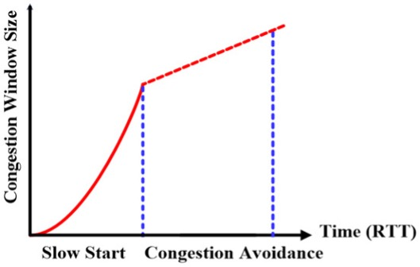

= Низкий старт (Slow start)

Последнее, о чем стоит упомянуть при разборе скорости передачи данных в TCP - это медленный старт.

Когда мы говорим про CWND (количество пакетов, которые можно отправить до получения подтверждения), то есть два интересных вопроса:

* Какое начальное значение CWND?
* С какой скоростью он будет расти?

Вот допустим у нас начальное значение CWND 1, хорошо. Мы отправили пакет с данными и получили подтверждение. Выяснили, что нас никто не тормозит и мы можем разогнаться. Каким поставить следующее значение CWND: 2, 4, 10?

Вначале скорость роста CWND экспоненциальная и эта фаза называется Slow start (низкий старт). Как только CWND доходит до определенного предела, скорость роста становится линейной и эта фаза называется Congestion Avoidance (избежание переполнения).

.Низкий старт в TCP.

Таким образом, находясь на низкой скорости TCP пытается как можно быстрей разогнаться до чего-то приемлемого. А уже после, пытаться адаптироваться и контролировать скорость.

NOTE: Во всей (из того, что я видел) литературе Slow start переведен как “Медленный старт”. Хотя как он может быть медленный, если он разгоняется экспоненциально? Считаю, что перевод низкий старт более уместен.

